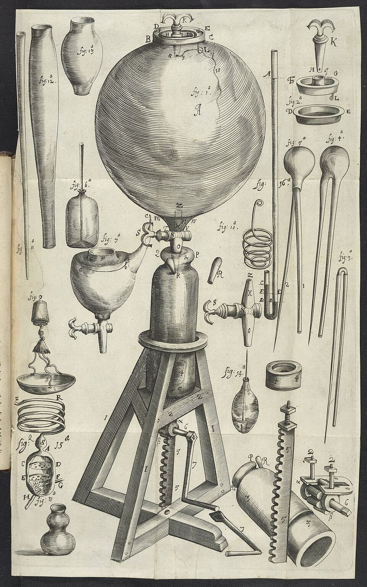

In 1661 a wealthy young experimenter at Oxford published a book arguing that nobody yet knew what anything was made of. **[Robert Boyle](kloom:e/robert-boyle)**, born in 1627 at Lismore in Ireland, the fourteenth child of the Earl of Cork, called it **[_The Sceptical Chymist_](kloom:e/the-sceptical-chymist)**. It is a dialogue in a garden, and its hero is a doubter. Boyle's part is taken by Carneades. Against him sit Themistius, who defends the four elements of the Aristotelians, earth, water, air and fire, and Philoponus, who defends the three principles of the chymists, salt, sulphur and mercury.

## The sceptic in the garden

Both sides claimed that fire proves them. Themistius burns green wood in a chimney and finds his four elements in it: fire in the flame, air in the smoke, water hissing from the ends, earth in the ash. Carneades asks whether anyone has ever drawn a single one of the four elements "out of Gold by any degree of Fire whatsoever". Gold, silver and a few other bodies come out of the hottest furnace as they went in, so fire cannot be the universal analyser that both schools needed it to be. And what fire does bring out of a thing may be made by the fire, not found in the thing.

Then Boyle defines what an element would be, if there were any: "certain Primitive and Simple, or perfectly unmingled bodies", from which mixed bodies are made and into which they can be taken apart again. It sounds modern, and it is often quoted as the birth of the chemical element. But Boyle said in the same breath that he doubted any known substance was one, gold and sulphur included. He believed, with the corpuscular philosophers, that all matter is one stuff in particles of different sizes, shapes and motions. The book cleared ground; it did not draw up a list. The list waited more than a century, for Lavoisier.

## The engine

Boyle's authority came from the bench. In 1657 he read that **[Otto von Guericke](kloom:e/otto-von-guericke)**, the burgomaster of Magdeburg, had emptied glass vessels of air with a pump. Guericke's needed "the continual labour of two strong men for divers hours", and nothing could be put inside the glass. So Boyle set two men to design a better one, and, in his words, after "an unsuccessful trial or two" the second of them "fitted me with a pump". That was **[Robert Hooke](kloom:e/robert-hooke)**, then Boyle's assistant. By 1659 the pneumatical engine stood in Oxford: a glass receiver of "about 30 wine quarts", with an opening at the top to put things in, over a brass cylinder whose piston was wound down by a rack and pinion.

In _New Experiments Physico-Mechanicall, Touching the Spring of the Air_ (1660), Boyle reported forty-three experiments with it. In the emptied receiver a candle went out, the ticking of a watch faded until nobody could hear it, and animals died. The air, he argued, has weight and a _spring_: squeezed, it pushes back. In November 1660 he was one of the twelve men at Gresham College in London who founded what became the **[Royal Society](kloom:e/royal-society)**.

## The J-tube

A Jesuit, Franciscus Linus, answered that no spring could hold up a column of mercury: an invisible cord, the _funiculus_, did it. Boyle's reply of 1662, _A Defence of the Doctrine touching the Spring and Weight of the Air_, measured the spring. He sealed the short arm of a tall J-shaped glass tube, trapped air in it with a little mercury, and poured more mercury into the long arm. The tube was too tall for a room, so two of them worked on a staircase, one pouring at the top and one watching the air below, with a small mirror to read the levels. The first tube broke. With the second, as the trapped air shrank to each mark, they wrote down how much mercury was pressing on it.

Boyle's table of 25 readings is the plate's curve. Here are six of them as he printed them, in inches and sixteenths, with his prediction beside each. By our arithmetic, pressure times volume stays within 1.3% of its first value all the way to a quarter of the volume:

| Air, in quarter inches | Pressure, inches of mercury | Boyle's prediction | Volume × pressure |
| ---------------------: | --------------------------: | -----------------: | ----------------: |
|                     48 |                     29 2⁄16 |            29 2⁄16 |             1,398 |
|                     40 |                     35 5⁄16 |                 35 |             1,413 |
|                     32 |                     44 3⁄16 |           43 11⁄16 |             1,414 |
|                     24 |                    58 13⁄16 |             58 2⁄8 |             1,412 |
|                     16 |                    87 14⁄16 |             87 3⁄8 |             1,406 |
|                     12 |                    117 9⁄16 |            116 4⁄8 |             1,411 |

Halve the air, double the pressure: _PV_ is constant at a fixed temperature, the law that English speakers call **[Boyle's law](kloom:e/boyles-law)**. Boyle himself wrote that "some particulars do not so exactly answer" the rule, and would not say that it held "universally and precisely". (The 1744 edition of his _Works_ misprints two numbers in this table; the 1662 original has the ones given here.)

## Whose law?

Boyle did not claim the rule was his. **[Richard Towneley](kloom:e/richard-towneley)** and his physician **[Henry Power](kloom:e/henry-power)** had carried a barometer up Pendle Hill in Lancashire in April 1661, and Power's _Experimental Philosophy_ (1664) states the proportion. In the chapter of his table, Boyle credits it to "Mr. Towneley's" suppositions and theory. Wikipedia's article on Boyle says that Power formulated it and Boyle wrongly credited Towneley; its article on Towneley says that the two found it together. Edme Mariotte found the same law in France in the 1670s, and in France it is Mariotte's law.

Boyle was also an alchemist. He hoped to multiply gold, and he helped repeal England's law against doing it. That side of him, and of Newton, is the trail Alchemy's last century. On the spine, the next frame is a theory of fire itself: phlogiston.
