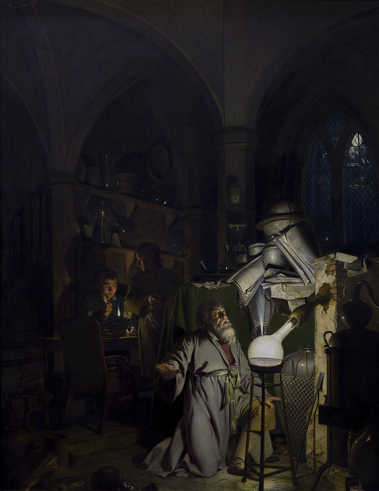

In 1669, in **Hamburg**, a man boiling urine in search of the philosophers' stone got something else: a white, waxy stuff that shone in the dark. **[Hennig Brand](kloom:e/hennig-brand)** had been a soldier, and was called a merchant by some and a physician by others; a wealthy second wife, Margaretha, paid for his furnace. What he caught in his receiver was **[phosphorus](kloom:e/phosphorus)**, and he is usually counted as the first person known by name to have discovered an element. Gold, lead and sulphur had been known since before writing; nobody knows who first saw them.

## Cold fire

In his letters Brand called it his cold fire, _kaltes Feuer_. He kept the method secret, as alchemists did, and tried in vain to make gold with it. The name that stuck, _phosphorus_, "light-bearer", was already used for anything that shone in the dark.

The secret did not keep. **[Johann Kunckel](kloom:e/johann-von-lowenstern-kunckel)**, a chemist in the service of the Elector of Saxony, heard of it in Hamburg and wrote to a friend in Dresden, Johann Daniel Krafft. In Kunckel's own account Krafft hurried to Hamburg behind his back and bought the secret for 200 thalers, and Kunckel, told only that it came from urine, worked the method out for himself. The letters that **[Gottfried Wilhelm Leibniz](kloom:e/gottfried-wilhelm-leibniz)** kept at Hanover tell it differently: the historian Hermann Peters read them in 1902, and by Leibniz's account both men learned it from Brand. Leibniz, who wrote a history of the discovery, took Brand to Hanover in 1678 to make phosphorus for his duke, and sent the recipe to **[Ehrenfried Walther von Tschirnhaus](kloom:e/ehrenfried-walther-von-tschirnhaus)** in Paris, who published it and in 1682 was elected to the French Academy of Sciences.

Krafft made it a show. On 24 April 1676 he put out the candles at the court of Brandenburg and performed with the "perpetual fire". In London on 15 September 1677 he showed it to **[Robert Boyle](kloom:e/robert-boyle)**, and wrote DOMINI on a sheet of paper with a fingertip; the letters shone, Boyle wrote, with "a mixture of strangeness, beauty, and frightfulness".

## Boyle's recipe

Boyle made it himself. On 14 October 1680 he left a sealed account with the Royal Society, opened after his death and printed in 1693, and it is a recipe a chemist can follow. Urine, left to stand for a while, was distilled down to "a somewhat thick Syrup" and mixed with "thrice its Weight of fine White Sand". This went into a stone retort whose nose almost touched the water in a large receiver, as the plate draws it, and was heated gently for five or six hours, then for five or six more "as strong and intense as the Furnace ... was capable of giving". White fumes came over, then fumes with "a faint blewish Light", and last a heavier substance that sank through the water. Krafft said that he had told Boyle the method; Boyle said that he had found it for himself.

The chemistry is a reduction. Urine carries phosphates, and in the red-hot retort carbon from the residue takes their oxygen, as it takes copper's, and goes off as carbon monoxide. The sand takes up the sodium. As Wikipedia's article on phosphorus writes it:

4 NaPO₃ + 2 SiO₂ + 10 C → 2 Na₂SiO₃ + 10 CO + P₄

The phosphorus comes over as a vapour of P₄, four atoms in a tetrahedron, and condenses under the water. It glows because it burns slowly. The vapour above the solid reacts with the oxygen of the air, and short-lived molecules made in the reaction, HPO and P₂O₂, give off the energy as green light. That is **[chemiluminescence](kloom:e/chemiluminescence)**, light from a chemical reaction, and not phosphorescence, which is light stored and given back, although the word was named after the element.

## A bucket of urine

How much is there to catch? A 2015 review of what people excrete found reports of 0.35 to 2.5 grams of phosphorus in a litre of fresh urine, and 0.4 to 2.5 grams a day in a median of 1.4 litres. By our arithmetic, at about a gram a litre:

| Urine                        | Phosphorus in it, at 1 g a litre |
| ---------------------------- | -------------------------------: |
| A day's, 1.4 litres          |                      about 1.4 g |
| A 10-litre bucket            |                       about 10 g |
| 4,500 litres (1,200 gallons) |                     about 4.5 kg |
| 5,700 litres (1,500 gallons) |                     about 5.7 kg |

Nobody measured Brand's. The Science History Institute says he boiled down about 1,200 gallons over two weeks; Wikipedia says about 1,500 US gallons, to make 120 grams, and explains that he threw away the salty part of the residue, which held most of the phosphate. If both are right he caught two or three grams in every hundred. (Wikipedia's article on Brand puts a litre's phosphorus at 0.11 grams, ten times less than the review.)

## The painting

A century later **[Joseph Wright of Derby](kloom:e/joseph-wright-of-derby)** painted the moment: _The Alchymist, in Search of the Philosopher's Stone, Discovers Phosphorus_, first shown in 1771 and reworked in 1795, now in Derby. He set a seventeenth-century workshop in a Gothic vault, with the alchemist on his knees before a receiver that blazes like a lamp. Real phosphorus glows far more faintly. Wright knew the story from Pierre-Joseph Macquer's textbook, which gave "a citizen of Hamburgh named Brandt" the credit and said that such misguided work had "proved the occasion of several curious discoveries".

In the same years a young professor at Cambridge was reading the alchemists and building a furnace of his own. The next frame is Isaac Newton the alchemist.
