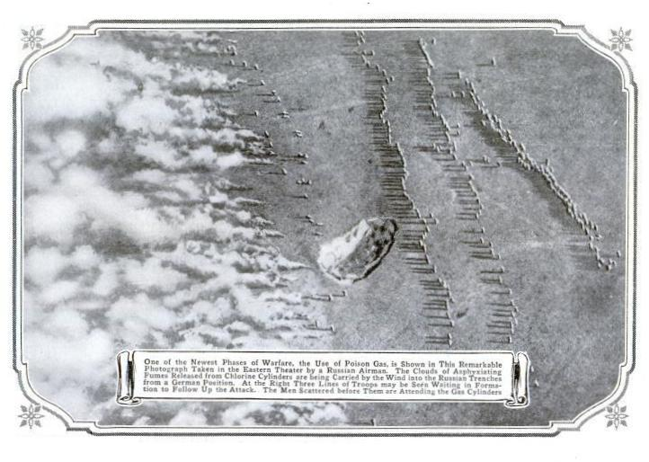

Late in the afternoon of 22 April 1915, north of the Belgian town of Ypres, German troops opened the valves of 5,730 steel cylinders dug into their front line and let out some 170 tonnes of **[chlorine](kloom:e/chlorine)**. A light wind carried the grey-green cloud across no man's land onto two French divisions, one of them of North African troops. Men ran from it, and a gap about six kilometres wide opened in the line. It was the first day of the **[Second Battle of Ypres](kloom:e/second-battle-of-ypres)**, and Germany's first mass use of poison gas on the Western Front. The French lost 2,000 to 3,000 men that evening, of whom the historian Olivier Lepick estimates 800 to 1,400 were killed by the gas.

The weapon was a chemist's idea. **[Fritz Haber](kloom:e/fritz-haber)**, of the Kaiser Wilhelm Institute in Berlin, watched a field test of a tear gas and proposed chlorine instead, because it is heavier than air. It was to hand: the dye makers BASF, Hoechst and Bayer made it as a by-product. Haber led a team of more than 150 scientists, and he was at the front when the valves were opened.

## Why the cloud sank

Equal volumes of gases at the same temperature and pressure hold equal numbers of molecules, so a gas's density goes with the mass of its molecules. A chlorine molecule, Cl₂, weighs 2 × 35.45 = 70.9 grams a mole. Air is about four-fifths nitrogen (28.0) and one-fifth oxygen (32.0), which averages about 29. By our arithmetic chlorine is nearly two and a half times as dense as air, so the cloud rolled along the ground and poured into the trenches and shell holes where soldiers took cover. The agents that followed were heavier still:

| Agent    | Formula      | Grams per mole | Density against air | First used                                 |
| -------- | ------------ | -------------: | ------------------: | ------------------------------------------ |
| Chlorine | Cl₂          |           70.9 |               2.4 × | April 1915, by Germany                     |
| Phosgene | COCl₂        |           98.9 |               3.4 × | 1915, by France                            |
| Mustard  | (ClCH₂CH₂)₂S |          159.1 |     5.5 × as vapour | July 1917, by Germany, as a mist in shells |

In the lungs chlorine meets water: Cl₂ + H₂O ⇌ HCl + HOCl. Both acids, hydrochloric and hypochlorous, burn the lining of the airways. Canadian soldiers knew the gas because it smelled like their drinking water, and soon men were breathing through pads soaked in urine, whose urea reacts with chlorine. Phosgene does the same harm more slowly, COCl₂ + H₂O → CO₂ + 2 HCl, often a day after a man had breathed it; mustard blistered skin, eyes and lungs.

About 190,000 tonnes of chemical agents were made in the war. The toll usually given is some 90,000 dead and 1.3 million casualties, but only 26,600 deaths are documented in the four countries whose records are reliable, and the Russian figures have been called guesswork. The historian L. F. Haber, Fritz Haber's son, thought the usual totals too high, and conceded "we shall never know".

## Clara Immerwahr

Haber's wife, **[Clara Immerwahr](kloom:e/clara-immerwahr)**, had been the first woman to take a doctorate in chemistry at the University of Breslau, in 1900. On the night of 1 to 2 May 1915, after a party at their house in Dahlem for the gas attack's "success" and his promotion to captain, she shot herself with his army pistol. The next morning Haber left for the Eastern Front.

She is often remembered as a pacifist who died in protest, calling his work "a perversion of the ideals of science". The chemists Bretislav Friedrich and Dieter Hoffmann traced that phrase in 2016 to a 1967 biography of Haber that gives no source for it. The testimony, most of it gathered forty years later, points both ways: a cousin said she had been horrified by gas tests on animals, while the institute's mechanic said that she found Haber that night with another woman. They conclude that her death followed years of depression and a marriage long gone wrong, and cannot be tied to the gas alone.

## Banning it

The **[Geneva Protocol](kloom:e/geneva-protocol)** of 1925 banned the use of gas in war, but not its making or keeping, and many states kept the right to answer in kind. The **[Chemical Weapons Convention](kloom:e/chemical-weapons-convention)**, in force since 1997, bans all three and demands destruction, checked by inspectors of the **[Organisation for the Prohibition of Chemical Weapons](kloom:e/organisation-for-the-prohibition-of-chemical-weapons)** in The Hague, which won the Nobel Peace Prize in 2013. On 7 July 2023 the last declared weapon, an American rocket filled with sarin, was destroyed in Kentucky. As of the organisation's figures for the end of 2025, all 72,304 tonnes of agent declared by its 193 member states have been destroyed. Four United Nations members are still outside the treaty, and its inspectors have found that Syria's government used gas in its civil war. Chlorine itself cannot be banned: industry makes it by the million tonnes, for drinking water and plastics.

A new question arrived in 2022. A drug-discovery company, preparing a talk for a Swiss arms-control conference, turned its molecule generator round to reward toxicity; in under six hours it proposed 40,000 molecules, among them the nerve agent VX. None was made. That is why AI laboratories now test their models for chemical-weapons uplift before release, and promise stronger safeguards for any model that shows it.

The next frame is a quieter chemistry of the same years: the long molecules of polymers, and a chemist who had spoken out against Haber's gas.
