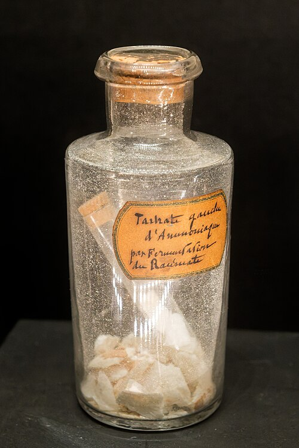

In the spring of 1848 **[Louis Pasteur](kloom:e/louis-pasteur)**, a chemist of 25 working as a laboratory assistant at the École Normale in Paris, looked through a lens at small colorless crystals and saw that they came in two kinds, each the mirror image of the other. He sorted them with tweezers into two piles. Dissolved in water, one pile turned a beam of polarized light to the right and the other turned it to the left, by the same amount. It was the first proof that a molecule can have a hand, as a glove does: a left and a right version, made of the same atoms joined in the same order, that cannot be laid one on the other. The property is now called **[chirality](kloom:e/chirality-chemistry)**, a word Lord Kelvin coined in 1894 from the Greek _cheir_, hand.

## Two acids from wine

The puzzle came from the wine trade. The crust in wine casks gives **[tartaric acid](kloom:e/tartaric-acid)**. Around 1819 a manufacturer in Alsace found a second acid in his crude tartar, with exactly the same composition, which Gay-Lussac named racemic acid, from the Latin for a bunch of grapes. **[Jean-Baptiste Biot](kloom:e/jean-baptiste-biot)**, the physicist who had found that some liquids turn the plane of polarized light, showed in 1832 that tartaric acid does so, to the right, and in 1838 that racemic acid does not. In 1844 the crystallographer **[Eilhard Mitscherlich](kloom:e/eilhard-mitscherlich)** reported that the two acids' sodium ammonium salts had the same crystals, with the same angles, and differed only in what they did to light.

Pasteur saw what Mitscherlich had missed. The tartrate's crystals carry small extra faces, _hemihedral_ faces, cut on only half of the corners where symmetry would put them, and all of them lean the same way. The racemate's crystals carried them too, but on some they leaned to the right and on others to the left. Racemic acid was a mixture, half and half, of ordinary tartaric acid and its mirror image, an acid nobody had seen before. The plate draws the two crystals, the mirror between them, and the two readings of the light.

He was lucky: fewer than one racemic compound in ten crystallizes as separate left and right crystals, and this salt does so only below about 28 °C; above that it forms crystals holding both hands at once, as Arcangelo Scacchi reported in 1865. He advised crystallizing in the morning, before the day's heat blurred the small faces.

## Reading the rotation

A polarimeter measures the angle, _α_, through which a solution turns polarized light. It grows with the length of the tube, _l_ (in decimeters), and the concentration, _c_ (in grams per milliliter), so chemists divide both out and quote the _specific rotation_, [α] = _α_ / (_l_ × _c_). The European Union's specification for food-grade tartaric acid puts it between +11.5° and +13.5° for a 20 per cent solution in yellow sodium light. Take +12°. By our arithmetic, for that solution in a one-decimeter tube:

| In the tube                 | Specific rotation | Angle read |
| --------------------------- | ----------------: | ---------: |
| Right acid, from wine       |              +12° |      +2.4° |
| Left acid, Pasteur's        |              −12° |      −2.4° |
| Equal weights of each       |                0° |         0° |
| Three parts right, one left |               +6° |      +1.2° |

Equal and opposite rotations are the signature of mirror-image molecules: every property that does not involve handedness is identical, so only the sign differs. An equal mixture reads zero, which is why racemic acid had seemed inactive, and a reading halfway to the pure value means three parts of one hand to one of the other.

## Biot's test

Biot was 74 and doubted it. As Pasteur told it in a lecture of 1860, Biot gave him racemic acid from his own stock, watched him make the salt, and let it crystallize in his own rooms at the Collège de France. He had Pasteur sort the crystals in front of him and prepared the solutions himself. Seeing the left-handed one turn the light, he took Pasteur's arm: "My dear child, I have loved science so much throughout my life that this makes my heart throb."

That is Pasteur's telling. The crystallographer Howard Flack, reviewing all of his work in 2009, warns that the stories Pasteur and his family told were shaped to flatter the Paris establishment: the notebooks show that he came to the tartrates through a messier study of crystal forms, not straight from Mitscherlich's puzzle. Flack also dates the first announcement to 22 May 1848, where many books say 15 May; Wikipedia's article on chirality gives the sorting as 1849.

## Hands in the body

Around 1857 Pasteur found a third way to separate the two. Fermenting racemic acid's ammonium salt, microbes consumed the right-handed tartrate and left the left; the bottle in the photograph, at the Musée Pasteur, is labeled as left ammonium tartrate made that way. Living things tell the hands apart. A century later **[thalidomide](kloom:e/thalidomide)**, sold from 1957 as a sedative and for morning sickness, harmed more than 10,000 children before birth. It was an equal mixture of its two hands, and the S form is held responsible; but the two turn rapidly into each other in the body, so a pure "safe" hand would not have prevented the disaster. Since 1992 the US Food and Drug Administration has asked the makers of a new drug with a mirror image to study each hand on its own.

Pasteur guessed that the handedness lay in how a molecule's atoms were arranged in space, and could not say how. The answer came in 1874, from a carbon atom whose four bonds point to the corners of a tetrahedron. First chemists had to learn that carbon has four bonds at all: the next frame.
