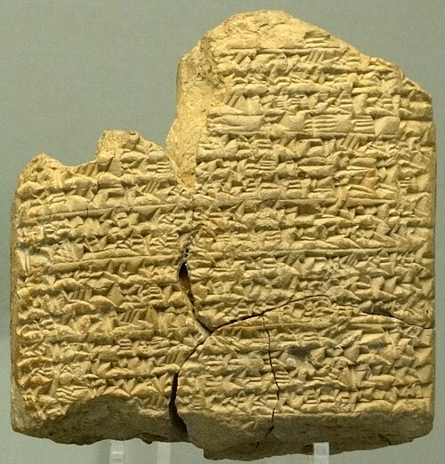

The first chemist whose name we know was a perfumer. A clay tablet from **[Assur](kloom:e/assur)**, the old capital of Assyria, gives a recipe for a scented oil "fit for the king" and says it comes "from the mouth of" **[Tapputi](kloom:e/tapputi)**-Bēlet-ekallim, a woman who made perfumes at the palace. The tablet, now in Berlin's Vorderasiatisches Museum, is dated by its colophon to the reign of **[Tukulti-Ninurta I](kloom:e/tukulti-ninurta-i)**, about 1200 BC; the perfume historian Nuri McBride reads the date as May 1239 BC. It is one of the oldest written records of a chemical procedure: not a boast or an account, but instructions for making a substance, step by step, so that someone else could make it again.

## Tapputi's oil

The German Assyriologist Erich Ebeling published Tapputi's tablet in 1919, and most of what is known of Mesopotamian perfumery rests on his editions. Tapputi's recipe steeps aromatics, calamus, cyperus and myrrh among them, in water and oil, leaves them overnight, filters them through cloth again and again, heats the mixture and cools it, and pours the result into a jar. It is patient work with solvents: oil draws out the scent that water will not hold.

Whether it is also distillation is disputed. Martin Levey, a historian of chemistry, wrote in 1973 that the earliest chemist known by name is a woman, and Wikipedia's article says that her ingredients were "distilled and filtered". McBride, reading the same tablet, calls the process an early form of distillation at most, and warns against calling a palace craftswoman a scientist in the modern sense. What is certain is that the tablet names her as the authority, and names a second woman perfumer whose name is broken off.

## Glass by the mina

The fullest chemical recipes from Mesopotamia are for glass. A set of tablets from the library of **[Ashurbanipal](kloom:e/ashurbanipal)** at **[Nineveh](kloom:e/nineveh)**, of the seventh century BC, and older ones from Middle Assyrian Assur, tell a glassmaker how to build a kiln, what to burn under it, and what to put in. The kiln's foundations are to be laid in a favorable month, with figures of the Kūbu spirits set down in its house so that no stranger enters; on the day the glass goes in, a sheep is sacrificed and honey poured over juniper. Then the chemistry:

> If you want to make "lapis lazuli": you grind separately 10 minas of immanakku-stone, 15 minas of salicornia ashes, and 1⅔ minas of "white plant." You mix them together.

The stone is ground quartz. **[Salicornia](kloom:e/salicornia)**, the glasswort of salt marshes, burns to an ash rich in soda, sodium carbonate. That is the trick of every soda glass since. Pure silica melts at about 1,713 °C, far beyond an ancient kiln; soda is a flux, and a mixture of the two melts at a heat a kiln can reach. As it melts, the carbonate gives up carbon dioxide and leaves sodium oxide in the glass:

| What goes in             | What happens in the kiln  | What stays in the glass    |
| ------------------------ | ------------------------- | -------------------------- |
| quartz, SiO₂             | melts only when fluxed    | the silica network         |
| plant ash, mostly Na₂CO₃ | Na₂CO₃ → Na₂O + CO₂ (gas) | sodium oxide, the flux     |
| "slow copper"            | dissolves into the melt   | the blue of "lapis lazuli" |

By our arithmetic, the recipe puts one and a half parts of ash to every part of quartz by weight. Plant ash is far from pure soda, and the recipe needs a great deal of it. The same tablet then melts ten minas of this frit over "slow copper" heated until it glows red, and the copper turns the glass blue: an imitation of lapis lazuli, the costly blue stone, made from sand, weeds and copper ore.

## Recipes for color

The scribes wrote recipes for dyes too. A Neo-Babylonian tablet of the sixth century BC from **[Sippar](kloom:e/sippar)**, now in the **[British Museum](kloom:e/british-museum)** (BM 62788), gives instructions for dyeing wool purple and blue: the colors of the murex vats, recorded in the same wedges that had once counted grain.

The glass texts end with a colophon naming the "palace of Ashurbanipal, king of the world", which kept them among its tablets of omens, medicine and literature. For two thousand years after, the craft knowledge of metal, dye and glass would sit beside a new question, first asked by Greeks: what is everything made of? The next frame is their answer, the four elements.
