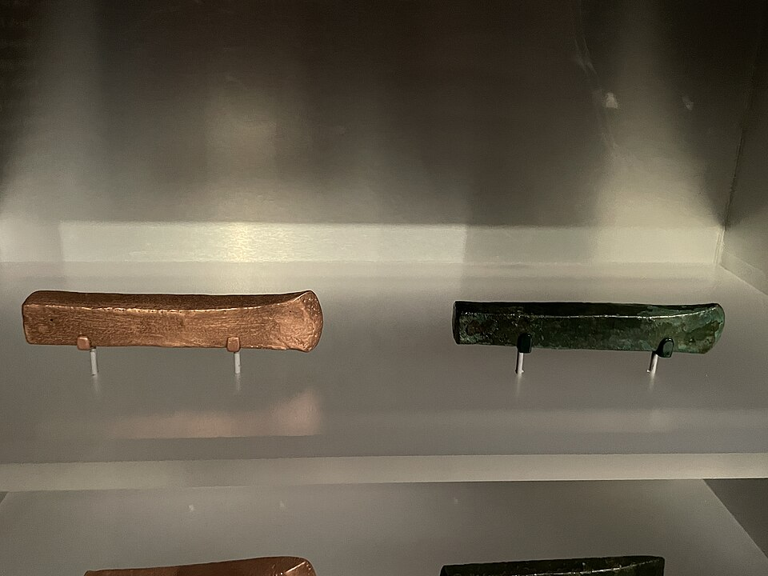
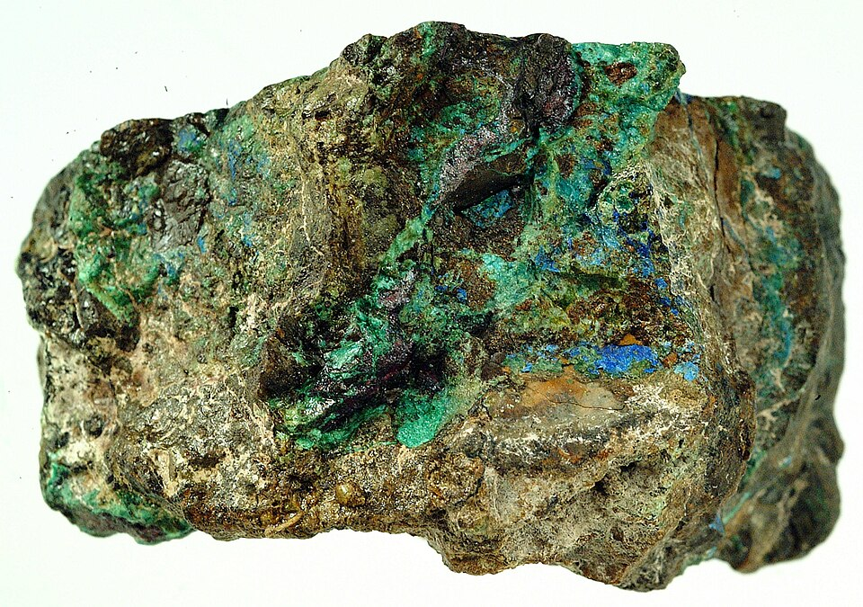

Some seven thousand years ago, in a village of the **[Vinča culture](kloom:e/vinca-culture)** at Belovode in eastern Serbia, people heated green stones in a fire and took metal out of them. What they left is almost nothing: a few crumbs of slag, each under a gram, which the excavators noticed only because some still held beads of [copper](kloom:e/copper) gone green. The crumbs spent fourteen years in a box at the **[National Museum of Serbia](kloom:e/national-museum-of-serbia)** in Belgrade labeled "copper minerals", because when they were dug up nobody knew what the first slag would look like. Analyzed and dated to about 5000 BC, they are the oldest securely dated evidence of **[smelting](kloom:e/smelting)** anywhere: turning an ore into a metal by fire and chemistry, rather than hammering metal that the ground gave up already made.

## Green stones

Copper sometimes lies in the ground as metal, and people had hammered that native copper for two thousand years before anyone smelted. The Vinča smelters did something new. They chose black-and-green stones streaked with **[malachite](kloom:e/malachite)**, and green, blue and violet minerals with little copper in them at all, which suggests that they were led by color rather than richness. The archaeologists **Miljana Radivojević** and Benjamin Roberts, in their 2021 review, trace the taste for those colors back to beads worn along the Danube around 6200 BC, and argue that smelting grew out of centuries of play with them, not out of one discovery.

## What the fire does

Malachite is a copper carbonate, Cu₂CO₃(OH)₂. Heat drives water and carbon dioxide out of it and leaves black copper oxide. Burning charcoal short of air makes carbon monoxide, and carbon monoxide takes the oxygen from the copper oxide and leaves the metal. By our arithmetic, from the atomic weights (copper 63.5, carbon 12, oxygen 16, hydrogen 1):

| Step                   | Reaction                        | From 100 g of pure malachite |
| ---------------------- | ------------------------------- | ---------------------------: |
| Roasting               | Cu₂CO₃(OH)₂ → 2 CuO + CO₂ + H₂O |         72 g of copper oxide |
| Charcoal, short of air | 2 C + O₂ → 2 CO                 |         the gas that does it |
| Reduction              | CuO + CO → Cu + CO₂             |               57 g of copper |

So at best a little over half the weight of pure malachite comes out as copper, and real ore, mixed with rock, gives much less. The second step is the hard one. It needs a fire rich in carbon monoxide, which means more charcoal than air, and hot enough to melt the slag away from the metal and let the copper, which melts at about 1,085 °C, run together.

Where the heat came from is disputed. Wikipedia's article on smelting gives the old idea that it was learned in pottery kilns, because an open fire falls about 200 °C short. But Vinča pots were fired below about 800 °C, and a 2020 study of them argues that what potters really mastered was the atmosphere of a fire, reducing or oxidizing, not its temperature. That, too, is what a smelter needs.

## A drummer and six blowpipes

No Vinča furnace survives. What survives are potsherds with slag stuck to them, which suggests a hole in the ground lined with broken pots, used once or a few times. In 2013 Radivojević's team built one at **[Pločnik](kloom:e/plocnik-archaeological-site)**, another Vinča site, in southern Serbia, and smelted local ore in it. It took half an hour to dig the hole and line it. Six people blew through six pipes with clay nozzles, relieved every fifteen or twenty minutes over a smelt of about an hour, while a seventh fed charcoal. They also needed a drummer: without one rhythm for the breath, the heat rose and fell and the copper was lost into the slag. Nine months later the furnace could barely be seen. A smelt gave tens to hundreds of grams of metal, and ore turns up in every house at Belovode and Pločnik, so the review argues that smelting was the work of whole households, not of a lone master smith.

## Everywhere at once?

Older claims for the first smelting have fallen. A "slag" from **[Çatalhöyük](kloom:e/catalhoyuk)** in Turkey, of about 6500 BC, turned out on reanalysis in 2017 to be a copper mineral, probably a green pigment laid in a burial, baked when the house burned. The nearest rival to Belovode is Tal-i Iblis in Iran, in the early fifth millennium BC, dated only by the layers around it. Smelting may have been found more than once, and the Balkan way of doing it, choosing ores by color, is its own. The same sites give the first known smelting of lead, a slag cake of about 5200 BC, which needed more than 1,100 °C.

Some Wikipedia articles give the first smelting as early as 5500 BC, from an axe found at Prokuplje in 2010; the excavators' own review gives about 5000 BC for the slags, and says the invention could lie anywhere in the centuries before.

The first thing fire pulled out of stone was metal. The next frame is color: on the shores of Crete and Phoenicia, dyers learned to pull a purple out of a sea snail.
