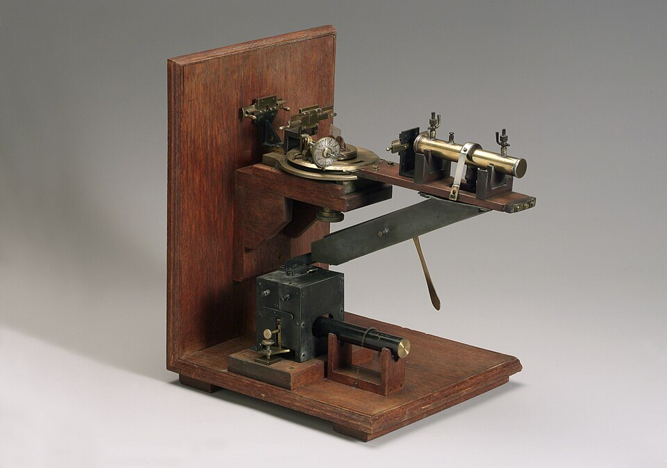
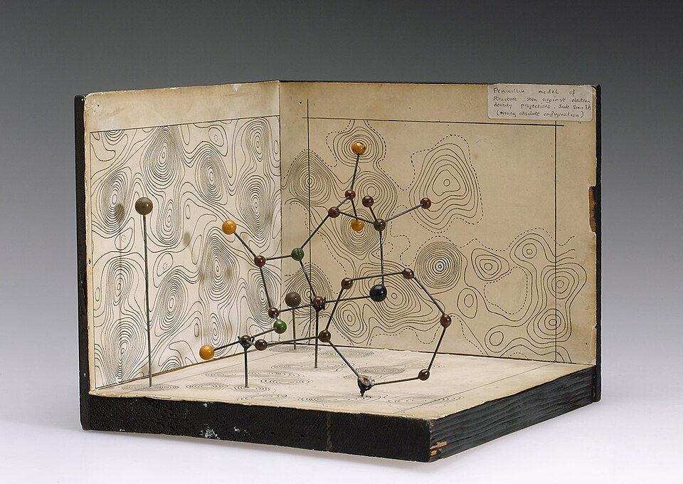

For a century chemists had written formulas for crystals without any way of seeing inside one. **[X-ray crystallography](kloom:e/x-ray-crystallography)** gave them one. In 1912 a physicist in Munich showed that a crystal scatters X-rays into a pattern of spots, and within a year a father and son in England had learned to read the pattern as a map of where the atoms sit. The first thing the map showed was that common salt holds no molecules at all. Forty years later the same method was working out the shapes of the molecules of life.

## Spots on a plate

Röntgen's X-rays, found in 1895, were still a puzzle: waves or particles? **[Max von Laue](kloom:e/max-von-laue)**, a young lecturer at Sommerfeld's institute in Munich, wondered in early 1912, after a talk with the student Paul Ewald about his thesis on crystals, whether rays with a wavelength near the spacing of the atoms would be diffracted by a crystal's regular rows, as light is by a grating. Many of his colleagues doubted it: the heat of the atoms, they argued, would smear any pattern away. Walter Friedrich and Paul Knipping tried it anyway. For their crystal they used a piece of copper sulphate, in Ewald's account "as it was found in the laboratory", fixed in wax in no particular orientation. The first plate, put in front of the crystal, showed nothing. The second, behind it, showed rings of spots around the direct beam. The work went to the Bavarian Academy on 8 June 1912, and it won von Laue the Nobel Prize in Physics in 1914.

## Planes of atoms

Von Laue explained his spots as several wavelengths at once. **[Lawrence Bragg](kloom:e/lawrence-bragg)**, a 22-year-old research student at Cambridge, saw a simpler reading: each spot is a reflection from one set of parallel planes of atoms, and the reflections add up only at particular angles. He put it to the Cambridge Philosophical Society on 11 November 1912. His father, **[William Henry Bragg](kloom:e/william-henry-bragg)**, professor of physics at Leeds, built a spectrometer to measure the reflections, with an ionisation chamber in place of a telescope, and in April 1913 the two stated the condition that is now **[Bragg's law](kloom:e/braggs-law)**: _n_λ = 2*d* sin θ. Here λ is the wavelength, _d_ the distance between the planes, θ the glancing angle and _n_ a whole number, the order of the reflection. The lower ray in the plate travels 2*d* sin θ further than the upper one; when that extra path is a whole number of wavelengths, the two reinforce.

## Salt without molecules

In a paper received by the Royal Society on 21 June 1913, the younger Bragg worked out the structure of **[sodium chloride](kloom:e/sodium-chloride)**. Its atoms lie on a cubic lattice, sodium and chlorine alternating along every row, "the sodium atom has six neighbouring chlorine atoms equally close with which it might pair off to form a molecule of NaCl". None is paired: the crystal is one continuous lattice. Bragg warned that his argument could not "pretend to be a complete proof". Wikipedia's article on crystallography dates the structure of salt to 1914, though the 1913 paper already gives it, and says the structure proved that ionic compounds exist. The Braggs shared the Nobel Prize in Physics in 1915. Lawrence, at 25, is still the youngest Nobel laureate in any science.

The measurement is easy to check. Salt's density is 2.17 g/cm³, and a cube of its lattice holds four NaCl units of 58.44 g/mol. By our arithmetic, that makes the cube 5.63 Å on a side, and the planes that hold alternate sodium and chlorine 2.82 Å apart. Copper's Kα X-rays have an energy of 8,047.78 eV, a wavelength of 1.5406 Å. Then:

| Step                        | Arithmetic                         | Result |
| --------------------------- | ---------------------------------- | ------ |
| Cube edge, from density     | ∛(4 × 58.44 / (6.022×10²³ × 2.17)) | 5.63 Å |
| Spacing of the (200) planes | half the edge                      | 2.82 Å |
| Bragg's law, first order    | sin θ = 1.5406 / (2 × 2.820)       | 0.2731 |
| Glancing angle              | θ                                  | 15.85° |

So a beam of copper X-rays reflects strongly off a salt crystal at 15.85°, and hardly at all a degree either side. The Braggs' own X-rays came from a platinum target, and they ran the argument the other way, from the atoms' mass to the wavelength.

Every crystal's symmetry belongs to one of 230 **space groups**, the ways a pattern can repeat in three dimensions, which Evgraf Fedorov and Arthur Schoenflies had counted in 1891. Each is a group in the mathematicians' sense: a set of moves, turns, reflections and slides, closed under doing one after another.

## Molecules of life

By the 1940s the method could map molecules no chemist had pinned down. **[Dorothy Hodgkin](kloom:e/dorothy-hodgkin)** grew crystals of **[penicillin](kloom:e/penicillin)** at Oxford from 3 milligrams of the sodium salt flown from the United States during the war, and in 1945, with Charles Bunn and Barbara Low, found its structure. It held a strained four-membered ring, the beta-lactam, which many chemists had doubted. The work was published in 1949. Vitamin B12 followed: two X-ray photographs taken overnight gave its molecular weight as about 1,500, and the full structure, published in 1955 and 1956, needed calculations that Kenneth Trueblood ran, as she told it in her Nobel lecture, on "a fast computer in California, free and for nothing". The work brought Hodgkin the Nobel Prize in Chemistry in 1964. Insulin, whose first photograph she had taken in 1934, fell to her team in 1969.

Salt showed that a crystal can be held together without molecules. What holds a molecule together was another question, and the next frame is G. N. Lewis's answer: a shared pair of electrons.
