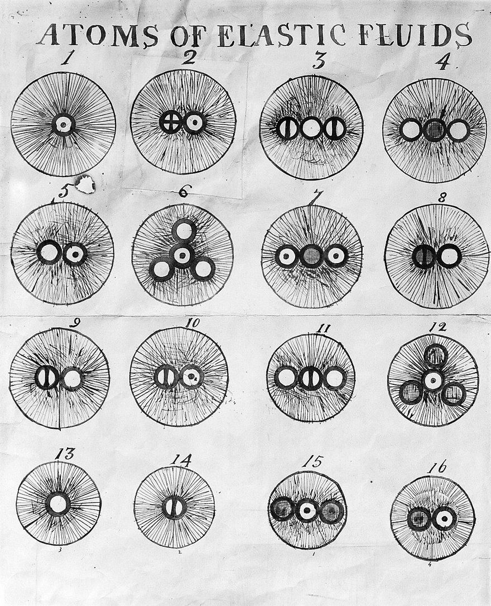

In 1808 a Quaker teacher in [Manchester](kloom:e/manchester) published the first part of a book that gave every chemical element an atom of its own weight. **[John Dalton](kloom:e/john-dalton)** was the son of a Cumberland weaver, and known chiefly for his weather diaries and for describing his own colour blindness to the **[Manchester Literary and Philosophical Society](kloom:e/manchester-literary-and-philosophical-society)**. His book, **_A New System of Chemical Philosophy_**, said that all the atoms of one element are alike and weigh the same, that the atoms of different elements differ in weight, and that chemistry only takes atoms apart and puts them together: "No new creation or destruction of matter is within the reach of chemical agency." The atoms were old; the Greeks had argued over them. What was new was the weighing.

## Circles with weights

Dalton drew each element as a small circle with a mark of its own: a dot for hydrogen, a bar for azote (nitrogen), a solid disc for carbon, an empty circle for oxygen. Compounds were circles set side by side. The plate that closes the 1808 volume lists twenty elements with their weights, hydrogen being 1: azote 5, carbon 5, oxygen 7, sulphur 13, silver 100.

No one could count the atoms in a compound, so Dalton made rules. If two elements form only one compound, "it must be presumed to be a binary one", one atom of each. Water was the only known compound of hydrogen and oxygen, so water was HO. Dalton took water to be about seven parts of oxygen to one of hydrogen by weight, so oxygen was 7 and "an atom of water or steam" was 8. Water is H₂O, and with the right analysis, eight parts of oxygen to one of hydrogen, oxygen weighs 16. A guessed formula made a wrong weight, and a wrong weight made more wrong formulas; chemists did not agree on them for half a century.

## Two, three, four

The atoms made one prediction that could be checked. If a compound is made of whole atoms, then when two elements form several compounds, the weights of one that join a fixed weight of the other must stand in small whole ratios. That is the **[law of multiple proportions](kloom:e/law-of-multiple-proportions)**. The second part of the _New System_, printed in 1810, tested it on the oxides of nitrogen, using the analyses of **[Humphry Davy](kloom:e/humphry-davy)**, who, as Dalton pointed out, held no views like his and so could not have bent them to fit. By our arithmetic, from the figures in Dalton's table:

| Dalton's name | Today       | Azote : oxygen by weight | Oxygen per 100 azote | Ratio |
| ------------- | ----------- | -----------------------: | -------------------: | ----: |
| nitrous oxide | N₂O         |              63.5 : 36.5 |                 57.5 |     1 |
| nitrous gas   | NO          |              46.6 : 53.4 |                114.6 |  1.99 |
| nitric acid   | NO₂ (a gas) |              29.5 : 70.5 |                239.0 |  4.16 |

One, two and four, near enough, although the three numbers came from three separate experiments. With today's atomic weights the oxygen is 57.1, 114.2 and 228.4. Dalton wrote that "the theory does not differ more from the experiments than they differ from one another". The plate draws the three compounds as he drew them, and the weights of oxygen against a fixed azote.

## Volumes

In Paris the same gases told a different story. **[Joseph Louis Gay-Lussac](kloom:e/joseph-louis-gay-lussac)**, who with Alexander von Humboldt had found water to be exactly 100 volumes of oxygen to 200 of hydrogen, announced at the end of 1808 that gases always combine in simple ratios by volume: 100 of nitrogen with 50 of oxygen to make nitrous oxide, with 100 to make nitrous gas. His memoir was printed in 1809. Dalton answered in the appendix to his second part that Gay-Lussac's "notion of measures is analogous to mine of atoms", and that the two would be the same if all gases held the same number of atoms in the same volume. He had tried that idea and given it up, and did "not doubt but he will soon see its inadequacy".

In 1811 **[Amedeo Avogadro](kloom:e/amedeo-avogadro)**, a teacher of physics at Vercelli in Piedmont, took the step Dalton refused. Equal volumes of gases, he supposed, hold equal numbers of molecules, and the molecule of an element may be more than one atom. Two volumes of hydrogen and one of oxygen then make water with two hydrogens to each oxygen, and the densities of the gases give oxygen about 15 times hydrogen's weight. Almost nobody took it up for fifty years; how it was rescued is the frame on the Karlsruhe congress.

## Where the atoms came from

How Dalton reached his atoms is disputed. Henry Roscoe and Arthur Harden, reading his notebooks in 1896, argued that they grew from physics, from his puzzling over why water dissolves some gases more than others: a paper he read in October 1803, printed in 1805, ends with the first table of atomic weights, and his lecture diagrams show atoms wrapped in atmospheres of heat. The historian Mark Grossman, rereading the notebooks in 2021, argues instead that Dalton built the chemical theory in 1803 to reconcile Henry Cavendish's and Antoine Lavoisier's analyses of nitric acid. Wikipedia gives both.

Dalton's atoms stayed a hypothesis for a century: many chemists used his weights and doubted the atoms. The counting of grains in Brownian motion ended the doubt. Twenty years after the _New System_, in Berlin, a chemist made one substance out of the atoms of another: the next frame.
