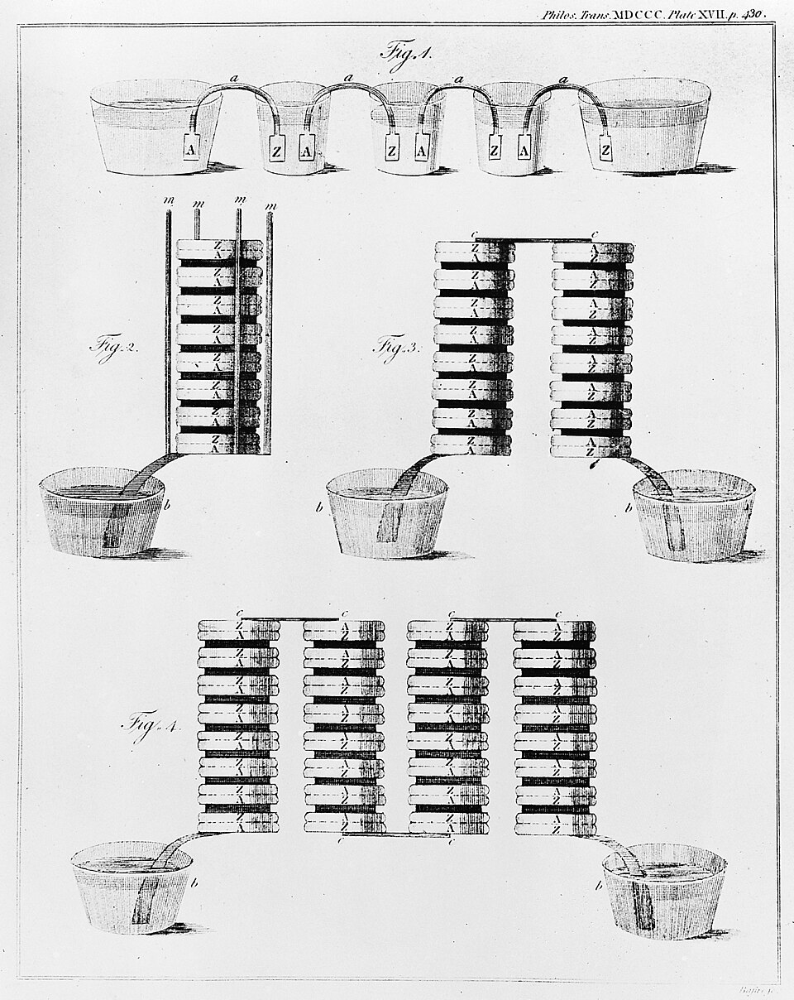
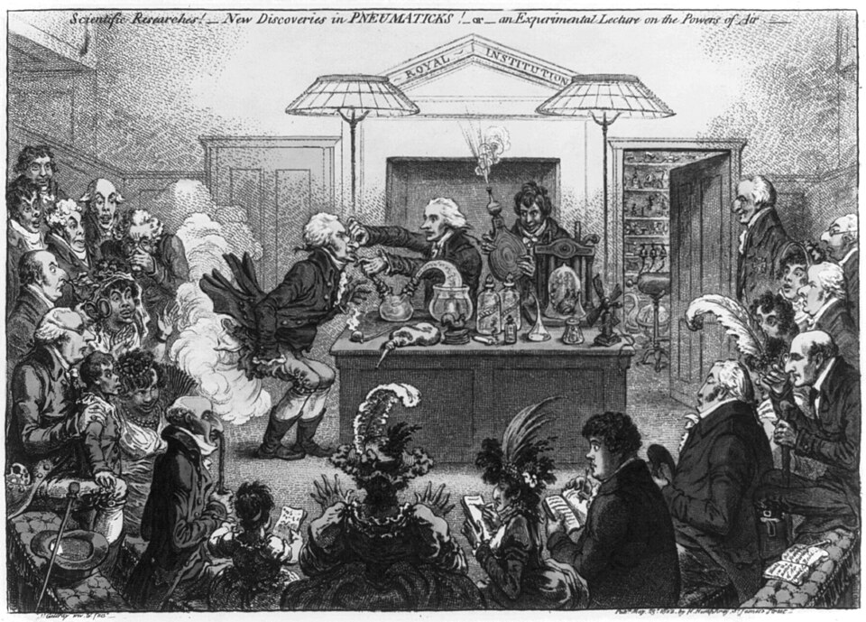

In October 1807, in the laboratory of the **[Royal Institution](kloom:e/royal-institution)** in London, **[Humphry Davy](kloom:e/humphry-davy)** set a small piece of potash on a disc of platinum, wired the disc to one end of the largest battery he could assemble, and touched the top of the lump with a platinum wire from the other end. The potash melted where the current entered it. At the top it fizzed. At the bottom, he wrote, "small globules having a high metallic lustre, and being precisely similar in visible characters to quicksilver, appeared, some of which burnt with explosion and bright flame". He had pulled a metal out of plant ash. He named it **[potassium](kloom:e/potassium)**.

## A pile of discs

The battery was seven years old as an idea. On 20 March 1800, at Como, **[Alessandro Volta](kloom:e/alessandro-volta)** wrote to Sir Joseph Banks in London describing an instrument that gave a shock like a charged Leyden jar, but never ran down: thirty, forty or sixty discs of copper or, better, silver, each laid on a disc of zinc, with a layer of water or brine between each pair and the next. The letter, in French, was read to the Royal Society on 26 June. By then word of it had reached **William Nicholson** and **Anthony Carlisle** in London, and in May they had built a pile, dipped its wires into water and watched it come apart into hydrogen and oxygen, a gas at each wire. Chemistry had a new way to break things.

The **[voltaic pile](kloom:e/voltaic-pile)** was the tool; the question was what it would take apart. Lavoisier had left potash and soda off his table of simple substances as "evidently compound", but no chemist had broken either.

## The lecturer

Davy came to the Royal Institution in 1801 at twenty-two, from a Bristol clinic where he had breathed nitrous oxide and made his name. His lectures filled the theatre on Albemarle Street, nearly five hundred people by June of his first year, and Coleridge said he went to them to enlarge his stock of metaphors. In 1806, in a lecture to the Royal Society, he argued that chemical attraction was electrical, and that a current was the likeliest means of taking any compound back to its elements. France, then at war with Britain, gave him Napoleon's prize for it.

James Gillray drew the Royal Institution's lectures in 1802, with the young Davy at the bellows. The Library of Congress names the lecturer, with a question mark, as Thomas Young; Wikipedia names him Thomas Garnett.

## Potash, then soda

The alkalies did not come easily. Davy's paper of 1808 tells it. A strong solution of potash, under the full battery, gave only hydrogen and oxygen: the water took the current. Potash melted over a lamp in a platinum spoon gave "a most intense light" and flames at the wire, but nothing he could collect. What worked was dry potash left a few seconds in the air, just damp enough on its surface to conduct, so that the current itself melted it and split it. The battery that did it had 250 pairs of copper and zinc plates, six and four inches square. **[Sodium](kloom:e/sodium)** came from soda a few days later, and needed thinner pieces and more power. When he first saw the globules, his brother John wrote, on the word of Edmund Davy, a relative who assisted him, Davy "danced about the room in ecstatic delight".

When is disputed. Davy gave 6 October 1807; his biographer John Ayrton Paris read the laboratory register and put the first success on 19 October. Wikipedia says he electrolysed "molten" potash and soda; his own paper says he could not get the metal that way.

In modern terms the potash is potassium hydroxide, K⁺ and OH⁻ ions. At the platinum disc, the negative pole, each potassium ion takes an electron; at the wire, the hydroxide gives electrons up and fizzes off as oxygen:

| Where         | Reaction                           | For each gram of potassium, by our arithmetic   |
| ------------- | ---------------------------------- | ----------------------------------------------- |
| Negative disc | K⁺ + e⁻ → K                        | 1 gram of metal                                 |
| Positive wire | 4 OH⁻ → O₂ + 2 H₂O + 4 e⁻          | 0.2 gram of oxygen, about 150 millilitres       |
| The circuit   | one electron per atom of potassium | about 2,470 coulombs: one ampere for 41 minutes |

The arithmetic uses the modern charge on a mole of electrons, 96,485 coulombs, and potassium's atomic weight of 39.1. Sodium, whose atoms are lighter, needs about 4,200 coulombs a gram. Why the charge follows the atoms so exactly is Faraday's to find.

## Earths, and an assistant

In 1808 Davy turned on the earths Lavoisier had suspected. He struggled until June, when **[Jöns Jacob Berzelius](kloom:e/jons-jacob-berzelius)** wrote from Stockholm that he and Magnus Pontin had decomposed lime and barytes with a pool of mercury as the negative pole. Davy used the trick at once, on a battery of 500 pairs, and distilled the mercury off the amalgams. On 30 June 1808 he named barium, strontium, calcium and "magnium", which became magnesium, though he admitted he could never be sure that no mercury was left in them. (Wikipedia's article on the pile gives him a battery of 2,000 pairs for this; his paper says 500.)

In 1812 a bookbinder's apprentice, **[Michael Faraday](kloom:e/michael-faraday)**, heard Davy lecture and sent him his notes, bound. On 1 March 1813 Faraday became chemical assistant at the Royal Institution. What he made of electrolysis is this subject's frame on Faraday's laws; his induction ring of 1831 belongs to the history of the West.
