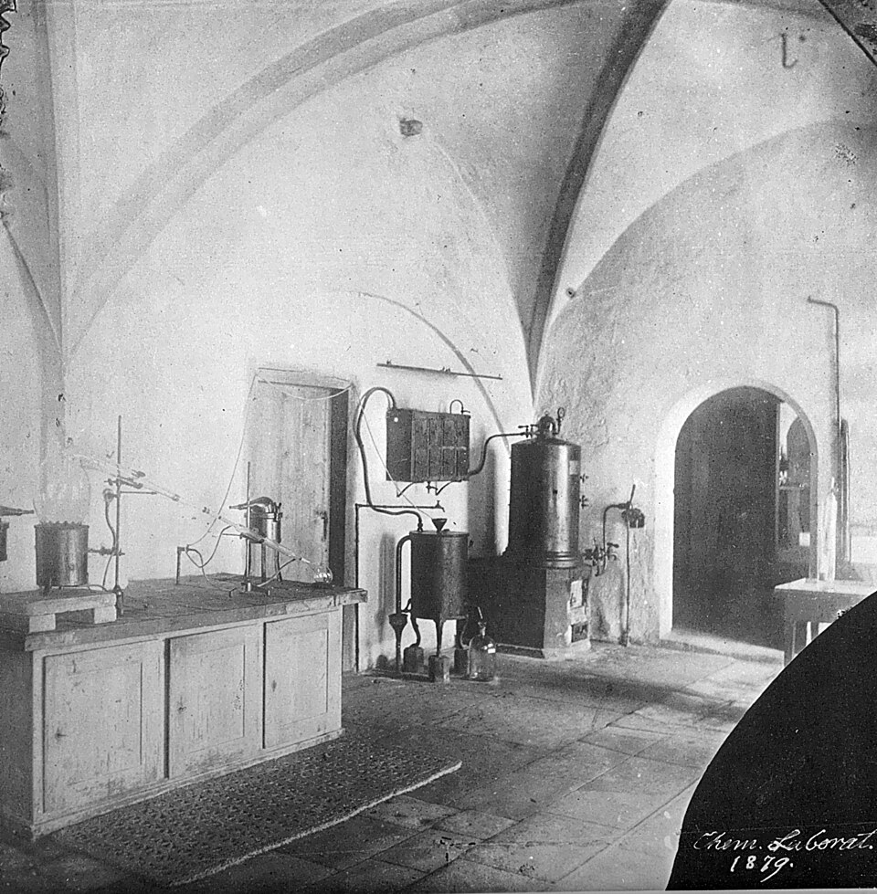

In the winter of 1868–69 a young Swiss doctor, **[Friedrich Miescher](kloom:e/friedrich-miescher)**, was washing pus off surgical bandages in the old kitchen of Tübingen castle, which served as **Felix Hoppe-Seyler**'s laboratory. He wanted the chemistry of the cell nucleus, and white blood cells from the nearby hospital's bandages were the purest cells he could get in quantity. He freed their nuclei, dissolved them in alkali and threw them down again with acid, and got a substance unlike any protein: rich in phosphorus, acidic, and made in large molecules. He called it _nuclein_. Hoppe-Seyler made two other students repeat the work before he printed it, and it appeared only in 1871. Nuclein was **[DNA](kloom:e/dna)**, and for seventy-five years afterwards chemists took it apart without believing it mattered.

Miescher himself guessed that heredity was written in molecules, "as the words and terms of all languages" are written in an alphabet, the historian Ralf Dahm quotes him from 1892. But he looked for the alphabet in the asymmetric carbon atoms of proteins, not in his own nuclein.

## A dull molecule

**[Albrecht Kossel](kloom:e/albrecht-kossel)**, another of Hoppe-Seyler's students, broke nuclein into its parts. Between 1885 and 1901 he and his colleagues isolated the bases that nucleic acids carry: adenine, guanine, cytosine and thymine, and uracil, which RNA carries in place of thymine. He won the Nobel Prize in Physiology or Medicine in 1910.

At the Rockefeller Institute in New York, **[Phoebus Levene](kloom:e/phoebus-levene)** found the sugar, deoxyribose, in 1929, and showed that the parts are joined as phosphate, sugar and base, a unit he called a _nucleotide_, strung together through the phosphates. He also proposed, from around 1910, the **[tetranucleotide hypothesis](kloom:e/tetranucleotide-hypothesis)**: that DNA holds the four bases in equal amounts, perhaps as one repeating unit of four. A molecule that says A, G, C, T over and over says nothing, and Levene himself thought DNA far too simple to carry genes. Genes, most biologists agreed, were proteins.

## The transforming principle

In February 1944 **[Oswald Avery](kloom:e/oswald-avery)**, Colin MacLeod and Maclyn McCarty, also at the Rockefeller Institute, reported that a substance from dead pneumococci of Type III turned live, harmless bacteria of Type II into Type III, and that their descendants stayed that way. They purified the substance and weighed its elements. Its ratio of nitrogen to phosphorus averaged 1.67, against 1.69 calculated for sodium deoxyribonucleate. Protein, which holds nitrogen and almost no phosphorus, would have pushed that ratio up. Enzymes that digest protein or RNA left the activity alone; an enzyme preparation that breaks down DNA destroyed it, and three thousandths of a microgram still worked. The theory they calculated against, though, was the tetranucleotide's. The paper claimed only that the active substance was DNA "within the limits of the methods", and many readers went on suspecting a trace of protein.

## Chargaff's ratios

**[Erwin Chargaff](kloom:e/erwin-chargaff)**, a biochemist at **[Columbia University](kloom:e/columbia-university)**, read Avery's paper as a challenge: if DNA carries heredity, DNA from different species should differ. His laboratory hydrolysed DNA, separated the bases on strips of filter paper and measured each by its ultraviolet absorption, from two or three milligrams. In June 1950 he summed up in _Experientia_, giving each base in moles per mole of phosphorus. Four of his preparations, with our arithmetic in the last three columns:

| DNA                            | A    | T    | G    | C    | A/T  | G/C  | (A + T)/(G + C) |
| ------------------------------ | ---- | ---- | ---- | ---- | ---- | ---- | --------------: |
| Human sperm                    | 0.29 | 0.31 | 0.18 | 0.18 | 0.94 | 1.00 |            1.67 |
| Yeast                          | 0.24 | 0.25 | 0.14 | 0.13 | 0.96 | 1.08 |            1.81 |
| Avian tubercle bacilli         | 0.12 | 0.11 | 0.28 | 0.26 | 1.09 | 1.08 |            0.43 |
| Ox thymus                      | 0.26 | 0.25 | 0.21 | 0.16 | 1.04 | 1.31 |            1.38 |
| Tetranucleotide, if it were so | 0.25 | 0.25 | 0.25 | 0.25 | 1    | 1    |               1 |

Read down the last column and the tetranucleotide dies: human DNA has two parts of A and T to one of G and C, and the tubercle bacillus has the reverse. DNA differs from species to species, as a carrier of genes must. Read across and something else holds whatever the species: A comes close to T, and G to C.

Chargaff noticed. The ratios of A to T and G to C "were not far from 1", he wrote, and whether "this is more than accidental, cannot yet be said". He had reason to hedge: his ox thymus gives 1.31 for G to C, because his cytosine figures ran low. He had also written, on his first page, that words such as "template" would not be found in his lecture.

The two ratios point to pairs. If every A in DNA stands opposite a T and every G opposite a C, the amounts must match base for base, while the order along a strand, and so the proportions, stay free. That is the reading that Watson and Crick's double helix gave them in 1953, and the next frame is the other chain in the cell: the protein.
