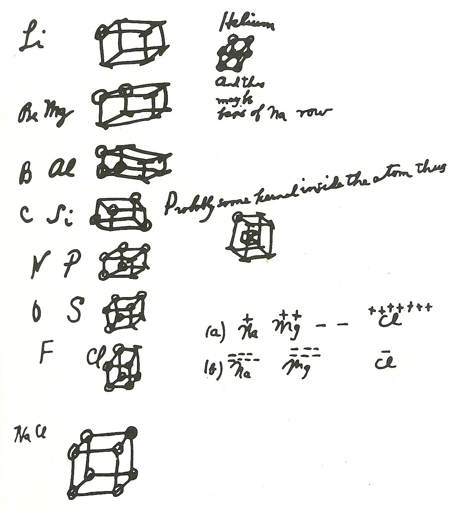

Chemists drew a bond as a line between two atoms, and nobody could say what the line was. In 1916 **[Gilbert N. Lewis](kloom:e/gilbert-n-lewis)**, dean of the College of Chemistry at Berkeley, said: it is a pair of [electrons](kloom:e/electron) that the two atoms hold in common. The idea is so much a part of chemistry now that it is hard to see it as an idea at all. Every student who draws dots round an atom is drawing Lewis's picture, and quantum mechanics, when it came, did not overturn it but explained it.

## Cubes in a lecture

Lewis dated the picture to a memorandum of 28 March 1902, when, trying to explain valence to his students at Harvard, he drew atoms as cubes with an electron at each corner. The **[cubical atom](kloom:e/cubical-atom)** explained the rows of eight in the periodic table. Lithium had one corner filled, carbon four, chlorine seven, and an atom became stable when its cube was full, as the noble gases' are. The electron itself was then five years old, found by J. J. Thomson in 1897, and Lewis built on it: in his paper his atom has a _kernel_, which chemistry leaves unchanged, and a _shell_ of outer electrons, which he said correspond roughly to the inner and outer rings of the Thomson atom.

## The Atom and the Molecule

He published it in the _Journal of the American Chemical Society_ in April 1916, as "The Atom and the Molecule". An atom tends to hold "an even number of electrons in the shell and especially to hold eight". Two shells can interpenetrate, so that an electron "may form a part of the shell of two different atoms and cannot be said to belong to either one exclusively". Two chlorine atoms, each with seven, share one pair and each has eight: two cubes with an edge in common, as the plate draws them. Lewis wrote it with a colon, Cl : Cl, and said the two dots do what the old line did. That made a **[covalent bond](kloom:e/covalent-bond)**, although the word was not yet his, and it made the ionic bond, sodium's electron handed over whole to chlorine, the far end of the same scale rather than a different kind of thing. In Germany Walther Kossel published a theory of the ionic bond the same year.

The cube had a flaw Lewis saw himself: two cubes can share a corner or an edge but not three edges, so it could not draw a triple bond. In the same paper he let the electrons of each pair draw together, turning the eight corners into four pairs at the corners of a tetrahedron, the tetrahedral carbon of the organic chemists.

## Counting to eight

A **[Lewis structure](kloom:e/lewis-structure)** comes from counting. Add up the outer electrons of every atom. Then add up how many the molecule would need if no atom shared: eight for each atom but hydrogen, whose rule is two, as Lewis noted. The difference is the number of electrons held in common, and half of it is the number of bonds. By our arithmetic:

| Molecule | Outer electrons | Needed alone   | Shared | Bonds         | Lone pairs  |
| -------- | --------------: | -------------- | -----: | ------------- | ----------- |
| H₂O      |   6 + 1 + 1 = 8 | 8 + 2 + 2 = 12 |      4 | 2 single      | 2 on O      |
| NH₃      |           5 + 3 | 8 + 3 × 2 = 14 |      6 | 3 single      | 1 on N      |
| CO₂      |       4 + 6 + 6 | 8 × 3 = 24     |      8 | 2 double, C=O | 2 on each O |
| NO       |      5 + 6 = 11 | 16             |    odd | none fits     | —           |

The last row is the exception, and Lewis named it himself: a molecule with an odd number of electrons cannot pair them all. He called nitric oxide and its kind "odd molecules", holding one unpaired electron. They are what chemists now call free radicals.

## Langmuir's octet, Lewis's missing prize

**[Irving Langmuir](kloom:e/irving-langmuir)**, a chemist at General Electric, took up the theory in 1919 in a long paper that spoke of _octets_ and gave the word **covalence** to "the number of pairs of electrons that a given atom shares with its neighbors". The two fell into a dispute over priority. Wikipedia's article on Langmuir puts it that his skill as a presenter did most to popularize the theory, and that the credit for the theory itself "belongs mostly to Lewis". The rule of eight became the **[octet rule](kloom:e/octet-rule)**.

The Nobel Committee's archive lists Lewis as nominated 41 times for the chemistry prize, from 1922 to 1946, once, in 1933, by Langmuir, who had won it himself in 1932 for surface chemistry. Lewis never won. On 23 March 1946 he was found dead in his laboratory, where he had been working with hydrogen cyanide. The coroner ruled that he died of heart disease; some colleagues believed it was suicide, and Michael Kasha recalled years later that Lewis had lunched with Langmuir that day and came back in a dark mood. Which is true is not known.

Lewis's pair was a rule without a reason. Why two electrons, of opposite spin, should hold two atoms together was a question for the new quantum mechanics, and the next frame is its answer, worked first for the hydrogen molecule in 1927.
