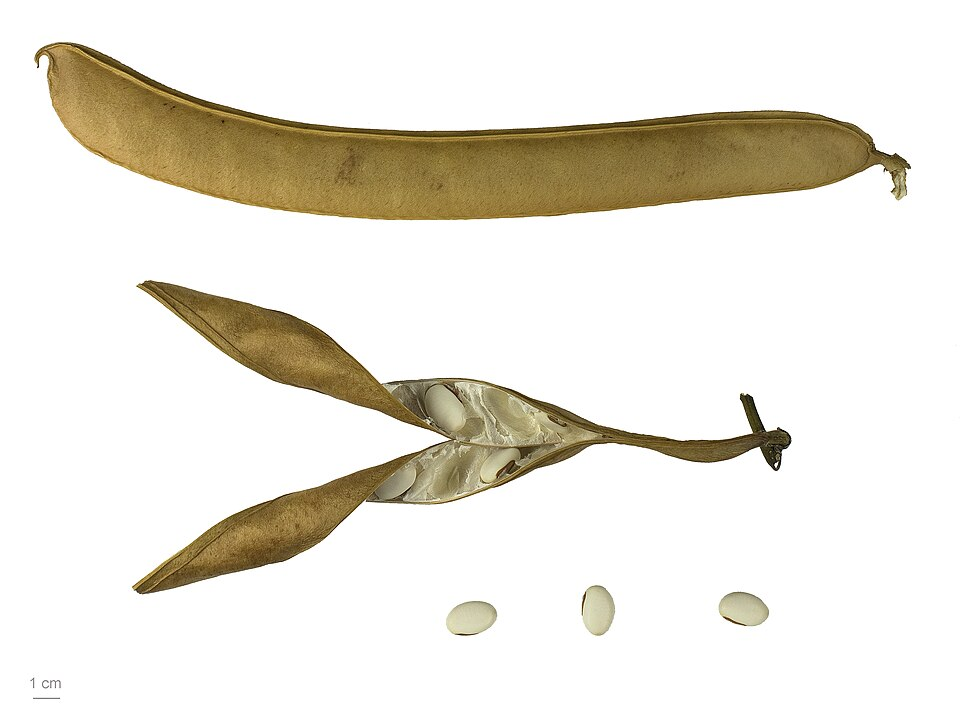

For most of the nineteenth century the most persuasive answer was that fermentation needs life. **[Louis Pasteur](kloom:e/louis-pasteur)** spent a decade showing that no sugar ferments without living yeast, and he wrote that alcoholic fermentation is "an act correlated with the life and organization of the yeast cells". The great chemists had jeered at the idea: in 1839 Liebig and Wöhler published a satire of yeast creatures that swallowed sugar and excreted alcohol. Wöhler had made urea in his laboratory in 1828, a substance thought to need a living body, and to Liebig fermentation was chemistry too. Pasteur's experiments beat their theories, but not even Pasteur could find what inside the yeast did the work. In 1877 the physiologist Wilhelm Kühne gave the unknown agents a name, **[enzymes](kloom:e/enzyme)**, from the Greek for "in yeast".

## Juice without cells

At the Hygiene Institute in Munich, where his brother Hans was a bacteriologist, the chemist **[Eduard Buchner](kloom:e/eduard-buchner)** broke the yeast open. His paper of 1897 gives the recipe: a kilogram of brewer's yeast, rubbed with the same weight of quartz sand and 250 grams of kieselguhr until the mass turned moist and plastic, then wrapped in a cloth and squeezed in a hydraulic press at 400 to 500 atmospheres. Out came half a liter of yellow juice. Mixed with a strong solution of cane sugar, it began within an hour to give off carbon dioxide, for days. It still did so after it had been passed through a filter that held back every yeast cell, and after it had been saturated with chloroform. Buchner called the active substance zymase and wrote that it was "doubtless a protein". His Nobel lecture of 1907 gives a different pressure, 90 kilograms per square centimeter, about 87 atmospheres. We cannot tell which figure is right.

Buchner won the Nobel Prize in Chemistry in 1907. Some historians have argued that Antoine Béchamp got there in 1857, but what Béchamp's cell-free extract did was split cane sugar, not ferment it.

## The arithmetic of beer

Lavoisier had shown that sugar ferments to alcohol and carbon dioxide, and Gay-Lussac that their weights add up to the sugar's. Buchner's juice made them in the same proportions as living yeast. By our arithmetic, from the atomic weights:

C₆H₁₂O₆ → 2 C₂H₅OH + 2 CO₂

| Substance      | Formula  | Grams, from one mole of glucose |
| -------------- | -------- | ------------------------------: |
| glucose        | C₆H₁₂O₆  |                          180.16 |
| ethanol        | 2 C₂H₅OH |                           92.14 |
| carbon dioxide | 2 CO₂    |                           88.02 |

So a little over half of a sugar's weight becomes alcohol, and the rest leaves as gas: 51 to 49. Zymase proved to be not one enzyme but a complex of them; in 1905 Arthur Harden split it into two parts, and it took decades to learn every step between the sugar and the alcohol.

## Are enzymes proteins?

In the 1920s the leading school said no. **[Richard Willstätter](kloom:e/richard-willstatter)**'s school in Munich held that enzymes were neither fats, sugars nor proteins, and that they were present in amounts too small to find. At Cornell, **[James B. Sumner](kloom:e/james-b-sumner)**, who had lost his left arm in a hunting accident at seventeen, set out in 1917 to isolate one anyway. He chose urease, which splits urea, because the jack bean was rich in it. In 1926 he extracted jack-bean meal with dilute acetone, left the extract in the laboratory's new ice chest overnight, and found tiny crystals under the microscope, crystals of a protein with enormous urease activity. He telephoned his wife: "I have crystallized the first enzyme."

Few believed him. **[John Howard Northrop](kloom:e/john-howard-northrop)** at the Rockefeller Institute crystallized pepsin, the stomach's protein-cutting enzyme, in 1930, by his own account (Wikipedia's articles on Sumner and on Northrop say 1929), and then trypsin and more. By 1946 some twenty enzymes had been crystallized, and every one was a protein. Sumner and Northrop shared the Nobel Prize in Chemistry for 1946 with Wendell Stanley.

## How fast

What an enzyme is came late. How it behaves was worked out first. In 1913, in Berlin, **[Leonor Michaelis](kloom:e/leonor-michaelis)** and **[Maud Menten](kloom:e/maud-menten)**, a Canadian physician, followed the enzyme invertase splitting cane sugar by the change in how the solution turned polarized light. They argued that the enzyme holds its sugar in a complex for a moment, and that the rate is proportional to how much of the enzyme is so occupied. That gives the Michaelis–Menten equation, rate = maximum × [S] / ([S] + K), where K is the sugar concentration at which the enzyme works at half speed. For invertase they found K = 16.7 millimolar. Their five experiments began at the concentrations in the table, and the rate the equation gives for each, by our arithmetic, shows the enzyme filling up:

| Sucrose, mM | Rate, as a fraction of the maximum |
| ----------: | ---------------------------------: |
|        20.8 |                               0.55 |
|        41.6 |                               0.71 |
|        83.3 |                               0.83 |
|       166.7 |                               0.91 |
|       333.0 |                               0.95 |

Doubling the sugar never doubles the rate, and at high sugar it barely helps: every enzyme molecule is busy. The plate draws the curve as Michaelis and Menten drew it, against the logarithm of the sugar concentration, with the tangent of slope 0.576 at half speed that they used to find K without knowing the maximum. A reanalysis of their tables by Kenneth Johnson and Roger Goody in 2011 found that they had also fitted all their time courses at once, what the reanalysts call the first global analysis of such data.

The enzymes are proteins. The next frame is the molecule whose sequence tells a cell which proteins to make: DNA.
