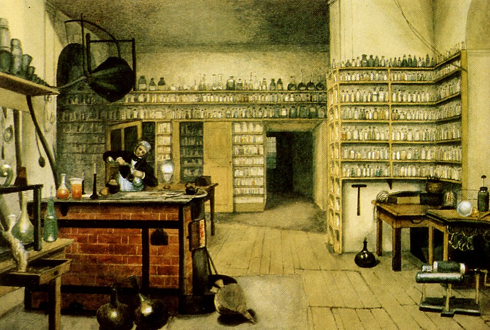

In January 1834 **[Michael Faraday](kloom:e/michael-faraday)** sent the Royal Society the seventh series of his _Experimental Researches in Electricity_. It said that electricity could be measured by the chemistry it does, and that a given quantity of it always does the same amount. Pass one current through water, molten tin chloride and molten lead chloride, and the weights of hydrogen, tin and lead set free stand to each other as the weights that combine in ordinary chemistry. These are **[Faraday's laws of electrolysis](kloom:e/faradays-laws-of-electrolysis)**. The first, that "the chemical power of a current of electricity is in direct proportion to the absolute quantity of electricity which passes", he had put forward in 1833; the seventh series proved the second, which he called _definite electro-chemical action_. The frame on Davy's electrolysis tells how the voltaic pile first tore compounds apart; the frame on his induction ring, in the History of Western Civilization, tells what Faraday had found at the **[Royal Institution](kloom:e/royal-institution)** three years before.

## New names

Faraday thought that the old words carried a wrong picture. "Poles" suggested points that attract, and he believed that the force lay in the liquid, not at its ends. He wanted names "without involving more theory than I could help", he wrote to **[William Whewell](kloom:e/william-whewell)** in Cambridge on 24 April 1834. A friend, Dr Nicholl, had already given him _electrode_ and _electrolyte_, which Faraday kept. For the two surfaces where the current entered and left, Nicholl had offered _eisode_ and _exode_, and Faraday was not satisfied. Whewell proposed _anode_ and _cathode_, the way up and the way down, and when Faraday offered "voltode" and "galvanode" instead he pressed them again, adding _anion_ and _cation_ for what travels to each, and _ions_ for both, in place of Faraday's _zetodes_. "I have taken your advice", Faraday wrote on 15 May. There had been "hot objections" at the Institution, "but when I held up the shield of your authority it was wonderful to observe how the tone of objection melted away." The paper had been read under the old words; it was printed under the new, with a note that he had changed them.

## Tin against water

To measure a current's quantity Faraday built a _volta-electrometer_: a tube in which the current split acidulated water, and whose gas measured how much electricity had passed. Then he put it in series with other cells. In one experiment a current decomposed molten tin chloride, and a platinum wire that weighed 20 grains came out weighing 23.2. The same current made 3.85 cubic inches of mixed hydrogen and oxygen, which he reckoned at 0.497 grains of water. His arithmetic, with water's equivalent as 9:

> 0.49742 : 3.2 :: 9 : 57.9

The chemists' equivalent for tin was 58, or 57.9. Four runs averaged 58.53; by our arithmetic from today's atomic weights, on his scale, tin's is 59.3. The electricity that sets free 9 parts of water sets free one equivalent of tin, and of every other ion. As he put it, "the equivalent weights of bodies are simply those quantities of them which contain equal quantities of electricity".

## A mole of silver

That constant quantity is now called the **[Faraday constant](kloom:e/faraday-constant)**: 96,485.332 coulombs, the charge of a mole of electrons. [Silver](kloom:e/silver), whose ion is Ag⁺, needs one electron for each atom it lays down, so 96,485 coulombs deposit one mole of it, 107.87 grams. By our arithmetic:

| Current and time     | Charge    | Moles of silver | Silver deposited |
| -------------------- | --------- | --------------: | ---------------: |
| 1 ampere, 1 second   | 1 coulomb |      0.00001036 |         1.118 mg |
| 1 ampere, 1 hour     | 3,600 C   |         0.03731 |          4.025 g |
| 26.8 amperes, 1 hour | 96,485 C  |               1 |         107.87 g |

The first line was once a definition: the "international ampere" was the current that deposits 0.001118 grams of silver a second from silver nitrate. Weighing silver, deposited or dissolved, was until about 1970 the most reliable way to find the constant. Since 2019 it has been exact, the product of two constants the SI fixes, the Avogadro constant and the elementary charge, and the plate draws the cell and the straight line of mass against charge.

## Atoms of electricity

Faraday would not go further. "I must confess I am jealous of the term _atom_," he wrote, though "if we adopt the atomic theory", equivalent atoms "have equal quantities of electricity naturally associated with them". In 1874 the Irish physicist **[George Johnstone Stoney](kloom:e/george-johnstone-stoney)** used the laws to estimate that single quantity, the charge of one ion, and in 1891 named it the _electron_. On 5 April 1881 **[Hermann von Helmholtz](kloom:e/hermann-von-helmholtz)**, giving the Chemical Society's Faraday Lecture in the Royal Institution's theatre, said it plainly: if elements are made of atoms, "we can not avoid concluding that electricity also, positive as well as negative, is divided into definite elementary portions, which behave like atoms of electricity." Sixteen years later J. J. Thomson found the particle, and set its ratio of mass to charge beside the hydrogen ion's from electrolysis, a thousand times larger.

The next frame returns to isomers, and to shape: Pasteur's mirror-image crystals of tartaric acid.
