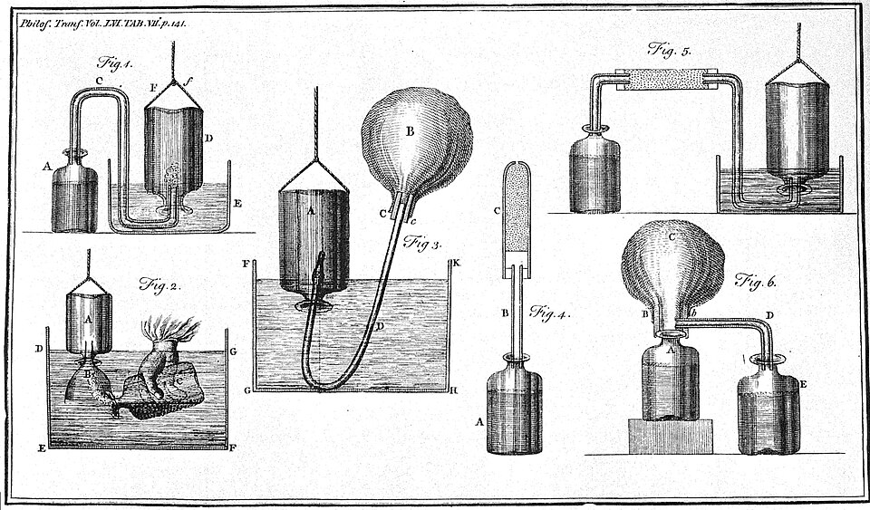

In June 1755 a young Edinburgh physician read a paper to a society in the city about a white powder sold as a mild laxative. **[Joseph Black](kloom:e/joseph-black)**, born in Bordeaux in 1728 to a family in the wine trade, had taken his medical degree at the **[University of Edinburgh](kloom:e/university-of-edinburgh)** the year before with a thesis on **[_magnesia alba_](kloom:e/magnesium-carbonate)**. He had hoped, he wrote, to find "a new sort of lime and lime-water, which might possibly be a more powerful solvent of the stone than that commonly used", and "was disappointed". What he found instead was a gas that could hide inside a solid, and a way to prove it with a balance. The paper, _Experiments upon Magnesia Alba, Quicklime, and some other Alcaline Substances_, was printed in 1756.

## A powder that lost weight

Black made his magnesia alba from Epsom salt and potash, and then heated it. "An ounce of magnesia was exposed in a crucible for about an hour to such a heat as is sufficient to melt copper. When taken out, it weighed three drams and one scruple, or had lost 7/12 of its former weight." The powder that was left no longer fizzed in acid. Where had seven twelfths of it gone?

He heated three ounces in a glass retort with a receiver and caught only five drams of water. Most of what the fire drove off, he concluded, was "air, which having been imprisoned in the body, under a solid form, was set free and rendered fluid and elastic by the fire". Then he put it back. Two drams of magnesia burned down to 52 grains; dissolved in acid and thrown down again with an alkali, which carries this air, it weighed 110 grains, and it fizzed again. It had recovered "an addition of weight nearly equal to what had been lost in the fire".

Here are his weighings in the apothecaries' units he used (an ounce is 8 drams, a dram 3 scruples, a scruple 20 grains) and, by our arithmetic, what the modern formulas predict. We now write the reaction MgCO₃ → MgO + CO₂. But Black's powder, precipitated from a boiled solution, was probably not pure MgCO₃: magnesia made that way is a _basic_ carbonate that holds water too, Mg₅(CO₃)₄(OH)₂ with four or five molecules of water.

| Trial                          | Black's weights                    | Lost                          |
| ------------------------------ | ---------------------------------- | ----------------------------- |
| An ounce, an hour in the fire  | 480 grains → 200 grains            | 58% (his 7/12)                |
| Pure MgCO₃ → MgO + CO₂         | 84.3 → 40.3, by formula weight     | 52%                           |
| Mg₅(CO₃)₄(OH)₂·4–5 H₂O → 5 MgO | 468–486 → 201.5, by formula weight | 57–59%                        |
| Three ounces in a retort       | 1,440 grains → 690 grains          | 750 grains, 300 of them water |

His 7/12 fits the basic carbonate almost exactly. In the retort, where the heat was lower and he admits the calcination was imperfect, about 450 grains escaped as a gas that no vessel of his could hold.

Black called the gas **fixed air**, after Stephen Hales, who had shown that alkaline salts "contain a large quantity of fixed air". It is **[carbon dioxide](kloom:e/carbon-dioxide)**.

## Mild and caustic

The same reasoning explained lime. Chalk or limestone, Black argued, is "a peculiar acrid earth rendered mild by its union with fixed air"; burning drives the air out and leaves caustic quicklime, which dissolves a little in water as lime-water. Lime-water left in the open grows a crust, because the lime "gradually attract[s] the particles of fixed air which float in the atmosphere" and turns back into chalk: in modern terms, Ca(OH)₂ + CO₂ → CaCO₃ + H₂O. So the atmosphere holds some of this air. According to Wikipedia's biography of Black, he later used the clouding of lime-water to show that breathing and fermentation give off the same gas.

## Inflammable air

In 1766 **[Henry Cavendish](kloom:e/henry-cavendish)** sent the Royal Society three papers on "factitious air", any air "contained in other bodies in an unelastic state". He took the name fixed air, he says, from Dr. Black. He caught his gases in bottles filled with water and turned upside down in a trough, and weighed them. Zinc, iron and tin in dilute acid gave an _inflammable air_ about seven times lighter than common air: **[hydrogen](kloom:e/hydrogen)**. One ounce of zinc gave "about 356 ounce measures". By our arithmetic, Zn + H₂SO₄ → ZnSO₄ + H₂ predicts about 355 at 10 °C and sea-level pressure. Cavendish, a phlogistonist, thought the metal's phlogiston "flies off" to form the gas.

## Heat that hides

In 1756 Black moved to the University of Glasgow. There, around 1761, he found that ice at its melting point takes in heat without getting warmer, and boiling water the same: the heat became _latent_. The university's instrument maker was **[James Watt](kloom:e/james-watt)**, and the two became friends. According to Wikipedia's biography, Watt came to the importance of **[latent heat](kloom:e/latent-heat)** himself while studying steam engines, unaware that Black had found it first, and Black later lent him money for the engine. Western civilization's frame on the steam engine tells what Watt built.

Black, like Cavendish, kept the language of phlogiston. The next frame is the discovery of the gas that would end it: oxygen.
