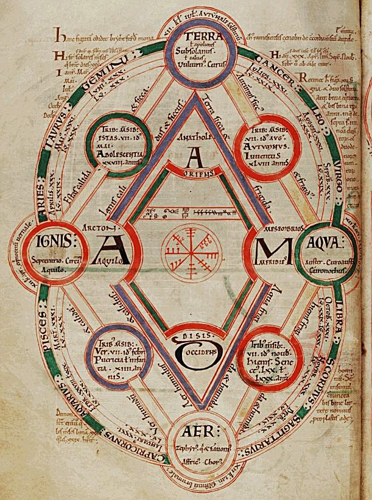

The glassmakers and dyers of the frames before this one knew what to do with their materials, and their tablets say nothing about what the materials were. In the Greek cities of the fifth century BC a different question was asked: what is everything made of? The answers were argued rather than tested, and one of them, the four **[classical elements](kloom:e/classical-element)**, set the terms of chemistry for two thousand years.

## Four roots, two forces

**[Empedocles](kloom:e/empedocles)** of Akragas, in Sicily, who lived from about 494 to about 434 BC, gave the first set of four. His poem survives only in fragments quoted by later writers, and one of them begins, in Arthur Fairbanks's translation of 1898: "Hear first the four roots of all things: bright Zeus, life-giving Hera, and Aidoneus, and Nestis who moistens the springs of men with her tears." Ancient readers decoded the gods as fire, air, earth and water. Nothing new comes into being, he said, and nothing perishes: there is "only mixture and separation of what is mixed", driven by two forces, Love, which joins, and Strife, which parts. Another fragment gives a recipe: earth took "two out of the eight parts" of water and four of fire, and they became white bones.

## Atoms and the void

At about the same time **[Leucippus](kloom:e/leucippus)** and his pupil **[Democritus](kloom:e/democritus)**, of Abdera, answered differently. The world, they said, is made of atoms, _atomos_ meaning "uncuttable", too small to see, endless in number and shape, moving in empty space. Their books are lost. What we know of them comes through **[Aristotle](kloom:e/aristotle)**, who argued against them, and through quotations in writers centuries later. One sentence of Democritus survives in his own words: "by convention sweet and by convention bitter, by convention hot, by convention cold, by convention color; but in reality atoms and void." Of Leucippus a single sentence survives, and even in antiquity Epicurus was said to have doubted that he existed.

## Qualities that change places

**[Plato](kloom:e/plato)**, in the [_Timaeus_](kloom:e/timaeus-dialogue) of about 360 BC, gave Empedocles' elements shapes built from triangles: fire the tetrahedron, air the octahedron, water the icosahedron, earth the cube. The shapes let him do arithmetic. Each face of the first three is six small right triangles, so by our count a particle of fire holds 24, air 48 and water 120 (the _Timaeus_ gives the 120 itself), and the _Timaeus_ says that water broken up "may become one part fire and two parts air". The count balances, 120 = 24 + 2 × 48, as atoms balance in an equation now. Earth's cube is made of a different triangle, so earth, Plato says, can never become anything else.

Aristotle, in _On Generation and Corruption_, built the elements instead from four qualities, two at a time: "Fire is hot and dry, whereas Air is hot and moist ... and Water is cold and moist, while Earth is cold and dry." Change one quality and one element becomes another: let the hot in air be "overcome by the cold" and there will be water. The plate draws the square. Neighbors share a quality and turn into each other quickly; opposites, fire and water, share none and change slowly. The elements could turn into one another, and that was the theory alchemy leaned on: if water can become air, why should lead not become gold? The Middle Ages drew the same figure: the English monk Byrhtferth's diagram, in a copy of about 1110 now at St John's College, Oxford, sets the four at the corners of a diamond, with their qualities written along its sides.

## Splitting water

The square was a theory of qualities, and a test of substances eventually broke it. Pass an electric current through water, with a little salt or acid to carry it, and gas bubbles off both wires: hydrogen at one, oxygen at the other, in two volumes to one.

| Water, split             | Hydrogen, 2 H₂ | Oxygen, O₂ |
| ------------------------ | -------------: | ---------: |
| Volume of gas            |              2 |          1 |
| Mass, from 36.03 g water |         4.03 g |    32.00 g |
| Share of the mass        |            11% |        89% |

The equation is 2 H₂O → 2 H₂ + O₂; the masses are by our arithmetic, from the atomic weights of hydrogen, 1.008, and oxygen, 16.00. Two volumes of hydrogen weigh an eighth as much as one of oxygen. Air comes apart too: dry air is by volume 78 percent nitrogen, 21 percent oxygen and nearly 1 percent argon. Neither water nor air is an element; each is a mixture or a compound of elements Aristotle never named. Plato's triangles, oddly, are closer in spirit to the modern answer than Aristotle's qualities: small units of fixed shape, counted and conserved when one substance becomes another.

For two thousand years after Aristotle, though, his qualities were the working theory. The alchemists of Roman Egypt, in the next frame, took it into the workshop.
