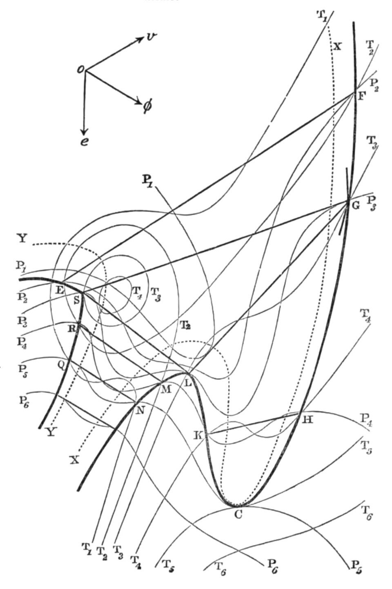

In 1871 **[Yale University](kloom:e/yale-university)** made **[Josiah Willard Gibbs](kloom:e/josiah-willard-gibbs)** its professor of mathematical physics, the first in the United States, and paid him nothing; he had money of his own, and no publications. Between 1875 and 1878 the Connecticut Academy of Arts and Sciences printed, in its little-read _Transactions_, his "On the Equilibrium of Heterogeneous Substances": about three hundred pages and seven hundred numbered equations, which turned the laws of heat into a way of telling which chemical changes can happen and which cannot. It is where chemical thermodynamics begins.

It opens with a motto in German from **[Rudolf Clausius](kloom:e/rudolf-clausius)**, his two laws of heat in two sentences.

## Downhill for chemistry

Clausius's law is about a system left wholly to itself: its **[entropy](kloom:e/entropy)**, the measure of how far its energy has spread, never falls. The motto says it of the whole world: "The energy of the world is constant. The entropy of the world tends towards a maximum." A flask in a laboratory is not left to itself. It sits in air at a steady pressure and trades heat with the room. Gibbs showed that such a system has its own quantity that only ever goes down, and that it comes to rest where that quantity is least. He wrote it _ζ_ = _ε_ − _tη_ + _pv_: energy, less temperature times entropy, plus pressure times volume. Today it is written _G_ = _H_ − _TS_, where _H_, the **enthalpy**, gathers the energy and the pressure term, and it is called the **[Gibbs free energy](kloom:e/gibbs-free-energy)**, or, as the international chemists' union has recommended since 1988, the Gibbs energy.

For a reaction at a fixed temperature, the test is one line: ΔG = ΔH − TΔS. If ΔG is negative the reaction can go by itself. A reaction can pay its way by giving out heat, which makes ΔH negative, or by making disorder, which makes ΔS positive, and temperature decides how much the second counts. The test says whether, not how fast: diamond turning into graphite has a negative ΔG at room temperature, and no one has seen a diamond do it.

## Burning lime

Limestone heated in a kiln gives off carbon dioxide and leaves quicklime, the reaction that has made mortar and cement for thousands of years: CaCO₃ → CaO + CO₂. Wikipedia's articles on the three compounds give their standard enthalpies of formation and entropies at 25 °C, and from them, by our arithmetic:

| Quantity                 | Worked from                |              Value |
| ------------------------ | -------------------------- | -----------------: |
| ΔH, the heat taken in    | −635 − 393.5 − (−1,207) kJ |          +178.5 kJ |
| ΔS, the disorder made    | 40 + 214 − 93 J/K          |           +161 J/K |
| ΔG at 25 °C (298 K)      | 178.5 − 298 × 0.161        |        +130 kJ: no |
| ΔG at 1,000 °C (1,273 K) | 178.5 − 1,273 × 0.161      |        −26 kJ: yes |
| Where ΔG changes sign    | 178,500 ÷ 161              | 1,109 K, or 836 °C |

At room temperature the heat the reaction needs outweighs the disorder it makes, and limestone lasts for ages. The entropy term grows with temperature, mostly because a gas is set free, and somewhere above 800 °C it wins. The plate draws the two terms as lines and the crossing between them. This is only an estimate: it treats ΔH and ΔS as fixed, which they are not quite. Wikipedia's article on calcination, from a fit to high-temperature data, puts the crossing at 1,121 K, or 848 °C; its article on quicklime says above 825 °C; and its article on calcination says that working kilns run at 900 to 1,050 °C.

## Potentials and phases

For a mixture, Gibbs asked how the energy changes when a little more of one substance is added, and called the answer that substance's potential, now its **[chemical potential](kloom:e/chemical-potential)**. Matter flows from where its potential is higher to where it is lower, as heat flows from hot to cold, and equilibrium comes when each substance's potential is the same everywhere.

From that followed the **[phase rule](kloom:e/phase-rule)**. A system of _n_ substances in _r_ phases, such as solid, liquid and vapor, has _n_ + 2 − _r_ ways it can vary and stay as it is. Gibbs gave the examples himself. Water alone, with ice, liquid and vapor together, has 1 + 2 − 3 = 0: they can coexist at only one temperature and one pressure, the triple point. A salt solution with its vapor and two kinds of crystal is 2 + 2 − 4 = 0 again.

## Read late

Few chemists could read it. **[James Clerk Maxwell](kloom:e/james-clerk-maxwell)** could, having taken up Gibbs's papers of 1873 on thermodynamic surfaces, and he put them into his _Theory of Heat_ and built a model of Gibbs's surface for water; he died in 1879. Europe caught up when Wilhelm Ostwald translated the memoir into German, in 1891 by the account in Henry Bumstead's memoir of Gibbs, and Henry Le Chatelier into French in 1899. By then, Bumstead wrote, several of its laws had been found again by others, "sometimes from theoretical considerations, but more often by experiment". Gibbs went on to found, with Maxwell and Ludwig Boltzmann, the explanation of all this by counting the states of molecules, and named it in his _Elementary Principles in Statistical Mechanics_ (1902).

The next frame is radium, and energy of another kind entirely.
