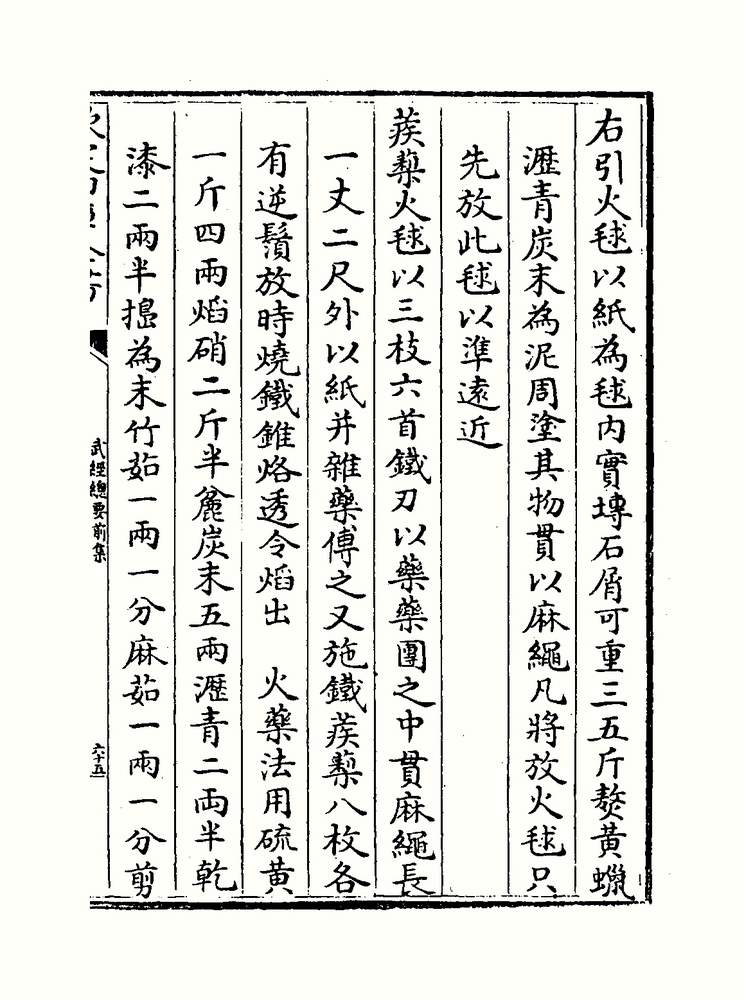

The Chinese word for **[gunpowder](kloom:e/gunpowder)** is still _huoyao_, "fire medicine", and it was found by people looking for a medicine. Daoist alchemists of the Tang dynasty, heating minerals in search of an elixir of long life, worked with **[saltpeter](kloom:e/potassium-nitrate)** and sulfur. A Daoist book of the ninth century, the _Zhenyuan miaodao yaolüe_, lists experiments not to try, one of which is gunpowder in all but name: "Some have heated together sulfur, realgar and saltpetre with honey; smoke and flames result, so that their hands and faces have been burnt, and even the whole house burned down." Its date is uncertain. Wikipedia puts it about 850; the historian Feng Jiasheng, as J. R. Partington reports him, placed it between 760 and 906 and probably after 900. An alchemical text of 808 already mixes six parts of sulfur with six of saltpeter and one of birthwort.

## The first written formulas

The oldest surviving formulas for gunpowder are in the **[_Wujing Zongyao_](kloom:e/wujing-zongyao)**, the _Complete Essentials of the Military Classics_, compiled from about 1040 to 1044 by Zeng Gongliang, Ding Du and Yang Weide for the emperor Renzong of the **[Song dynasty](kloom:e/song-dynasty)**, who wrote its preface. The original was lost when the Jurchen took the capital, Kaifeng, in 1126, and the oldest complete printing is of 1510. It gives three recipes, for fire balls thrown by trebuchet and for a ball of poison smoke. The one for the "caltrop fire ball", packed round iron spikes, reads, in our translation:

> Take one _jin_ four _liang_ of sulfur, two and a half _jin_ of saltpetre, five _liang_ of coarse charcoal, two and a half _liang_ of pitch and two and a half of dry lacquer, and pound them to powder.

Bamboo fiber, hemp, tung oil and wax follow. With sixteen _liang_ to the _jin_, the three main ingredients stand at 40 : 20 : 5. The first recipe has no charcoal at all, only sulfur, saltpeter and fourteen _liang_ of pine resin.

These powders were rich in fuel and short of saltpeter. They burned fiercely but did not explode, and the book's weapons are incendiaries: fire arrows, fire balls and the "thunderclap bomb", a ball of powder and broken porcelain packed round a bamboo tube.

## What the saltpeter does

Saltpeter is potassium nitrate, KNO₃, and it carries its own oxygen. Sulfur and charcoal are the fuel, and the saltpeter burns them without any air, so powder burns inside a closed tube. Chemists write an idealized reaction:

2 KNO₃ + S + 3 C → K₂S + N₂ + 3 CO₂

By our arithmetic, with atomic weights of potassium 39.1, nitrogen 14, oxygen 16, sulfur 32.1 and carbon 12, 270 grams of mixture give 4 moles of gas, nitrogen and carbon dioxide, which at 0 °C and ordinary pressure fill about 90 liters. A kilogram of powder, pressed to the density of 1.7 grams a cubic centimeter that modern makers use, takes up less than 0.6 liters and gives some 330 liters of gas: over five hundred times its own volume before the heat of the flame expands it further. Real powder does less well. One study found that only 43% of its mass became gas, against 59% in the equation, and the rest is the solid smoke and fouling that gunners cursed.

The same equation says what the best mixture is. Weighed out, its ingredients are 74.8% saltpeter, 11.9% sulfur and 13.3% carbon, by our arithmetic, near the 75% saltpeter, 10% sulfur and 15% charcoal used as the standard since 1780.

| Recipe                                        | Saltpeter | Sulfur | Charcoal |
| --------------------------------------------- | --------: | -----: | -------: |
| _Wujing Zongyao_, caltrop fire ball, 1044     |      61.5 |   30.8 |      7.7 |
| _Liber Ignium_, flying fire, c. 1280–1300     |      66.7 |   11.1 |     22.2 |
| Hasan al-Rammah's rockets, median, c. 1240–80 |      75.0 |    9.1 |     15.9 |
| The idealized equation                        |      74.8 |   11.9 |     13.3 |
| Standard black powder, since 1780             |        75 |     10 |       15 |

The percentages count only the three ingredients; the first two rows are ours, from the recipes' weights, and the Song recipe adds another 15 _liang_ of pitch, lacquer, fiber, oils and wax to its 65. The plate sets them on a triangle, where the old recipes close in on the equation.

## Westward

The recipe traveled west in the thirteenth century, perhaps with the Mongols. **[Hasan al-Rammah](kloom:e/hasan-al-rammah)**, writing in Syria between about 1240 and 1280, gave 107 recipes and the first clear method of purifying saltpeter, which Arabic writers called "Chinese snow". In England **[Roger Bacon](kloom:e/roger-bacon)** described, in his **[_Opus Majus_](kloom:e/opus-majus)** of 1267, a children's toy "as large as the human thumb", in which "from the force of the salt called saltpeter so horrible a sound is produced" that it "exceeds the roar of sharp thunder". The _Opus Majus_ names only saltpeter. Bacon's _Opus Tertium_, of the same years, adds sulfur and willow charcoal, and a quotation of the _Opus Majus_ in Wikipedia inserts them in brackets. No proportions are Bacon's: a 7 : 5 : 5 recipe that the artillery officer Henry Hime read out of a cipher in a letter ascribed to him was rejected by historians from 1915 on, and a powder so short of saltpeter burns slowly, mostly to smoke. The first European recipe with weights is in the _Liber Ignium_ of "Marcus Graecus", of about 1280–1300: six pounds of saltpeter, two of willow charcoal and one of sulfur.

Guns came quickly after. An English manuscript by Walter de Milemete, of 1326, draws a gun with a large arrow in its mouth, and in the same year Florence ordered metal cannon for its defense.

In Europe's laboratories saltpeter had a second use, and the next frame follows it: distilled with vitriol, it gave a water that dissolved silver.
