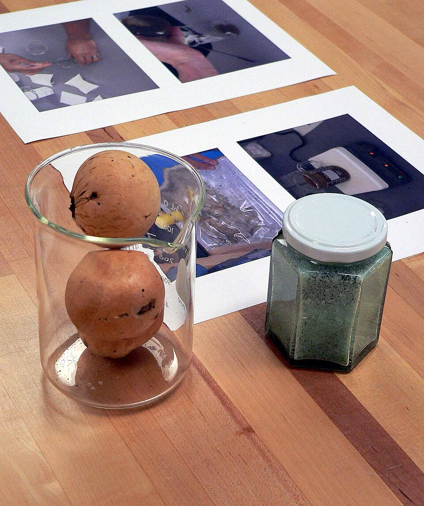
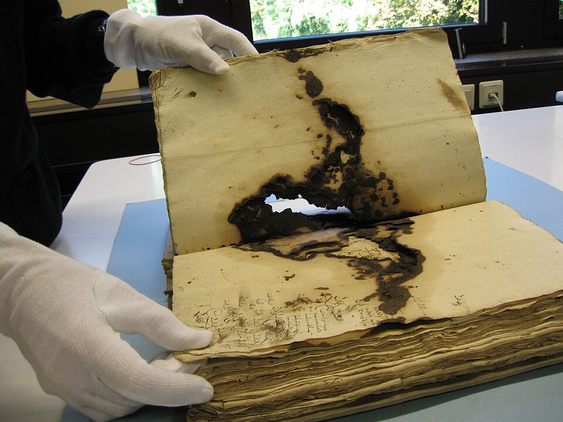

For more than a thousand years, most of what Europe wrote by hand was written in a chemical reaction. **[Iron gall ink](kloom:e/iron-gall-ink)** is made from three things: galls from oak trees, green vitriol, which is iron sulfate, and gum. It goes on the page pale and turns black within seconds, it sinks into parchment so deeply that it can be removed only by scraping, and over centuries some of it eats the page away.

## A test, then an ink

The reaction was known before the ink. **[Pliny the Elder](kloom:e/pliny-the-elder)**, in the first century AD, gives a test for verdigris, the green copper pigment, faked with shoemakers' black, a vitriol rich in iron: a strip of papyrus soaked in an infusion of galls "blackens at once" when the fake is smeared on it. (The English translation of 1855 says the paper blackens for the genuine pigment, but Pliny's Latin sets the test among the ways of finding the fake, and the chemistry agrees: it is the iron that turns galls black.) The Leiden papyrus of the previous frame used the same pair, gall-nut and copperas, to darken a purple dye. In the fifth century **[Martianus Capella](kloom:e/martianus-capella)** of Carthage named a writing ink of "galls and gum". When the new ink replaced the older carbon ink, made from soot, is disputed. Wikipedia calls it Europe's standard ink from the fifth century; the conservator Elmer Eusman writes that the change cannot be dated, that scribes long used both, and that only by the end of the Middle Ages was iron gall the primary ink. It stayed so into the twentieth century.

## The recipe

A gall is a growth that an oak makes around the egg of a gall wasp. It is rich in tannin, gallotannic acid, a sugar with five acid groups joined to it, and soaking or fermenting the galls sets those groups free as **[gallic acid](kloom:e/gallic-acid)**. Green vitriol was gathered in mines, from water that trickled out of the rock and left crystals as it evaporated. An English recipe of 1596, from _A Booke of Secrets_, takes six ounces of galls, four of vitriol and four of gum arabic, in a mixture of water, wine and vinegar, steeped for days and stirred "three or foure times" a day.

The chemistry happens in two steps. Iron(II), from the vitriol, joins the gallic acid, and the compound it forms dissolves in water and is nearly colourless, so the fresh ink is grey and soaks into the fibres. Then air reaches it on the page, and each iron atom gives up one electron to oxygen:

| Step           | Reaction                              | What you see             |
| -------------- | ------------------------------------- | ------------------------ |
| Mixing         | Fe²⁺ + gallic acid → iron(II) complex | a pale, grey liquid      |
| On the page    | Fe²⁺ → Fe³⁺ + e⁻                      | black within seconds     |
| Taken together | 4 Fe²⁺ + O₂ + 4 H⁺ → 4 Fe³⁺ + 2 H₂O   | one O₂ takes 4 electrons |

Iron(III) holds the gallate far more tightly, and the complex it makes is black and does not dissolve. The plate draws the usual model, iron bound by two neighbouring oxygens on each of two gallic acids. What the black really is remains disputed: a review in 2022 by Maria João Melo and her colleagues reports that inks made to historical recipes carry more galloyl sugars than free gallic acid, and that the iron may sit in tiny particles of iron oxide coated with the oxidised tannin.

## Ink that eats

The vitriol brings sulfate, and the sulfate stays behind with the acid the reaction releases. By our arithmetic, green vitriol, FeSO₄·7H₂O, is 20 percent iron by weight, and its sulfate can end as sulfuric acid weighing 35 percent as much as the vitriol, so the 1596 recipe's four ounces could leave up to about an ounce and a half of acid in the ink. Acid breaks the long chains of cellulose in paper. Worse, conservators have found, is iron(II) left over when an ink holds more vitriol than its galls can use: it keeps passing electrons to oxygen and makes radicals that cut the cellulose, even where the acid has been neutralised. The result is _ink corrosion_, first taken up as a problem at a conference at St. Gallen in 1898 called by the Vatican's librarian, Franz Ehrle.

**[Johann Sebastian Bach](kloom:e/johann-sebastian-bach)**'s manuscripts are the famous case. The Berlin State Library holds about 80 percent of his surviving autographs, and in 2009 its director general described note heads falling out of the paper "as if it had been hole-punched". Bach is said to have made his note heads bold because his eyes were weak; she called that possibly "nothing more than a nice legend", and wrote that experts are divided on why his ink held so much iron.

The **[United States Declaration of Independence](kloom:e/united-states-declaration-of-independence)**, the Constitution and the Bill of Rights were engrossed in iron gall ink on parchment, and the ink's acid let it "bite" into the surface. Since 2003 their pages have lain in cases of titanium and aluminium filled with argon: without oxygen, iron(II) has nobody to give its electron to.

Monks in the **[scriptorium](kloom:e/scriptorium)** were writing in this ink while the Greek alchemists' books were being translated into Arabic, and the next frame follows alchemy there.
