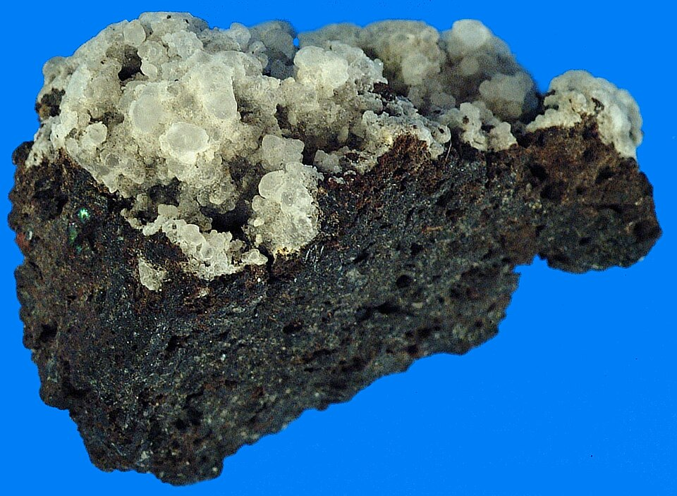

About 215 treatises survive under the name of **[Jabir ibn Hayyan](kloom:e/jabir-ibn-hayyan)**, out of some six hundred known by their titles. They cover alchemy above all, and also magic, medicine and Shi'ite religious thought. Their author says he was a pupil of the Imam Jaʿfar al-Ṣādiq, who died in 765, and later tradition has him living in Kufa and dying between 806 and 816. The treatises hold the oldest known systematic classification of chemical substances, and the oldest known instructions for making an inorganic compound, **[sal ammoniac](kloom:e/ammonium-chloride)**, out of plants, blood and hair.

## A name, not a man

Whether Jabir existed was doubted within two centuries. The [Baghdad](kloom:e/baghdad) bibliographer **[Ibn al-Nadim](kloom:e/ibn-al-nadim)** listed his works in his catalog, the _Fihrist_, in 987, and recorded that some people said there had never been such a man; Ibn al-Nadim thought there had. In 1942–43 the Arabist **[Paul Kraus](kloom:e/paul-kraus-arabist)** argued that the corpus was written between about 850 and 950 by a school of Shi'ite alchemists who used Jabir's name. The treatises use philosophical terms coined in the middle of the ninth century, and quote Greek philosophy that the translators of **Baghdad** put into Arabic only towards its end. Kraus's dating is the one most scholars accept. Fuat Sezgin and Syed Nomanul Haq argued for an earlier Jabir, and Pierre Lory for an eighth-century core, rewritten later. Even the size of the corpus depends on who counts: Kraus reached about three thousand treatises by counting chapters of long works separately, and Lory, in the _Encyclopaedia Iranica_, gives some two thousand.

## The balance of natures

The Jabirian authors took the four elements and four qualities of Aristotle, hot, cold, moist and dry, which they called natures, and gave every metal two natures outside and two within. Lead was cold and dry outside and hot and moist inside; gold was the reverse. Rearrange a metal's natures and you have another metal. As a physician's drug restores a patient's humors, a medicine would restore a metal's balance: _al-iksīr_, from the Greek _xērion_, a powder dried onto wounds, and the source of our _elixir_. A second theory, taken from a text ascribed to Apollonius of Tyana, the _Secret of Creation_, made every metal a union of sulfur and mercury formed in the earth, gold coming from the purest and best-balanced sulfur. It governed ideas about metals until the eighteenth century. Over both the corpus laid its "science of the balance", which tried to reduce everything, even the letters of a substance's Arabic name, to measures and proportions.

## Spirits that fly

The most practical successor of the corpus was a physician. **[Abu Bakr al-Razi](kloom:e/abu-bakr-al-razi)** (c. 865–925), of Rey, who ran hospitals there and in Baghdad, believed in transmutation, but his _Book of Secrets_ (_Kitāb al-Asrār_) and its sequel, the _Secret of Secrets_, read almost like a laboratory manual, with their operations and their apparatus, from crucibles and sand baths to the still with its cap, the **[alembic](kloom:e/alembic)** (Arabic _al-anbīq_, from Greek _ambix_, a cup). His classification of the mineral substances, as the historian of chemistry Eric Holmyard set it out in 1931 from Henry Stapleton's studies, runs:

| Class    | Members                                                          |
| -------- | ---------------------------------------------------------------- |
| Spirits  | mercury, sal ammoniac, orpiment, realgar, sulfur                 |
| Bodies   | gold, silver, copper, iron, tin, lead, "Chinese iron"            |
| Stones   | pyrites, tutty, azurite, malachite, hematite, gypsum, glass …    |
| Vitriols | black, white, yellow, green, red                                 |
| Boraces  | bread borax, natron, goldsmith's borax …                         |
| Salts    | sweet, bitter, rock, soda, salt of urine, slaked lime, oak ash … |

Wikipedia's version gives four spirits, counting orpiment and realgar as one, and its seven bodies have zinc where Holmyard has "Chinese iron", the corpus's _khārṣīnī_.

The spirits are the substances that fly from the fire, and sal ammoniac was the new one: the corpus added it to the list, under a Persian name, _nošāder_. It is ammonium chloride, NH₄Cl. Heated to about 338 °C it seems to vaporize, but in fact it comes apart into two gases, ammonia and hydrogen chloride, which recombine as white crystals wherever they meet a cool surface, such as the head of an alembic:

NH₄Cl (crystal, hot) ⇌ NH₃ (gas) + HCl (gas) ⇌ NH₄Cl (crystal, cool)

By our arithmetic, with atomic weights of nitrogen 14, hydrogen 1 and chlorine 35.5, 53.5 grams of sal ammoniac become 17 grams of ammonia and 36.5 grams of hydrogen chloride, and the same 53.5 grams settle out again. Nothing is lost, and to an alchemist the salt had passed through the fire as a spirit and come back. It could be made from hair and blood because they are rich in nitrogen, which strong heating drives off as ammonia. The plate draws the salt rising from the cucurbit and crystallizing in the cap.

The Jabirian books reached Latin Europe in the twelfth century, the _Book of Seventy_ in a translation by Gerard of Cremona, under the name Geber. The next frame goes east, where Daoist alchemists hunting for an elixir of their own heated saltpeter and sulfur together.
