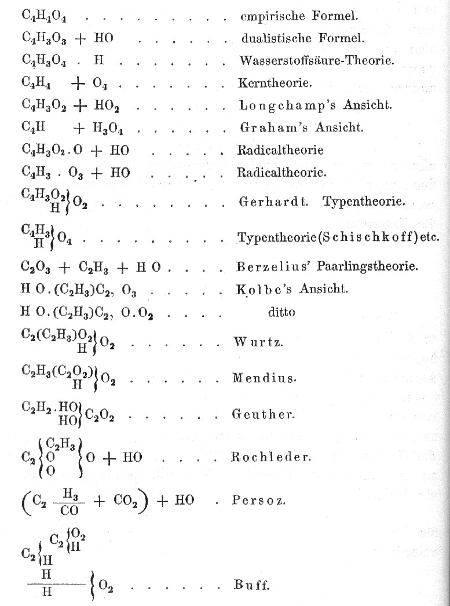

On 3 September 1860, 140 chemists met in the assembly hall of the parliament of Baden, at Karlsruhe, for the first international conference of their science. They had come because they could not agree on how to write down the simplest compound. [August Kekulé](kloom:e/august-kekule) had called the meeting, with Charles Adolphe Wurtz of Paris and Karl Weltzien of Karlsruhe, to settle what an atom was, what a molecule was, and what they weighed. The **[Karlsruhe Congress](kloom:e/karlsruhe-congress)** did not settle it in its three days. A pamphlet handed out as the delegates went home did.

## Nineteen acetic acids

Kekulé's own textbook of organic chemistry, in 1861, showed the trouble on one page. For vinegar's acid, one of the best-known compounds in chemistry, it listed nineteen formulas then in use, from the "empirical" C₄H₄O₄ to Kolbe's and Wurtz's and a dozen others'.

Part of the disorder was notation, and part was deeper. Chemists weighed elements against each other by the proportions in which they combined, but they could not agree how many atoms of each went into a compound, so they could not agree on the weights. Many used 6 for carbon and 8 for oxygen, taking hydrogen as 1; others 12 and 16. Water was HO in one book and H₂O in the next. The C₄H₄O₄ at the top of Kekulé's list is today's C₂H₄O₂, written with the halved weights.

## Avogadro's rule

The answer had been in print since 1811. The Italian scientist **[Amedeo Avogadro](kloom:e/amedeo-avogadro)** had proposed that equal volumes of gases, at the same temperature and pressure, hold equal numbers of molecules. **[Avogadro's law](kloom:e/avogadros-law)** was published again by André-Marie Ampère in 1814, and then, as the Alembic Club's preface to Cannizzaro's pamphlet puts it, lay "practically unrecognised for forty years". Its consequence is that the molecules of different substances, even of elements, may hold different numbers of atoms: a molecule of hydrogen is two.

**[Stanislao Cannizzaro](kloom:e/stanislao-cannizzaro)**, professor of chemistry at Genoa, built his course of 1858 on it, and set the course out in a long letter to a colleague, printed that year in the journal _Il Nuovo Cimento_. At Karlsruhe he argued for it from the floor, and at the close a friend of his, Angelo Pavesi, handed out reprints. **[Lothar Meyer](kloom:e/lothar-meyer)**, a young lecturer from Breslau, put his copy in his pocket to read on the way home. "It was as if the scales fell from my eyes," he wrote thirty years later, "the doubts faded, and the feeling of calmest assurance took its place." **[Dmitri Mendeleev](kloom:e/dmitri-mendeleev)**, then 26, was also in the hall.

## Weighing a molecule by its vapor

Cannizzaro's method takes two steps. First, weigh a liter of a compound's vapor against a liter of hydrogen at the same temperature and pressure. By Avogadro's rule the two liters hold the same number of molecules, so the ratio of the weights is the ratio of the molecules. Hydrogen's molecule is two atoms, so on a scale where the hydrogen atom weighs 1 a molecule weighs twice its vapor's density. Second, analyze the compound and find how much of the molecule's weight is each element. Carbon dioxide's vapor is 22 times as heavy as hydrogen, so its molecule weighs 44; it is 27.3 percent carbon, so the molecule holds 12 parts of carbon. That step is by our arithmetic; the rest of the table is Cannizzaro's own:

| Compound of carbon | Molecule's weight | Of which carbon | Carbon ÷ 12 |
| ------------------ | ----------------: | --------------: | ----------: |
| Carbon monoxide    |                28 |              12 |           1 |
| Carbon dioxide     |                44 |              12 |           1 |
| Carbon disulphide  |                76 |              12 |           1 |
| Marsh gas, methane |                16 |              12 |           1 |
| Ethylene           |                28 |              24 |           2 |
| Propylene          |                42 |              36 |           3 |
| Ether              |                74 |              48 |           4 |

The weights of carbon in molecules of every size are all whole multiples of one quantity, 12, and the smallest, which turns up again and again, can only be a single atom. Cannizzaro called it the law of atoms: "the different quantities of the same element contained in different molecules are all whole multiples of one and the same quantity". The same table for oxygen, from water's 18 with 16 of oxygen, carbon dioxide's 44 with 32, gives 16. He noted that the method never needs the weight of a molecule of carbon itself, which could not be vaporized; for all anyone knew it was a single atom or many.

## After Karlsruhe

The weights Cannizzaro's rule gave, about 1 for hydrogen, 12 for carbon and 16 for oxygen, were adopted after Karlsruhe. Meyer's _Die modernen Theorien der Chemie_ of 1864 grouped 28 elements into six families by their valence, an arrangement that equivalent weights had kept out of sight. With the right weights in a row, the elements' pattern could be seen; the next frame is Mendeleev's table.

Avogadro's rule said that a gram of hydrogen and 16 grams of oxygen hold the same number of atoms, without saying what the number was. In 1909 the physicist Jean Perrin counted it and named it for him. Since 2019 the **[Avogadro constant](kloom:e/avogadro-constant)** has been fixed exactly, at 6.02214076 × 10²³ particles to the mole, one of the seven constants that now define the International System of Units.
