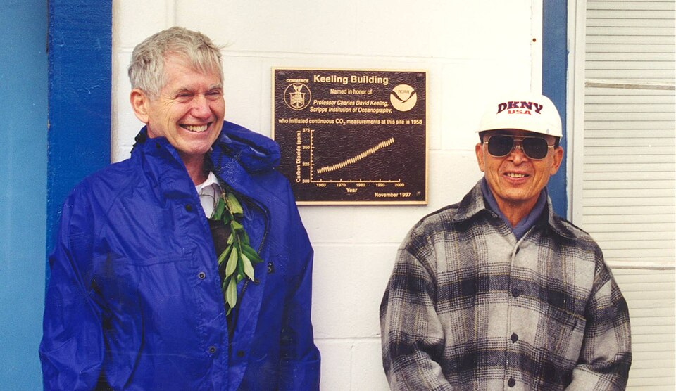
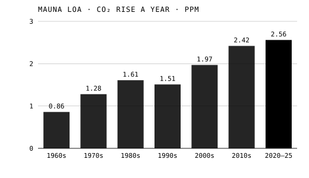

Every fire we have lit since the first copper smelt has put **[carbon dioxide](kloom:e/carbon-dioxide)** into the air. For most of history nobody could say how much of it was there, or whether the amount was changing. In 1958 a young chemist began measuring it on the side of a Hawaiian volcano, and the line he started, the **[Keeling Curve](kloom:e/keeling-curve)**, has not stopped rising since. This frame describes it as of 30 September 2026.

## A doubling, worked by hand

The first to calculate what the gas does to the climate was the Swedish chemist **[Svante Arrhenius](kloom:e/svante-arrhenius)**, in a paper in the _Philosophical Magazine_ in April 1896. He called it "carbonic acid", the name of his day, and he was trying to explain the ice ages, not to warn about coal. From the American astronomer Samuel Langley's measurements of infrared light he worked out, by hand, latitude by latitude and season by season, how the ground's temperature would change if the gas were cut to 0.67 of its amount or raised to 1.5, 2, 2.5 or 3 times. For double the carbonic acid his table gives a yearly warming of between 4.95 and 6.05 °C, depending on the latitude. He also found the rule that still holds: "if the quantity of carbonic acid increases in geometric progression, the augmentation of the temperature will increase nearly in arithmetic progression". Each doubling adds about the same warming. In a book for general readers, published in Swedish in 1906 and in English as _Worlds in the Making_ in 1908, he gave 4 °C for a doubling, expected the change to take centuries, and thought a warmer earth would help to feed a growing population.

## The breathing of the planet

**[Charles David Keeling](kloom:e/charles-david-keeling)** found in the 1950s that the gas could be measured far more precisely than anyone had managed. As a postdoctoral fellow at Caltech he built a manometer good to 0.1 per cent and carried flasks to remote places in the western states; he found about 310 parts per million in clean afternoon air wherever he went. Roger Revelle brought him to the **[Scripps Institution of Oceanography](kloom:e/scripps-institution-of-oceanography)**, and for the International Geophysical Year the Weather Bureau paid for infrared analyzers in Antarctica and at the **[Mauna Loa Observatory](kloom:e/mauna-loa-observatory)**, 3,400 meters up the volcano on the island of Hawaii. The first reading there, on 29 March 1958, was 313 ppm.

Power failures and broken equipment broke up the first year's record. "I became anxious that the concentration was going to be hopelessly erratic," Keeling recalled in 1978. A full year made sense of it. The level peaked in May and fell to a low in the autumn, as the forests and fields of the northern hemisphere took in carbon in summer and gave it back in winter: the planet breathing. And each year's average was higher than the last. By 1960 Keeling wrote in _Tellus_ that at the South Pole the rise was "nearly that to be expected from the combustion of fossil fuel". The plate draws the curve month by month from 1958 to August 2026, from the monthly record kept by NOAA, which has made its own measurements beside Scripps's since 1974.

In November 1997 the observatory's building was named for Keeling, who is shown with John Chin of NOAA beside its plaque. Keeling died in 2005, and his son Ralph runs the Scripps program.

## From parts per million to tonnes

The curve is in parts per million, and the carbon we burn is weighed in tonnes. By our arithmetic, with the mass of the dry atmosphere, 5.135 × 10¹⁸ kilograms, and air's average molar mass of 29 grams: the air holds about 1.77 × 10²⁰ moles of molecules, so one part per million is 1.77 × 10¹⁴ moles of CO₂, and at 12 grams of carbon a mole that is about 2.13 billion tonnes of carbon. The _Global Carbon Budget_ uses 2.124.

| Year | Carbon dioxide at Mauna Loa |
| ---- | --------------------------: |
| 1959 |                   316.0 ppm |
| 1980 |                   338.8 ppm |
| 2000 |                   369.7 ppm |
| 2025 |                   427.4 ppm |

| Decade  | Average rise a year |
| ------- | ------------------: |
| 1960s   |            0.86 ppm |
| 1970s   |            1.28 ppm |
| 1980s   |            1.61 ppm |
| 1990s   |            1.51 ppm |
| 2000s   |            1.97 ppm |
| 2010s   |            2.42 ppm |
| 2020–25 |            2.56 ppm |

The budget puts the world's air at about 278 ppm in 1750. From there to Mauna Loa's 2025 average of 427.4 ppm is 149 ppm: by our arithmetic about 317 billion tonnes of carbon, or 1,160 billion tonnes of CO₂, still in the air. In 2024 the air gained 3.73 ppm, about 7.9 billion tonnes of carbon, out of 11.6 billion that we emitted; in an ordinary year about half of our emissions stay in the air, and the ocean and the land take the rest. The decade averages in the chart are ours, from NOAA's yearly figures.

In May 2026 the monthly average reached 432.3 ppm in NOAA's record, and 432.0 in Scripps's, the highest yet; the latest month published, August 2026, was 427.6, the seasonal low still to come.

## The ocean's share

What the ocean takes, it pays for in acid. Dissolved carbon dioxide makes carbonic acid, which gives up hydrogen ions:

CO₂ + H₂O ⇌ H₂CO₃ ⇌ H⁺ + HCO₃⁻

The extra hydrogen ions meet carbonate, H⁺ + CO₃²⁻ → HCO₃⁻, and the carbonate that corals and shellfish build with grows scarcer. This is **[ocean acidification](kloom:e/ocean-acidification)**. Between 1950 and 2020 the surface ocean's pH fell from about 8.15 to 8.05; since pH is a logarithm, a fall of 0.1 means 10⁰·¹ = 1.26 times as many hydrogen ions, 26 per cent more.

The next frame, the last on this spine, looks at where chemistry stands today.
