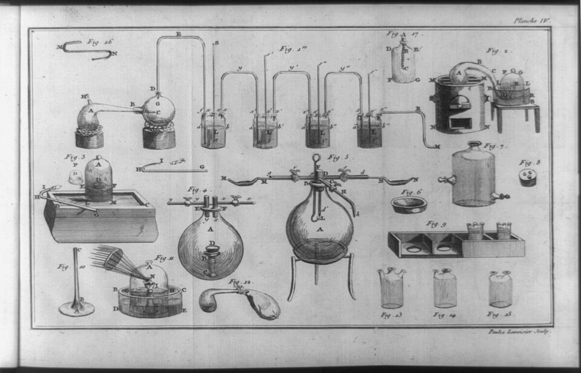
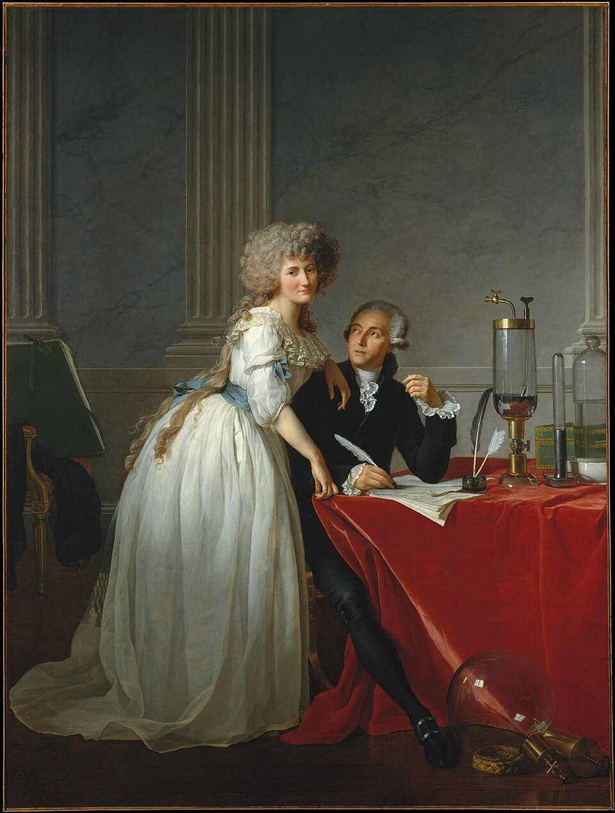

In 1789, the year the Bastille fell, **[Antoine Lavoisier](kloom:e/antoine-lavoisier)** published a textbook in Paris, the **[_Traité élémentaire de chimie_](kloom:e/traite-elementaire-de-chimie)**, the elementary treatise of chemistry. It set out the new chemistry he had built over fifteen years on the air Priestley and Scheele had found, in the new words he and three colleagues had given it, and it ended the old four elements. Within a year it was in English. It is often called the first modern chemistry textbook, and its method was a balance.

## Nothing is created

Lavoisier weighed everything that went into an experiment and everything that came out, gases included, and treated a difference as an error to find, not a substance to invent. In the _Traité_ he made it an axiom, here in Robert Kerr's translation of 1790: "in all the operations of art and nature, nothing is created; an equal quantity of matter exists both before and after the experiment". That rule, the **[conservation of mass](kloom:e/conservation-of-mass)**, was older than Lavoisier as a hunch; he made it the working method of chemistry. Its critics, Priestley among them, answered that precise weighing did not make his conclusions right.

## Water taken apart

The test case was water, an element since the Greeks. In June 1783 Lavoisier heard that Henry Cavendish had got water by burning inflammable air, and with Laplace he burned it with oxygen over mercury and got water too. In 1784, with Jean-Baptiste Meusnier, he took water apart: steam passed through a red-hot iron gun barrel lost its oxygen to the iron, and the inflammable air came out of the far end. The _Traité_ gives one run of the same kind, which the plate draws, with a tube of glass packed with a coil of iron. The water that went through lost 100 grains; the 274 grains of iron in the tube gained 85, and turned to a black oxide; 15 grains of a light, inflammable gas were collected. Water, Lavoisier concluded, is 85 parts of oxygen to 15 of the base of that gas, and he named the base **[hydrogen](kloom:e/hydrogen)**, "the generative principle of water".

In modern terms, 2 H₂ + O₂ → 2 H₂O. By our arithmetic, from the atomic weights (hydrogen 1.008, oxygen 16.00), 4.03 grams of hydrogen and 32.00 of oxygen make 36.03 grams of water, so water is 88.8 per cent oxygen by weight:

| 100 parts of water | Lavoisier, 1789 | Today |
| ------------------ | --------------: | ----: |
| Oxygen             |              85 |  88.8 |
| Hydrogen           |              15 |  11.2 |

He claimed his figures could not be "a two hundredth part" from the truth; they were nearly four parts in a hundred out. The method was right before the numbers were.

## Thirty-three simple substances

In 1787 Lavoisier, Louis-Bernard Guyton de Morveau, Claude-Louis Berthollet and Antoine-François de Fourcroy published the _Méthode de nomenclature chimique_, which named a substance for what it is and a compound for what it is made of: dephlogisticated air became oxygen, inflammable air hydrogen, and phlogisticated air azote, our nitrogen. The _Traité_ then listed the "simple substances", those no analysis had yet broken down. There are thirty-three:

| Class in the _Traité_                               | How many | What we would say                                                                    |
| --------------------------------------------------- | -------: | ------------------------------------------------------------------------------------ |
| Light, caloric, oxygen, azote, hydrogen             |        5 | Oxygen, nitrogen and hydrogen are elements; light and heat are not substances at all |
| Sulfur, phosphorus, charcoal, three acid "radicals" |        6 | All elements: the radicals are chlorine, fluorine and boron, then unknown            |
| Metals                                              |       17 | All elements                                                                         |
| Earths: lime, magnesia, barytes, argill, silex      |        5 | Oxides of calcium, magnesium, barium, aluminum and silicon                           |

So, by our reading, twenty-six of the thirty-three are elements. Lavoisier kept **[caloric](kloom:e/caloric-theory)**, the weightless matter of heat, among his elements. But he saw the other weak points: he wrote that the earths "must soon cease to be considered as simple bodies", perhaps metals already saturated with oxygen, and he left potash and soda off the table because they were "evidently compound substances".

## Madame Lavoisier

**[Marie-Anne Paulze Lavoisier](kloom:e/marie-anne-paulze-lavoisier)** married him in 1771, at thirteen; her father, like him, was a partner in the tax farm. She read English, which he did not, translated the chemists he needed, and published, without her name, a French translation of Richard Kirwan's _Essay on Phlogiston_, which Lavoisier and his allies answered in notes. She kept the laboratory notebooks. Trained in drawing by Jacques-Louis David, she drew and engraved the _Traité_'s thirteen plates of apparatus; the one below carries her name as engraver.

David's portrait of the two in 1788 shows her standing over him as he writes, among the instruments. Chemistry has since read the portrait itself: X-ray fluorescence at the Metropolitan Museum showed in 2021 that David first painted a fashionable couple, and added the instruments later.

## The scaffold

Lavoisier sat on the commission that made the metric system. On 23 December 1793 it was purged, and struck off it with him were the mathematicians Borda and Laplace, the physicist Coulomb, and **[Jean-Baptiste Delambre](kloom:e/jean-baptiste-delambre)**, the astronomer then measuring the meridian for the meter. Arrested as a former tax farmer, Lavoisier was guillotined on 8 May 1794 with twenty-seven others, among them his father-in-law. The judge's retort that "the Republic needs neither scholars nor chemists" is a legend.

**[Joseph-Louis Lagrange](kloom:e/joseph-louis-lagrange)**'s remark is better attested, though only just. Delambre, in his memoir of Lagrange, remembered him saying on the day after the execution, in our translation: "It took them only a moment to cut off that head, and a hundred years may not be enough to produce another like it."

The alkalies Lavoisier could not break open fell to a battery in London, eighteen years later.
