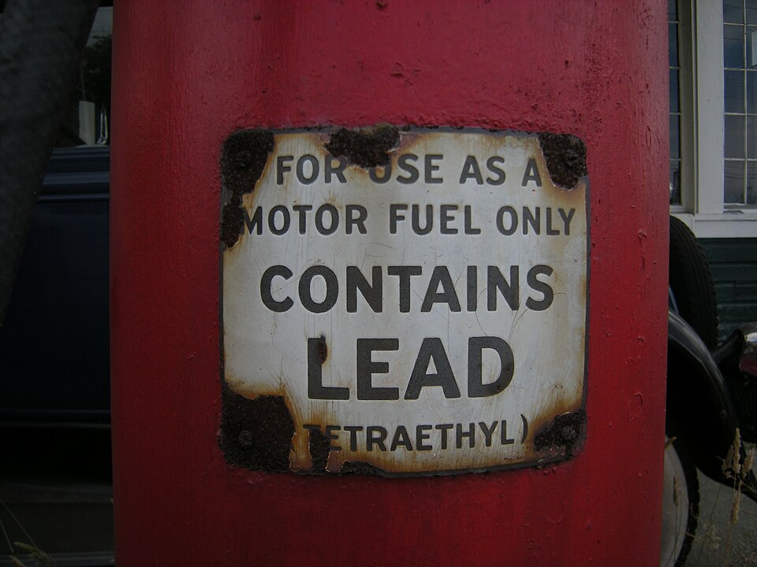

In December 1921, at the research laboratories of **[General Motors](kloom:e/general-motors)** in Dayton, Ohio, a mechanical engineer turned chemist, **[Thomas Midgley Jr.](kloom:e/thomas-midgley-jr)**, found what he and his director, **[Charles F. Kettering](kloom:e/charles-f-kettering)**, had been hunting for: a trace of one compound in petrol stopped an engine knocking. After tellurium was dropped for its smell, the winner was **[tetraethyllead](kloom:e/tetraethyllead)**, a lead atom carrying four ethyl groups. The company sold it as "Ethyl", and left the lead out of the name.

## Knock, and how lead stopped it

A petrol engine squeezes a mixture of fuel and air, and a spark lights it. A flame front then sweeps across the cylinder. If the unburnt mixture ahead of the flame, the _end gas_, is squeezed and heated too far, it ignites by itself before the flame arrives, and the pressure rings through the metal with a knock that wastes power. The more an engine compresses, the more efficient it is, and the more it knocks. The _octane rating_ measures a fuel against two reference hydrocarbons: iso-octane, which resists knock, is 100, and n-heptane, which knocks readily, is 0.

Knock is a chain reaction of free radicals. Tetraethyllead's four carbon–lead bonds are weak, and in the heat of the cylinder the molecule falls apart into lead and lead oxide, which mop up those radicals and break the chain. Burnt, it leaves lead oxide behind:

2 Pb(C₂H₅)₄ + 27 O₂ → 16 CO₂ + 20 H₂O + 2 PbO

Left alone, that oxide would foul the engine, so the fuel also carried dibromoethane and dichloroethane, which turn the lead into volatile lead bromide and chloride. They carried it out of the exhaust, and into the air.

How much lead was that? The dose Midgley defended was 1 part tetraethyllead to 1,300 of petrol by weight. By our arithmetic, from the atomic weights and a petrol of 0.755 kilograms a liter:

| Step                      | Working                        |      Result |
| ------------------------- | ------------------------------ | ----------: |
| Molar mass of Pb(C₂H₅)₄   | 207.2 + 8 × 12.01 + 20 × 1.008 | 323.4 g/mol |
| Lead's share of it        | 207.2 ÷ 323.4                  |         64% |
| Tetraethyllead in a liter | 755 g ÷ 1,300                  |      0.58 g |
| Lead in a liter           | 0.58 g × 0.64                  |      0.37 g |

That is close to the 0.4 grams a liter that Wikipedia gives as the average of American leaded petrol from 1926 to 1985: some 20 trillion liters, and about 8 million tonnes of lead.

## The plants

Making the compound was deadly from the start. Two workers died at the pilot plant in Dayton, and eight more at **[DuPont](kloom:e/dupont)**'s plant in Deepwater, New Jersey, over the following year. In 1924 General Motors and Standard Oil of New Jersey set up the Ethyl Gasoline Corporation, and in its first two months its new plant at Bayway had cases of hallucination and insanity, and five deaths. Midgley himself had taken a long holiday in 1923 to recover from lead poisoning. On 30 October 1924, at a press conference, he poured tetraethyllead over his hands and breathed its vapor for a minute to show that it was safe. Days later New Jersey closed the Bayway plant. Production resumed in 1926.

## The man who measured it

The lead's spread was found by accident. At Caltech, the geochemist **[Clair Patterson](kloom:e/clair-patterson)** was measuring lead isotopes in a meteorite to date the Earth, and in 1956 he gave its age as 4.55 billion years. To do it he had to build one of the first clean rooms, because lead from everywhere spoiled his samples. Following that contamination, he found far more lead in the surface of the oceans than in the deep water, and in polar snow, in his telling, a rise of two or three hundred times since the 1700s. From 1965 he argued that the lead in people was not "normal" but poisonous, against the industry's own expert, Robert Kehoe. The oil companies that had paid for his research no longer did, and in 1971 he was left off a national panel on lead in the air.

American cars built from 1975 needed unleaded petrol to protect their catalytic converters, and leaded petrol for road vehicles was banned in the United States from 1 January 1996. Children's blood lead fell with it, though old paint and the solder in food cans were sources too:

| Survey    | Mean blood lead, ages 1–5 (µg/dL) |
| --------- | --------------------------------: |
| 1976–80   |                              15.2 |
| 1988–91   |                               3.6 |
| 1991–94   |                               2.7 |
| 1999–2002 |                               1.9 |
| 2003–06   |                               1.6 |
| 2007–10   |                               1.3 |
| 2011–16   |                               0.8 |

The last country to sell leaded petrol for cars, Algeria, stopped in July 2021. Piston aircraft still burn it.

## A gas for the refrigerator

Midgley's second molecule answered a different danger. Refrigerators of the 1920s used ammonia, sulfur dioxide and chloromethane, which were toxic or flammable, and leaks had killed. For General Motors' Frigidaire division, Midgley and Albert Henne turned to compounds of carbon with fluorine and chlorine, and made dichlorodifluoromethane, CCl₂F₂, sold as Freon: the first **[chlorofluorocarbon](kloom:e/chlorofluorocarbon)**. In 1930, before the American Chemical Society, Midgley breathed it in and blew out a candle. Crippled by polio, he died in 1944, strangled by the harness of ropes he had built to lift himself from bed; the coroner called it suicide. The environmental historian J. R. McNeill judged that he "had more adverse impact on the atmosphere than any other single organism in Earth's history". What his refrigerator gas did high above us is the story of the ozone hole.
