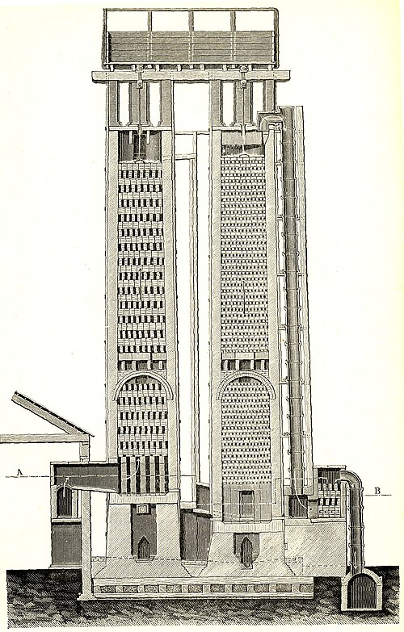
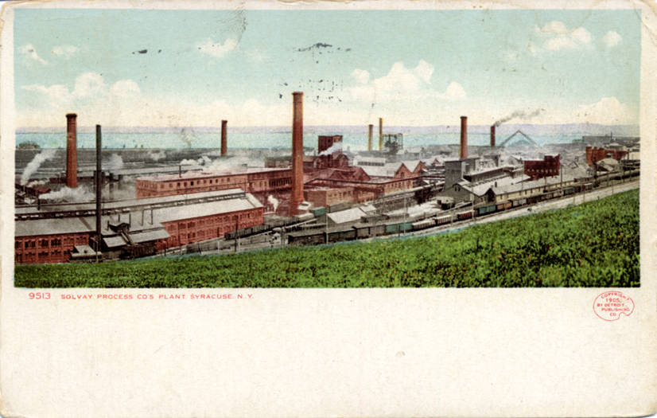

Glass, soap and cloth all needed an alkali, and for most of history the best one came out of a bonfire. **[Sodium carbonate](kloom:e/sodium-carbonate)**, soda, was leached from the ash of plants that grow in salt marshes: the saltworts and glassworts that Spain grew and burned and sold as **[barilla](kloom:e/barilla)**, whose ash held as much as 25–30% soda, and the kelp that Scottish crofters raked off their shores. Potash, its cousin, came from the ash of trees. As Europe's glassworks, soap-boilers and bleachfields grew in the eighteenth century, the ash ran short and its price and quality swung. The alkali industry that replaced it was the first great chemical industry, and it turned on one question: how to make soda from common salt.

## The physician's process

In 1783, by the account of the historian David Kiefer, Louis XVI had the French Academy of Sciences offer 2,400 livres for "the simplest and most economical method of decomposing sea salt on a large scale". Wikipedia's article on the man who won it dates the offer to 1775. **[Nicolas Leblanc](kloom:e/nicolas-leblanc)**, physician to the Duke of Orléans, worked on it for about five years with a young chemist, J. J. M. Dizé, and in 1791 patented the answer and built a works at Saint-Denis, near Paris. Salt heated with sulfuric acid gave sodium sulfate, the "salt cake", and hydrogen chloride. Salt cake roasted with chalk and coal gave a "black ash" from which water washed the soda.

Then the Revolution took it all. The duke was guillotined in 1793, his property seized, and Leblanc made to disclose his process, which the new government published for anyone to use. His works were returned to him in 1801 (Wikipedia says 1802), derelict and unable to compete, and he never received the prize. In January 1806 he shot himself; Kiefer gives the date as the 6th, Wikipedia as the 16th. In 1855 Napoleon III paid his heirs instead.

## Two equations

The **[Leblanc process](kloom:e/leblanc-process)** and its successor, the **[Solvay process](kloom:e/solvay-process)**, turn the same salt into the same soda, and what they leave behind is the whole difference between them. Adding up each process's steps gives its overall equation. By our arithmetic, from the atomic weights (sodium 23.0, chlorine 35.45, calcium 40.08, sulfur 32.06, carbon 12.01, oxygen 16.00, hydrogen 1.01), for every tonne of soda:

| Process       | Overall reaction                                            | Left over, per tonne of Na₂CO₃     |
| ------------- | ----------------------------------------------------------- | ---------------------------------- |
| Leblanc, 1791 | 2 NaCl + H₂SO₄ + CaCO₃ + 2 C → Na₂CO₃ + CaS + 2 HCl + 2 CO₂ | 0.69 t HCl, 0.68 t CaS, 0.83 t CO₂ |
| Solvay, 1860s | 2 NaCl + CaCO₃ → Na₂CO₃ + CaCl₂                             | 1.05 t CaCl₂                       |

Soda is 31% of the weight going into Leblanc's reaction and 49% of the weight going into Solvay's. Solvay's is not the lighter waste: it leaves more by weight than the soda it makes, and at Solvay, New York, the waste beds came to half as much again as the soda. The difference is what the waste is. Calcium chloride is a harmless salt. Leblanc's hydrogen chloride is a choking acid gas, and his calcium sulfide, the gray "galligu", was heaped in stinking hills that gave off hydrogen sulfide as they weathered. Wikipedia gives the real figures as 5.5 tonnes of hydrogen chloride and 7 of sulfide waste for every 8 of soda, close to the equation for the gas and above it for the heaps, which held unburnt coal and more.

## The acid in the air

The process took hold in Britain once the salt tax went at the end of 1824. James Muspratt's works at Liverpool poured out acid "in torrents beyond endurance", a 1907 history of the trade says, until the corporation drove him out of the town. William Gossage showed in 1836 that a tower packed with coke, with water trickling down through the rising gas, would catch it. The **[Alkali Act 1863](kloom:e/alkali-act-1863)** made that the law: every works must condense 95% of its acid, and an inspector, the chemist Robert Angus Smith, with four sub-inspectors, would check. Wikipedia calls it the first modern air-pollution law. The caught acid was often poured into the nearest stream.

## Solvay's tower

The better chemistry had been known for decades. Brine saturated with ammonia and bubbled with carbon dioxide drops sodium bicarbonate, and heating that gives soda; Augustin Fresnel is said to have seen it in 1811, and it was patented in Britain in 1834. What no one could do was run it at scale, recovering the costly ammonia every time. **[Ernest Solvay](kloom:e/ernest-solvay)**, a Belgian who had never been to university, worked on it with his brother Alfred from 1861. His answer was a tower some 24 meters tall, brine falling through it as the gas rose, and a still in which lime drove the ammonia back out of the spent liquor to be used again. The Solvays' first works, at Couillet near Charleroi, started in 1863 or 1864; the sources differ. "Leblanc invented a process, Solvay an apparatus," as the 1907 history puts it.

Brunner, Mond and Company opened a Solvay works in Cheshire in 1874, and the Leblanc makers survived only by selling the chlorine they had once thrown away, as bleach. By the 1890s most of the world's soda was Solvay's, and by 1900, Wikipedia says, 90% of it. Solvay spent part of his fortune on science: the **[Solvay Conference](kloom:e/solvay-conference)** on physics, first held in Brussels in 1911.

Soda came from salt. The next frame's colors came from the other great waste of the century, the tar left when coal was made into gas.
