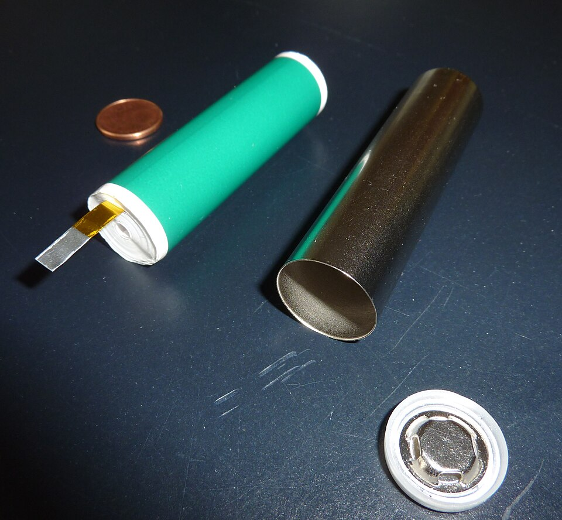

**[Lithium](kloom:e/lithium)** is the lightest metal, with a density of 0.53 grams per cubic centimeter, and among the most eager to give up an electron: its standard reduction potential is −3.05 volts. A battery made from it should be light and high in voltage. But the metal burns in air and reacts with water, and the Nobel committee's history of the **[lithium-ion battery](kloom:e/lithium-ion-battery)** calls the whole story the "taming" of it. The answer, found in three steps on three continents, was to keep lithium only as ions, parked inside two crystals, and never as metal at all.

## A sulfide at Exxon

**[M. Stanley Whittingham](kloom:e/m-stanley-whittingham)**, an Oxford-trained chemist at Exxon's research laboratories, worked in the 1970s on _intercalation_: guests slipping between the layers of a crystal without breaking it. Titanium disulfide is built of TiS₂ sheets held together only weakly, and lithium ions slide into the gaps between them, x Li + TiS₂ → LiₓTiS₂, with the lattice swelling only a little. In 1976 he reported a rechargeable cell of lithium against titanium disulfide at about 2.5 volts. Exxon built cells of up to 45 watt-hours. The Nobel committee's account gives the anode as lithium metal; Wikipedia's articles make it a lithium–aluminum alloy. Either way, metal plated back unevenly on each charge and grew whiskers, _dendrites_, that could pierce the separator, short the cell and set it alight. Development stopped.

## An oxide at Oxford

**[John B. Goodenough](kloom:e/john-b-goodenough)**, a physicist by training who had spent decades on transition-metal oxides, became head of Oxford's Inorganic Chemistry Laboratory in the late 1970s. He reasoned that a sulfide capped the voltage: pull more electrons from its metal and the sulfur is oxidized instead. Oxide ions hold their electrons lower in energy, so an oxide could be charged further. In 1980, with Koichi Mizushima, Philip Jones and Philip Wiseman, he showed that lithium cobalt oxide, LiCoO₂, gives up and takes back lithium ions at about 4 volts. It also came with its lithium already inside, so the other electrode need not be lithium metal. Wikipedia also credits Ned Godshall and his colleagues at Stanford with reporting the same material independently, in 1979 by one of its articles and 1980 by another. By Wikipedia's account, Oxford declined to patent Goodenough's oxide; the government's Atomic Energy Research Establishment at Harwell did, on terms that paid the inventors nothing, and licensed it to **[Sony](kloom:e/sony)** in 1990.

## Carbon at Asahi Kasei

**[Akira Yoshino](kloom:e/akira-yoshino)** of the Japanese chemical company Asahi Kasei supplied the other half. He tried the conducting polymer polyacetylene against Goodenough's oxide in 1983, then carbon, and in 1985 found that a petroleum coke, part graphite-like and part disordered, took lithium ions in and gave them back without flaking apart. The cell was assembled discharged, with every lithium ion in the cobalt oxide; charging moves them into the carbon. The ions swing between two hosts and back, and the design became known as the _rocking chair_. Yoshino dropped a weight on his cells to test them: they broke without fire, where cells with metal anodes reacted violently.

Sony began selling lithium-ion cells in 1991, at about 80 watt-hours per kilogram. Here the sources disagree: the Nobel committee says that first cell used a petroleum-coke anode, and a 2020 review by Arumugam Manthiram, who had worked with Goodenough at Oxford and Austin, says graphite; Wikipedia says the soft carbon gave way to hard carbon and then graphite through the 1990s.

## Counting the charge

On discharge the two electrodes do this:

| Electrode           | Half-reaction             |
| ------------------- | ------------------------- |
| negative, graphite  | LiC₆ → C₆ + Li⁺ + e⁻      |
| positive, the oxide | CoO₂ + Li⁺ + e⁻ → LiCoO₂  |
| the whole cell      | LiC₆ + CoO₂ → C₆ + LiCoO₂ |

Each formula unit of LiCoO₂ can hold one electron's worth of charge. By our arithmetic, its molar mass is 6.94 + 58.93 + 2 × 16.00 = 97.87 grams, and a mole of electrons is Faraday's constant, 96,485 coulombs, so one gram holds 96,485 ÷ 97.87 = 986 coulombs. A milliamp-hour is 3.6 coulombs, which gives 274 milliamp-hours per gram. Only about half can be used. Take out more than half the lithium and the cobalt's oxidized states reach down into the oxygen's, and the crystal starts to release oxygen; Manthiram puts LiCoO₂'s practical capacity at about 140 milliamp-hours per gram.

## Since 1991

Goodenough's group, by then at Austin, reported lithium iron phosphate, LiFePO₄, in 1996: its voltage is lower, but it is stable and holds no cobalt, and by the same arithmetic its capacity is 170 milliamp-hours per gram. The International Energy Agency, as Wikipedia reports, counts LFP batteries in half of the world's electric-vehicle sales. Micah Ziegler and Jessika Trancik reckon that the price of lithium-ion cells, per unit of energy, has fallen by about 97 per cent since 1991, and Wikipedia that their energy density more than tripled between 1991 and 2018. The cells sit in every laptop, camera and phone: the lithium cobalt oxide cell is the usual power of handheld electronics, and the **[smartphone](kloom:e/smartphone)** was built on it.

Whittingham, Goodenough and Yoshino shared the 2019 [Nobel Prize in Chemistry](kloom:e/nobel-prize-in-chemistry). Goodenough, at 97, was the oldest Nobel laureate there had been.

The next frames leave materials for the chemistry of life, beginning with the proteins that speed its reactions: enzymes.
