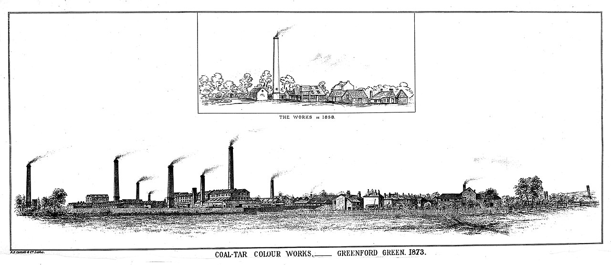

In the spring of 1856 a chemistry student of eighteen set out to make a drug and made a color instead. **[William Henry Perkin](kloom:e/william-henry-perkin)** was an assistant to **[August Wilhelm von Hofmann](kloom:e/august-wilhelm-von-hofmann)** at the Royal College of Chemistry in London, and during the Easter vacation he worked in a rough laboratory at home, in the family house off Cable Street in the East End. His target was **[quinine](kloom:e/quinine)**, the drug against malaria that came from the bark of the South American cinchona tree. What he got was a black sludge, and in it a purple that dyed silk and stood up to the light.

## Arithmetic without structure

Perkin told the story himself forty years later, in his memorial lecture for Hofmann in 1896, and gave his reasoning. Hofmann had written in 1849 that making quinine artificially was, in Perkin's words, "a great desideratum", and had guessed at a route by adding and subtracting formulas. Perkin did the same. Adolph Strecker had fixed quinine's formula in 1854 as C₂₀H₂₄N₂O₂. Perkin took a base called toluidine, gave it an allyl group to make allyltoluidine, C₁₀H₁₃N, and proposed that two of these, with oxygen, would give quinine and water:

2 C₁₀H₁₃N + 3 O → C₂₀H₂₄N₂O₂ + H₂O

It balances. By our arithmetic, atom by atom:

| Step                 |   C |   H |   N |   O |
| -------------------- | --: | --: | --: | --: |
| two allyltoluidines  |  20 |  26 |   2 |   0 |
| add three oxygens    |  20 |  26 |   2 |   3 |
| take away one water  |  20 |  24 |   2 |   2 |
| quinine, by Strecker |  20 |  24 |   2 |   2 |

A subtler count agrees too. A formula says how many rings and double bonds a molecule holds between them: the carbons, less half the hydrogens, plus half the nitrogens, plus one. For allyltoluidine that is 10 − 6.5 + 0.5 + 1 = 5, a benzene ring with its three double bonds and the allyl group's one. For quinine it is 20 − 12 + 1 + 1 = 10, exactly twice five. Yet nothing could come of it. Quinine's atoms sit in four rings: a quinoline, two rings fused side by side, and a cage of two more bridged through a nitrogen, which allyltoluidine does not have and potassium dichromate could not build. In 1856 no chemist could see this, because none yet wrote down how the atoms in a molecule are joined; the structure theory that does came two years later. Quinine was not made in a laboratory until 1944, and cinchona bark is still the only economic source of it.

Perkin's allyltoluidine gave "a dirty reddish-brown precipitate". Curious, he tried a simpler base, **[aniline](kloom:e/aniline)**, oxidizing its sulfate with potassium dichromate, and got a black precipitate that held the dye.

## Purple from tar

Aniline came from **[coal tar](kloom:e/coal-tar)**, the black waste left when coal was baked into coke and the gas that lit Victorian streets. Benzene distilled from the tar was nitrated, and the nitrobenzene reduced with iron, a method found only in 1854. In 1856, Perkin said, aniline could not be bought. But the color was wanted. Pullar's, the Perth dyers, wrote on 12 June 1856 that "if your discovery does not make the goods too expensive, it is decidedly one of the most valuable that has come out for a very long time", because lilac on silk had always faded. Perkin patented the process on 26 August 1856, at eighteen. He left Hofmann, who was "much annoyed", and with his father's savings and his brother Thomas's help built works at Greenford Green, west of London, from June 1857. Almost every vessel had to be invented: nitrobenzene had never been made in iron before. The name he first gave the dye borrowed the emperors' color, the **[Tyrian purple](kloom:e/tyrian-purple)** of the murex snail: in December 1857, he recalled, "aniline purple, or Tyrian purple, as it at first was called" was dyeing silk in a London dye-house.

By 1859 it was called mauve, from the French for the mallow flower, and it was the fashion. In August that year _Punch_ diagnosed "the Mauve Measles". Queen Victoria's journal says that she wore "mauve moire antique & silver" to her daughter's wedding in January 1858, but nobody recorded the dye, and in 1856–58 "mauve" also meant purples dyed with murexide or with natural dyes. The Science Museum in London holds a scrap of silk dyed with Perkin's color, cataloged as the pattern supplied to the Queen for a dress about 1860. Popular accounts also dress her in Perkin's dye at the 1862 International Exhibition; we found no record of it.

## What was in the flask

Perkin's aniline was impure, and the impurity made the dye. His aniline held toluidines, and the structure printed for **[mauveine](kloom:e/mauveine)** for most of a century was wrong. In 1994 Otto Meth-Cohn and Mandy Smith analyzed samples made in Perkin's own factory and found chiefly two dyes. The plate draws the first, mauveine A, C₂₆H₂₃N₄⁺, stitched together from two molecules of aniline and one each of the two toluidines: three six-membered rings fused in a row, the middle one holding two nitrogens, one of them charged and carrying a benzene ring. Its long run of alternating single and double bonds is what absorbs light and gives the color.

The industry mauveine founded left Britain. Hofmann went home to Berlin in 1865. Bayer and Hoechst were founded in 1863 and **[BASF](kloom:e/basf)** in 1865, and in 1869 BASF patented the red dye alizarin a day before Perkin did. By 1913 German firms made almost nine-tenths of the world's dyes. Those firms turned their chemistry from color to medicine, and the trail from this frame follows them: indigo made in a factory, then aspirin, Salvarsan and Prontosil, and, at its end, penicillin.
