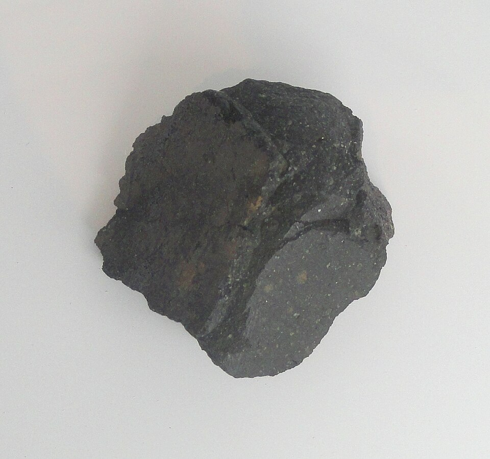

If life began from chemistry, the chemistry had to make its parts first. In 1924 the Soviet biochemist **[Alexander Oparin](kloom:e/alexander-oparin)** argued, in a Russian pamphlet few outside Russia read, that the young Earth's surface had made organic compounds from simple gases before anything lived. In 1929 the British biologist **[J. B. S. Haldane](kloom:e/j-b-s-haldane)**, independently, gave the idea its name: ultraviolet light acting on water, carbon dioxide and ammonia would have filled the early oceans until they reached "the consistency of hot dilute soup". By his 1936 book Oparin had settled on an atmosphere with no free oxygen, of methane, ammonia, hydrogen and water. For a quarter of a century it was an argument without an experiment.

## A week of lightning

In 1952 **[Harold Urey](kloom:e/harold-urey)**, the Nobel chemist who had found deuterium, argued at the University of Chicago that the early atmosphere was reducing, rich in hydrogen. A graduate student, **[Stanley Miller](kloom:e/stanley-miller)**, heard him lecture, and after a year of going nowhere with Edward Teller he asked Urey to let him test it. Urey was doubtful and gave him a year.

The apparatus is the plate. Miller put 200 ml of water in a small flask, pumped out the air, and let in hydrogen to 10 cm of mercury, methane to 20 and ammonia to 20: two parts methane to two of ammonia to one of hydrogen. The water boiled, the steam carried the gases into a five-litre flask where a spark ran between two electrodes, fed by an induction coil made for finding leaks in vacuum apparatus, and a condenser turned the vapour back to water, which ran through a U-shaped trap into the boiling flask again. He ran it for a week. The water turned pink on the first day and was "deep red and turbid" by the end.

On paper chromatograms sprayed with ninhydrin he identified **[glycine](kloom:e/glycine)** and two alanines, α and β, and less certainly aspartic acid and α-aminobutyric acid. The total yield, he estimated, was "in the milligram range". Urey refused to share the byline, so that the credit would be Miller's, and when _Science_ was slow he threatened to send the paper to the _Journal of the American Chemical Society_ instead. It appeared on 15 May 1953, as the **[Miller–Urey experiment](kloom:e/miller-urey-experiment)**, whose name still carries both.

## How the spark makes an amino acid

In 1957 Miller followed the solution through a run. Hydrogen cyanide and aldehydes such as formaldehyde built up first, and the amino acids grew as they were used up: the route by which the German chemist **Adolph Strecker** had long before made alanine from acetaldehyde, ammonia and cyanide. For glycine it runs in two steps, with ammonia given back at the end:

| Step                               | Reaction                            |
| ---------------------------------- | ----------------------------------- |
| Aldehyde, ammonia and cyanide join | CH₂O + NH₃ + HCN → H₂NCH₂CN + H₂O   |
| Water turns the nitrile to an acid | H₂NCH₂CN + 2 H₂O → H₂NCH₂COOH + NH₃ |
| Overall                            | CH₂O + HCN + H₂O → H₂NCH₂COOH       |

The overall reaction balances atom for atom: two carbons, five hydrogens, one nitrogen and two oxygens on each side, and glycine is C₂H₅NO₂. By our arithmetic, with carbon 12, nitrogen 14, oxygen 16 and hydrogen 1, 30 g of formaldehyde, 27 g of hydrogen cyanide and 18 g of water make at most 75 g of glycine, one mole of each. The alanines come the same way from acetaldehyde, CH₃CHO. The spark's job is only to break methane, ammonia and water into the radicals that build cyanide and aldehydes; the water does the rest. And the amino acids come out as equal mixtures of left- and right-handed forms, while life uses only one.

## Doubts, vials and meteorites

Recent models make the early atmosphere only weakly reducing, carbon dioxide and nitrogen rather than methane and ammonia, which gives far fewer amino acids; later experiments recover some yield with buffered water, and a model of 2023 has large asteroid impacts making Miller's atmosphere for millions of years at a time.

Miller kept his old samples. His former student Jeffrey Bada found them among Miller's laboratory materials, and in 2008 his group reanalysed the extracts of a second apparatus Miller had tried in the 1950s, which blew a jet of steam into the spark like a volcanic eruption. In 1953 Miller had noted only that an apparatus with an aspirator gave less. Modern instruments found 22 amino acids and five amines in it, a wider range than the classic flask. Wikipedia's article on Miller says the reanalysed samples were the 1952 ones; the paper's own abstract says the volcanic apparatus. Vials from 1958, with hydrogen sulphide added, gave 23 amino acids and four amines in 2011, seven of the compounds holding sulphur.

The **[Murchison meteorite](kloom:e/murchison-meteorite)**, which fell in Australia in 1969, carries amino acids in a mix much like a spark flask's, a sign that the same chemistry runs elsewhere in the solar system. But amino acids are not life. Chains of them, and a molecule that copies itself, are the harder steps, and the **[RNA world](kloom:e/rna-world)**, named by Walter Gilbert in 1986, proposes that RNA, which can both store information and catalyse, came first. Others look to the mineral chimneys of deep-sea hydrothermal vents. As of September 2026 no one knows how the first cell arose. The next frame is a way to copy DNA in a tube.
