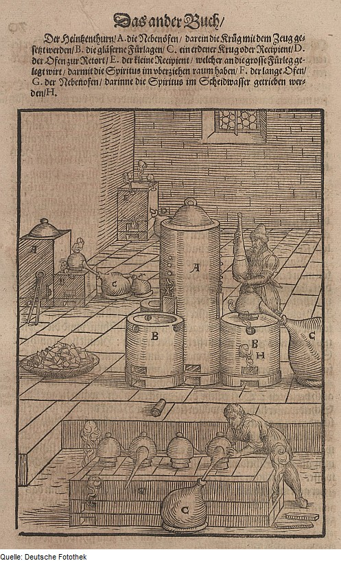

Shortly before 1310 a Latin book on alchemy appeared under the name of Geber, the Latin form of Jabir: the _Summa perfectionis magisterii_, "the height of the perfection of mastery". It was clearer and more practical than anything before it, a manual of laboratory operations and of tests of metals, and it explained the metals as made of tiny particles of sulfur and mercury. Its author is now called **[Pseudo-Geber](kloom:e/pseudo-geber)**. The historian **[William R. Newman](kloom:e/william-r-newman)** has argued since 1985 that he was **[Paul of Taranto](kloom:e/paul-of-taranto)**, a Franciscan of southern Italy, and many historians accept it as likely. Ahmad al-Hassan rejected it, and held that the Geber books were translated from Arabic originals. With the _Summa_ came a water that dissolved **[silver](kloom:e/silver)**, and then one that dissolved **[gold](kloom:e/gold)**.

## Our dissolving water

The recipe is not in the _Summa_ itself but in a companion book, the _Liber de inventione veritatis_, "the book of finding the truth", which Newman takes to have been written soon after as a commentary on it. The historian of chemistry Vladimír Karpenko calls it the first unambiguous European recipe for **[nitric acid](kloom:e/nitric-acid)**. It takes a pound of vitriol, half a pound of saltpeter and a quarter-pound of alum, and distills them with the vessel glowing red. The book calls the distillate _aqua nostra dissolutiva_, our dissolving water, and says it had been mentioned in the _Summa_; Karpenko finds no such water there, and reads the reference as a bid to tie the two books together. Then the recipe adds a quarter-pound of sal ammoniac, and ends: "This liquid then dissolves gold, sulfur, and silver." With the sal ammoniac it had become **[aqua regia](kloom:e/aqua-regia)**, royal water, Europe's first known solvent for gold.

In the still, heat breaks down the vitriol, a copper or iron sulfate, and the saltpeter's nitrogen and oxygen come over as nitric acid, which condenses in the receiver, by a chain of steps Karpenko sets out. For dried copper vitriol he gives the overall reaction:

2 KNO₃ + CuSO₄·3H₂O → 2 HNO₃ + K₂SO₄ + CuO + 2 H₂O

By our arithmetic, since a molecule of nitric acid weighs 63 against saltpeter's 101, saltpeter can give at most 62% of its own weight in acid: five ounces from the recipe's half-pound. In the 1950s the chemist Schröder distilled 150 grams of saltpeter with 150 of vitriol and 50 of alum at about 800 °C and collected 70 grams of nitric acid, 74% of what the equation allows, as a 51% solution.

## Why gold stays

Nitric acid dissolves silver:

3 Ag + 4 HNO₃ → 3 AgNO₃ + NO + 2 H₂O

and it leaves gold alone. The electrode potentials say why. A metal dissolves in the acid when its own potential lies below nitrate's, and silver's does. Gold's lies far above. But chloride holds gold in a tight complex, AuCl₄⁻, and in that form gold gives up its electrons much more readily, a little more readily than nitrate takes them. Add chloride, as the sal ammoniac did, and the gold goes:

Au + HNO₃ + 4 HCl → HAuCl₄ + NO + 2 H₂O

| Couple                          | Standard potential (volts) |
| ------------------------------- | -------------------------: |
| Ag⁺ + e⁻ ⇌ Ag                   |                       0.80 |
| AuCl₄⁻ + 3 e⁻ ⇌ Au + 4 Cl⁻      |                       0.93 |
| NO₃⁻ + 4 H⁺ + 3 e⁻ ⇌ NO + 2 H₂O |                       0.96 |
| Au³⁺ + 3 e⁻ ⇌ Au                |                       1.52 |

The margin is small; strong acid widens it. By our arithmetic, a gram of silver takes 0.78 grams of nitric acid to dissolve.

## The assayer's acid

That difference made nitric acid the tool of the assayer. A king who suspects his goldsmith of mixing silver into gold, as Hiero is said to have asked **[Archimedes](kloom:e/archimedes)**, can now dissolve the silver out and weigh the gold left behind. The method was called _parting_. An alloy rich in gold protects its silver, so assayers first melted in three parts of silver to each part of gold, _quartatio_, then hammered the button thin, rolled it into a tube and heated it in the acid until only a porous roll of gold was left. The name of the proof survives: the _acid test_. Karpenko finds the acid first in alchemists' laboratories, made in small amounts; the assayers' booklets of the early sixteenth century treat parting as routine, and Vannoccio Biringuccio in 1540 describes furnaces holding "three or four pairs of cucurbits" to make the acid. The woodcut shows an acid works in Lazarus Ercker's book on assaying, printed a generation later, here in an edition of 1629.

Europe may not have been first. Holmyard reported that chemists at the Cairo mint in the thirteenth century already parted gold and silver with nitric acid, al-Hassan found mineral acids in Arabic texts before 1200, and Joseph Needham read a Chinese text of about 660 as using nitrate for aqua regia. The Wikipedia article on silver nitrate says that Albertus Magnus described parting in the thirteenth century; Karpenko, following Robert Multhauf, says that neither Albertus nor Roger Bacon knew the mineral acids. He thinks they may have been found more than once, and that the early claims are hard to prove.

## Water of life

The same stills made a gentler water. Recipes for _aqua ardens_, burning water, made by distilling wine with salt, appear in Latin from the twelfth century, and the physician Taddeo Alderotti (1223–1296) concentrated it to about 90% alcohol by repeated distillation through a water-cooled still. It came to be called _aqua vitae_, the water of life. The two waters met: the cardinal Vitalis de Furno, who died in 1327, distilled saltpeter and copper vitriol with _aqua ardens_ for a water said to dissolve every metal.

The next frame turns from dissolving metals to casting them: the alloy of the printer's type.
