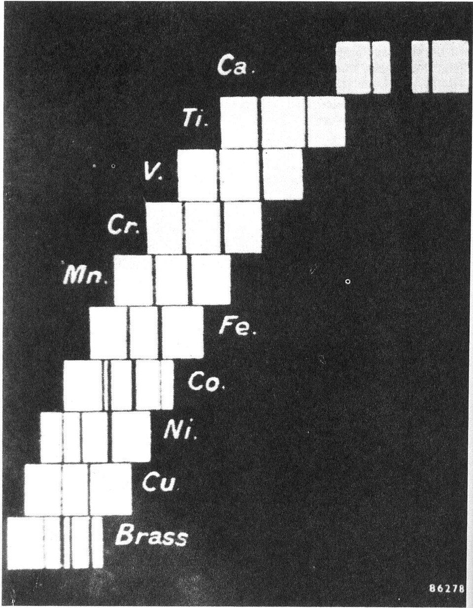

Until 1913 an element's number meant only its place in a list. Chemists ordered the [periodic table](kloom:e/periodic-table) by atomic weight, and where weight and chemistry disagreed they swapped the pair and moved on: argon went before potassium, though it was heavier, cobalt before nickel, tellurium before iodine. Nobody could say whether the numbers themselves meant anything, or how many elements were still missing. In two papers of 1913 and 1914 **[Henry Moseley](kloom:e/henry-moseley)**, a physicist in his mid-twenties, answered both questions with **[X-rays](kloom:e/x-ray)**.

## Light from deep in the atom

Moseley worked at the **[University of Manchester](kloom:e/university-of-manchester)**, in the laboratory of **[Ernest Rutherford](kloom:e/ernest-rutherford)**, who had just found the atom's nucleus. A year before, crystals had been shown to diffract X-rays, and the Braggs, father and son, had turned that into a way to measure an X-ray's wavelength: a ray reflects strongly from a crystal only at angles where _n_λ = 2_d_ sin θ, with _d_ the spacing of the crystal's layers.

Moseley put samples of different elements on a small truck inside an X-ray tube, so that a magnet could bring each in turn under the cathode rays. The rays each element gave off passed through a thin aluminium window, fell on a crystal of potassium ferrocyanide, and were caught on a photographic plate, usually in a five-minute exposure. The plate draws the geometry. Every element gave two lines, a strong one he called α and a weaker β, and from element to element they moved in a steady march.

## A number that steps by one

He turned each α line's wavelength into a frequency, _ν_, and compared it with ¾ of the frequency in hydrogen's own spectrum, the Rydberg frequency _ν_₀. The quantity _Q_ = √(_ν_ ÷ ¾_ν_₀) went up by one, almost exactly, from each element to the next. By our arithmetic, from the wavelengths in his table (the speed of light 3.00 × 10¹⁰ centimetres a second, _ν_₀ = 3.29 × 10¹⁵ a second), his figures come back to the second decimal:

| Element  | Place, _N_ | α wavelength, 10⁻⁸ cm | His _Q_ | _N_ − 1 |
| -------- | ---------: | --------------------: | ------: | ------: |
| Calcium  |         20 |                 3.368 |   19.00 |      19 |
| Titanium |         22 |                 2.758 |   20.99 |      21 |
| Vanadium |         23 |                 2.519 |   21.96 |      22 |
| Iron     |         26 |                 1.946 |   24.99 |      25 |
| Cobalt   |         27 |                 1.798 |   26.00 |      26 |
| Nickel   |         28 |                 1.662 |   27.04 |      27 |
| Copper   |         29 |                 1.549 |   28.01 |      28 |
| Zinc     |         30 |                 1.445 |   29.01 |      29 |

So _Q_ = _N_ − 1, and the frequency grows as the square of the number. Between calcium and titanium _Q_ jumps two: scandium, element 21, which he did not examine, sits in the gap. Cobalt, whose atomic weight (58.9) is a little more than nickel's (58.7), comes out 27 and nickel 28, just where the chemists had put them.

The ¾ was not a guess. It is 1 − ¼, the step from the second to the first orbit of **[Niels Bohr](kloom:e/niels-bohr)**'s new atom, and Moseley saw that Bohr's formula, meant for hydrogen, fitted X-rays two thousand times shorter if the nucleus's charge were _N_ − 1 rather than 1. In 1913 the Dutch physicist **[Antonius van den Broek](kloom:e/antonius-van-den-broek)** had proposed that an element's place in the table is the charge on its nucleus. Moseley's lines, he wrote, gave "the strongest possible support" to the idea. The **[atomic number](kloom:e/atomic-number)** was a count of charge, not a place in a queue.

## Three gaps

Late in 1913 he moved to the Electrical Laboratory at Oxford (Wikipedia's article on him gives that date in one place and has him leaving Manchester in 1914 in another), and by April 1914 he had measured some forty elements from aluminium to gold. Listed by number, they left gaps only at 43, 61 and 75, and he concluded that "three, and only three, more elements are likely to exist between Al and Au". Wikipedia's article on him counts four gaps, adding 72. His own diagram does not: it gives 72 to lutetium, because the rare earths were then so tangled that thulium took two places. Element 72, hafnium, was found in 1922 by Coster and Hevesy, by its X-ray lines, in zircon; rhenium, 75, followed. The chemists' swaps (argon and potassium, tellurium and iodine) were all confirmed.

When the war came, Moseley joined the Royal Engineers. He was a signals officer at Gallipoli, and on 10 August 1915 he was shot and killed, aged twenty-seven. He has no known grave. Almost fifty years later Niels Bohr said that the "great change came from Moseley".

The next frame is the first of his gaps, element 43, and how it was filled.
