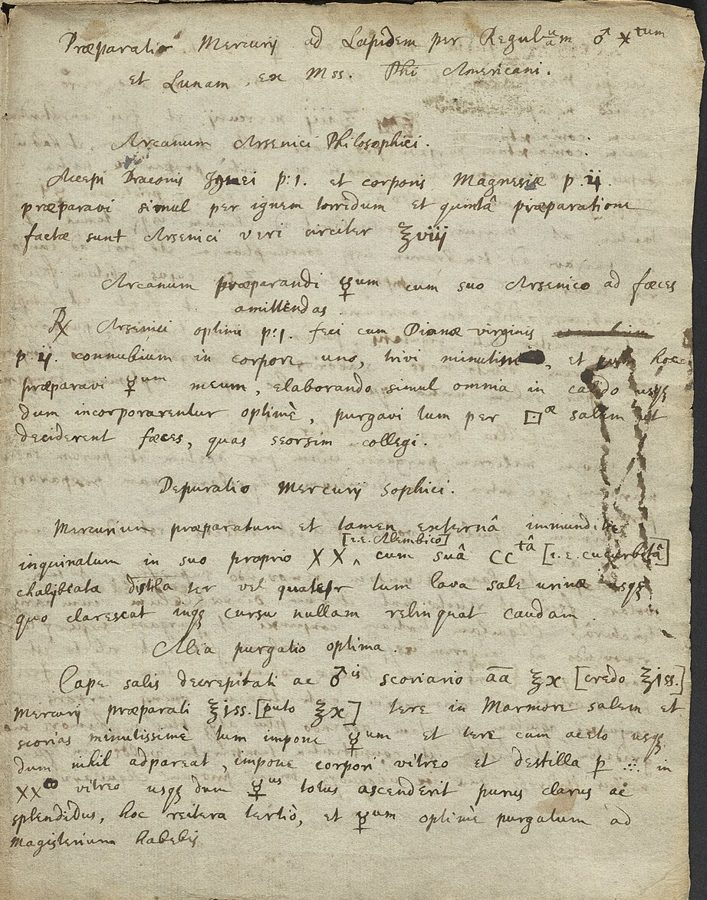

**[Isaac Newton](kloom:e/isaac-newton)** spent some thirty years on alchemy, from his early years at Cambridge in the 1660s until he left for the Mint in London in 1696, and probably beyond. He read, copied, indexed and tested the alchemists, and wrote and transcribed about a million words on the subject, by the count of the Chymistry of Isaac Newton project at Indiana University, which is editing them. He published almost none of it. When he died in 1727 the papers were labeled "not fit to be printed", and they stayed with his family, the Earls of Portsmouth, for two centuries.

## The furnace in the garden

What his laboratory was like comes from **Humphrey Newton**, who was sent up to Cambridge in the last year of Charles II's reign to work for him and stayed about five years, long enough to copy out the _Principia_ for the press. In letters written after Newton's death, in 1728, he remembered that each spring and autumn Newton spent about six weeks in his laboratory, the fire scarcely going out night or day, the two of them sitting up by turns. It stood at the left end of Newton's garden at **[Trinity College](kloom:e/trinity-college-cambridge)**, near the east end of the chapel, and was full of retorts, receivers and crucibles, though only the crucibles saw much use, for fusing metals. In his first letter Humphrey could not "penetrate into" what Newton was aiming at. In his second he wrote: "The transmuting of Metals, being his Chief Design, for which Purpose [Antimony](kloom:e/antimony) was a great Ingredient." It is his telling, nearly forty years on.

## The last of the magicians

In 1936 the ninth Earl of Portsmouth sold the papers at **Sotheby's**, 329 lots, over a third of them alchemical. The economist **[John Maynard Keynes](kloom:e/john-maynard-keynes)** bought at the sale and after it, and gathered about half of the dispersed papers, the alchemy chiefly, while the scholar Abraham Yahuda took the theology. Keynes left his to King's College, Cambridge. Wikipedia's article on Newton's occult studies says that much of Keynes's collection passed to Yahuda; the Newton Project's catalog, which lists the manuscripts as Keynes's at King's College, and the historian Sarah Dry both say otherwise.

Keynes's verdict, read by his brother at the Royal Society in 1946, months after Keynes died, became the most quoted sentence on the subject: "Newton was not the first of the age of reason. He was the last of the magicians." He thought the alchemy "wholly devoid of scientific value". The same essay places the laboratory in a small wooden building of two stories at the chapel end of the garden.

## The star regulus

Much of what Newton wrote is other men's work, copied. The page shown is his copy of a manuscript by the "American philosopher", the Harvard-educated alchemist **[George Starkey](kloom:e/george-starkey)**, who wrote as Eirenaeus Philalethes and had taught Robert Boyle his chymistry. Its title promises the philosophers' mercury "by the star regulus of Mars and the Moon": of antimony made with iron, and silver.

A regulus is the metal at the bottom of a crucible. **[Stibnite](kloom:e/stibnite)**, the gray ore of antimony, is its sulfide, and iron takes the sulfur from it. By our arithmetic, from the atomic weights (antimony 121.8, sulfur 32.1, iron 55.8):

| Sb₂S₃ + 3 Fe → 2 Sb + 3 FeS        | Stibnite, Sb₂S₃ | Iron, 3 Fe | Antimony, 2 Sb | Iron sulfide, 3 FeS |
| ---------------------------------- | --------------: | ---------: | -------------: | ------------------: |
| Grams, as the equation weighs them |             340 |        168 |            244 |                 264 |
| Grams, from 100 g of stibnite      |             100 |         49 |             72 |                  78 |

So half its weight in iron turns a lump of pure ore into nearly three-quarters of its weight of metal, and the iron sulfide floats off with the slag. The project's chemists, following Newton's own recipes, fused stibnite with iron and saltpeter, purified the antimony by fusing it again with more saltpeter, and let it cool slowly under a thick layer of slag. Cooled that way, the metal shows a star of crystals on its face, which is what the plate draws.

The "Clavis", the key, is a manuscript in Newton's hand of detailed directions for a long operation that begins with antimony, iron and sulfur. A Cambridge bookseller bought it at the sale for £6 and sold it to Keynes for £8 5s. The historian **[Betty Jo Teeter Dobbs](kloom:e/betty-jo-teeter-dobbs)** printed it in 1975 as probably Newton's own work; in 1987 **[William Newman](kloom:e/william-r-newman)** showed that it was copied from an unpublished manuscript of Starkey's, and Dobbs accepted it.

## What it was for

Historians disagree about what the alchemy meant. Dobbs, and the biographer Richard Westfall, argued that it shaped Newton's idea of a force acting across empty space, and Dobbs that it was part of his religious quest. Newman answers that there is no direct evidence for either: where Newton's alchemical papers explain why things fall, they do it with a material aether pushing them down. What Newman does find is a debt in optics. In the notebook where Newton first recorded putting the prism's colors back together into white light, he copied Boyle's accounts of taking substances apart and putting them back together, and in his lectures of 1669 he borrowed Boyle's word for it, _redintegration_. White light, to the young Newton, was a mixture of corpuscles that could be separated and recombined like a chymist's compound.

The trail's next frame is an alchemist who promised a king gold and made porcelain instead.
