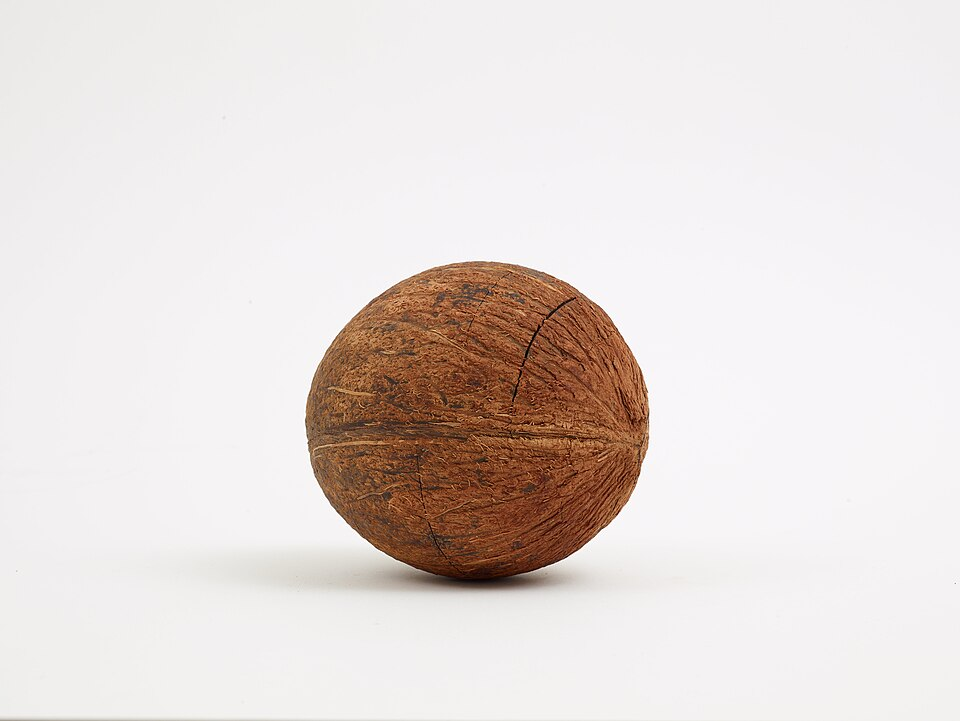

In December 1945, at Harvard, the physicist **[Edward Purcell](kloom:e/edward-mills-purcell)** and his colleagues Henry Torrey and Robert Pound put a solid into a strong magnet and found the frequency at which the protons in it absorbed energy. At almost the same time, at Stanford, **[Felix Bloch](kloom:e/felix-bloch)**, William Hansen and Martin Packard picked up the same signal from water, which they called _nuclear induction_. Both papers appeared in the _Physical Review_ early in 1946. **Isidor Rabi** had measured nuclear magnets in beams of molecules in 1938; what was new was doing it in ordinary matter. It was **nuclear magnetic resonance**, which chemists would make into **[NMR spectroscopy](kloom:e/nuclear-magnetic-resonance-spectroscopy)**. A nucleus with spin, such as a proton, behaves like a tiny magnet, precesses in a magnetic field at a frequency set by the field, and absorbs radio waves at exactly that frequency.

Bloch and Purcell shared the Nobel Prize in Physics in 1952. In his Nobel lecture Purcell remembered the winter of the first experiments, looking at the snow on his doorstep as "great heaps of protons quietly precessing in the earth's magnetic field".

## A nuisance for physicists

Physicists hoped that each kind of nucleus would resonate at one exact frequency. As magnets improved, the same nucleus in different molecules precessed at slightly different frequencies, because the electrons around it shield it from part of the applied field, and how much they shield depends on the chemical bonds it is in. The **[chemical shift](kloom:e/chemical-shift)**, in its present meaning, first appeared in journals in 1950. It was "only a nuisance", Purcell said, to the experimenter measuring nuclear moments, but interesting to the chemist, "because they reveal something about the electrons that partake in the chemical bond".

In 1951 James Arnold, S. S. Dharmatti and Packard, in Bloch's laboratory, published the example that made the point. The proton signal of **ethyl alcohol** split into three lines, one for each kind of hydrogen in the molecule. Russell Varian had filed a patent on the method in 1948, and his company, **Varian Associates**, built its first NMR spectrometer, the HR-30, in 1952.

## Reading ethanol

Ethanol is CH₃CH₂OH. Its six hydrogens sit in three different places: three on the end carbon, two on the carbon next to the oxygen, and one on the oxygen itself. Each place gives its own line, and, as Purcell told the Nobel audience, the area of each line is proportional to the number of hydrogens that make it: 3, 2 and 1. So the spectrum counts atoms. The CH₂ line sits well away from the CH₃ line because the oxygen next to it draws electrons away and unshields its protons.

With better magnets each line split again. A proton feels the tiny magnets of the protons on the neighbouring carbon, each pointing with the field or against it, and the effect passes through the electrons of the bonds between them. Each arrangement of the neighbours shifts the line a little, and arrangements with the same total give the same shift. So _n_ equivalent neighbours split a line into _n_ + 1, with heights from Pascal's triangle. By our arithmetic, for ethanol:

| Hydrogens | How many | Neighbours it feels | Arrangements of the neighbours               | Line becomes           |
| --------- | -------: | ------------------: | -------------------------------------------- | ---------------------- |
| CH₃       |        3 |             2 (CH₂) | ↑↑; ↑↓ or ↓↑; ↓↓                             | triplet, 1 : 2 : 1     |
| CH₂       |        2 |             3 (CH₃) | ↑↑↑; three with one ↓; three with two ↓; ↓↓↓ | quartet, 1 : 3 : 3 : 1 |
| OH        |        1 |       none it keeps | (swapped between molecules too fast)         | single line            |

The CH₃ triplet is the same counting as the purple dye's bromine pair: two things that can each be one of two ways, with "one of each" happening in two ways. The OH proton should split the CH₂ lines once more, but in ordinary ethanol it jumps between molecules so fast that the coupling averages away. Three lines of areas 3 : 2 : 1, one a triplet and one a quartet: from that alone a chemist can write the molecule. The plate draws the molecule and the spectrum it gives.

## Pulses, and pictures

Early spectrometers swept slowly through the frequencies. In 1964, at Varian in Palo Alto, Weston Anderson suggested to **[Richard Ernst](kloom:e/richard-r-ernst)** that they hit the sample with one short pulse of radio waves instead, which excites every line at once, and record the dying signal that follows. A Fourier transform separates that signal into its frequencies, a relation that Ernst's Nobel lecture traces back to Joseph Fourier's work on heat of 1822. In the time one slow sweep took, the pulse could be repeated and its signals added hundreds of times (500 in 500 seconds, in the lecture's first example), which made weak signals readable. Ernst and Anderson published it in 1966. Ernst went on to spread spectra over two dimensions, and won the Nobel Prize in Chemistry in 1991.

In 1973 **[Paul Lauterbur](kloom:e/paul-lauterbur)** added a magnetic field that varied across the sample, so that a proton's frequency told where it was, and made the first images by NMR. He shared the 2003 Nobel Prize in Physiology or Medicine with Peter Mansfield for **[magnetic resonance imaging](kloom:e/magnetic-resonance-imaging)**. Raymond Damadian, who had reported in 1971 that the protons of tumours relax more slowly than those of healthy tissue, and who built one of the first scanners, was not among the laureates. Lauterbur's group tested its three-dimensional method of 1981 on the coconut pictured, whose shell, flesh and milk were simple to tell apart.

Computers learned to read spectra too. **[DENDRAL](kloom:e/dendral)**, the Stanford expert system, took NMR data beside mass spectra in its papers on ethers and amines of 1969 and 1970. A critical review kept among Joshua Lederberg's papers is blunt: its programs were rarely used, and a structure was proved in the end by X-ray crystallography or by NMR itself. The next frame is chemistry done entirely by computer.
