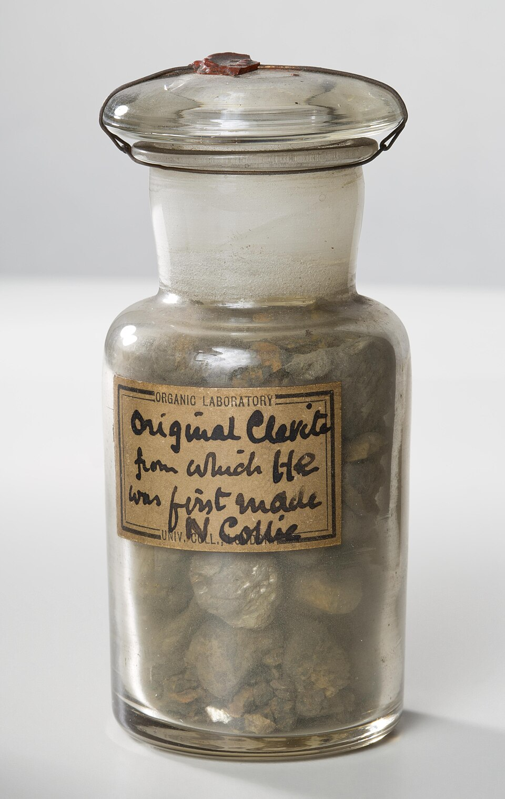
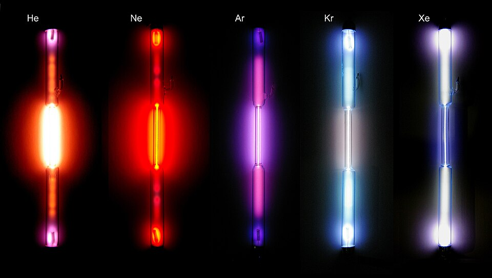

In September 1892 a letter in _Nature_ began: "I am much puzzled by some recent results as to the density of nitrogen, and shall be obliged if any of your chemical readers can offer suggestions as to the cause." Its author was **[Lord Rayleigh](kloom:e/john-william-strutt-3rd-baron-rayleigh)**, a physicist who weighed gases for a living. He had made nitrogen two ways, and the two did not weigh the same. Six years later the discrepancy had become five new elements and a whole new column of the [periodic table](kloom:e/periodic-table).

## A thousandth part

Rayleigh was weighing gases to test an old idea, Prout's, that atomic weights are whole numbers. He filled a glass globe with each gas and weighed it against a sealed dummy of the same size, so that the weather could not tip the balance. For nitrogen he took air and burned its oxygen away over red-hot copper. Then, on a suggestion from the chemist **[William Ramsay](kloom:e/william-ramsay)**, he tried passing the air through ammonia first, so that some of the nitrogen came from the ammonia. The ammonia nitrogen was lighter by about a thousandth part: small, but, he wrote, "entirely beyond the experimental errors".

"It is a good rule in experimental work," he said in his Nobel lecture, "to seek to magnify a discrepancy when it first presents itself." He fed the ammonia pure oxygen instead of air, so that all the nitrogen came from ammonia, and the gap grew to one part in two hundred. Nitrogen from other compounds came out light too (one batch, from urea, was "described as smelling like a dead rat"). Chemical friends suspected the light gas held split, dissociated nitrogen. He kept a sample for eight months, and its weight did not change.

## Weighing the difference

The paper Rayleigh and Ramsay read to the Royal Society in January 1895 gives the weight of gas that filled the same globe:

| Nitrogen made from                     | Grams in the globe |
| -------------------------------------- | -----------------: |
| Nitric oxide                           |             2.3001 |
| Nitrous oxide                          |             2.2990 |
| Ammonium nitrite                       |             2.2987 |
| Air, oxygen taken by hot copper (1892) |             2.3103 |
| Air, by hot iron (1893)                |             2.3100 |
| Air, by ferrous hydroxide (1894)       |             2.3102 |

By our arithmetic, "atmospheric nitrogen" is heavier by 0.0112 grams in 2.2990, or 0.49 per cent. Suppose it is ordinary nitrogen with a fraction _f_ of a gas whose density, on the hydrogen scale, is 19.9 (the figure the same paper found for **[argon](kloom:e/argon)**) against nitrogen's 14. Then

14 × (1 − _f_) + 19.9 × _f_ = 14 × 2.3102 ÷ 2.2990 = 14.068,

so _f_ = 0.068 ÷ 5.9, about 1.2 per cent. Their yield, extracting the gas outright, was between 0.99 and 1.11 per cent. Today argon is 0.934 per cent of air against nitrogen's 78.08, which by our arithmetic is 1.18 per cent of what Rayleigh called atmospheric nitrogen.

## A lazy gas

The heavier gas had been seen once before. In 1785 **[Henry Cavendish](kloom:e/henry-cavendish)** sparked air with extra oxygen over alkali until its nitrogen was used up, and was left with "a small bubble" of not more than a hundred and twentieth of it. Rayleigh and Ramsay repeated his experiment, and Ramsay also soaked up the nitrogen with red-hot magnesium. Both left about one per cent of a gas that nothing would make combine. They named it argon, from the Greek for idle, and had it by August 1894.

Argon broke the periodic table. The speed of sound in it showed its molecules were single atoms, so its atomic weight was about 40: more than potassium's 39.1, the next element up. The paper wondered whether "the periodic classification of the elements is complete", and whether argon belonged in an eighth group, after chlorine. "Argon must not be deemed rare," Rayleigh said later. "A large hall may easily contain a greater weight of it than a man can carry."

## A new column

Looking for something argon might react with, Ramsay read that a uranium mineral gave off nitrogen when boiled with acid. He doubted it. In March 1895 he boiled **cleveite** in weak sulfuric acid and put the gas in a discharge tube, and a brilliant yellow line appeared near sodium's. William Crookes measured it at 587.49 nanometres: the line D₃, seen in the Sun in 1868 and credited to an element no one had held. It was **[helium](kloom:e/helium)**, on Earth at last, and Cleve and Langlet found it in cleveite independently.

In 1898 Ramsay and his assistant **[Morris Travers](kloom:e/morris-travers)** borrowed large amounts of liquid air from William Hampson, liquefied their argon and boiled it off in fractions. The heavy end gave krypton, "hidden", on 30 May; the light end neon, "new", in June; and a third, xenon, "stranger", soon after. The **[noble gases](kloom:e/noble-gas)** filled a column with no place for chemistry at all, and in 1902, Wikipedia's account says, Mendeleev put them into his table as group 0. A sixth, radon, is given off by radium. Rayleigh received the 1904 Nobel Prize in Physics and Ramsay that year's prize in chemistry.

One oddity stayed. Argon, at 40, sat before potassium at 39.1, against the order of weights. The next frame is the young physicist who explained why.
