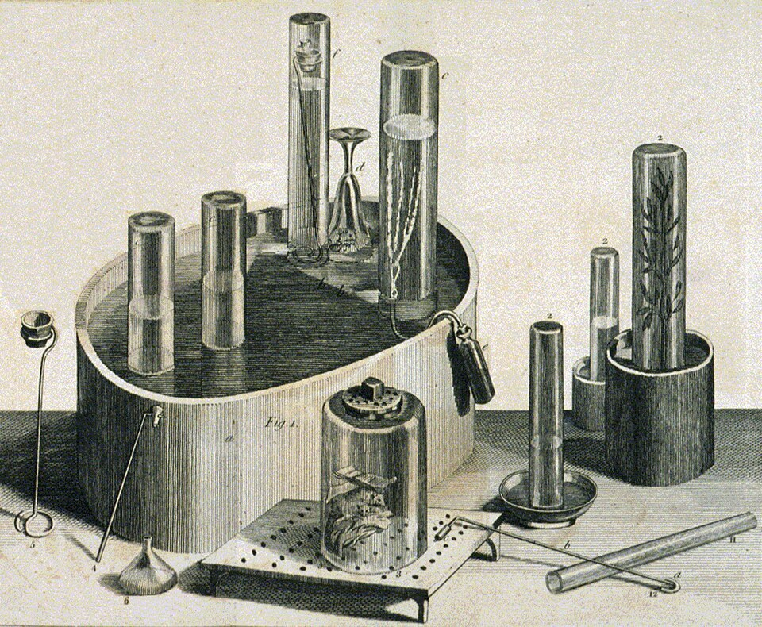

On 1 August 1774, at Calne in Wiltshire, the minister and experimenter **[Joseph Priestley](kloom:e/joseph-priestley)** turned a new burning lens, twelve inches across, on a pinch of red powder. The powder was the red calx that mercury forms when it is heated in air for a long time, _mercurius calcinatus per se_, which chemists now call **[mercury(II) oxide](kloom:e/mercury-ii-oxide)**. It sat at the top of a glass vessel filled with quicksilver and stood upside down in a basin of more. The sun's heat drove an air out of it, and the air pushed the mercury down. Priestley put a candle into the new air, and it burned, he wrote, "with a remarkably vigorous flame". He could not account for it.

## Two mice and myself

Priestley told the story himself in the second volume of his [_Experiments and Observations on Different Kinds of Air_](kloom:e/experiments-and-observations-on-different-kinds-of-air), dated November 1775, and he told it as a string of surprises. He first thought his calx was fake, bought at an apothecary's, and tried a sample a lecturer vouched for. In October 1774 he was in Paris, where he got an ounce of calx from the chemist Cadet, and where, he wrote, he often mentioned his "surprize" at the air to **[Antoine Lavoisier](kloom:e/antoine-lavoisier)** and other philosophers. He still took it to be common air, perhaps with something odd in it.

In March 1775 he tested it properly. On the 8th he put a full-grown mouse into two ounce-measures of it. In common air, he reckoned, it would have lived about a quarter of an hour. It lived a full half hour, was taken out seemingly dead, and revived by the fire. His usual test of an air's "goodness", mixing it with _nitrous air_ over water and seeing how far it shrank, now said it was "between four and five times as good as common air". Then he breathed it himself, through a glass siphon: his breast felt "peculiarly light and easy for some time afterwards". "Hitherto only two mice and myself have had the privilege of breathing it."

He named it _dephlogisticated air_. In the **[phlogiston theory](kloom:e/phlogiston-theory)** he held, a burning body gives off phlogiston into the air around it, and burning stops when the air can take no more. An air stripped of phlogiston could take a great deal, so candles blazed in it.

## What the calx gives up

In modern terms the heat splits the calx into mercury and **[oxygen](kloom:e/oxygen)**:

2 HgO → 2 Hg + O₂

By our arithmetic, from the atomic weights (mercury 200.6, oxygen 16.0), a molecule's worth of calx weighs 216.6, and only 16.0 of it is oxygen:

| Red calx heated | Mercury left | Oxygen given off |  Its volume, at 20 °C |
| --------------: | -----------: | ---------------: | --------------------: |
|           100 g |       92.6 g |            7.4 g |      about 5.6 liters |
|   7 g (¼ ounce) |        6.5 g |            0.5 g | about 390 milliliters |

So a heap of red powder holds a surprising volume of gas. After Paris, Priestley heated a quarter of an ounce of the calx gently and collected "an ounce-measure of air", about 30 milliliters: by our arithmetic, less than a tenth of what it held. His "four and five times as good" was a fair measurement too: air is about 21 percent oxygen, and pure oxygen holds 100 ÷ 21, about 4.8 times as much. (The lower row assumes an avoirdupois ounce; Priestley does not say which ounce he meant.)

## Who found it first

Oxygen was found three times in five years, and the priority has been argued ever since. The Swedish apothecary **[Carl Wilhelm Scheele](kloom:e/carl-wilhelm-scheele)** made it first. His laboratory notebooks show that by 1771–72, at Uppsala, he was getting it by heating black manganese with oil of vitriol, and he got it too from saltpeter, mercury calx and silver carbonate. He called it _fire air_. His book, _Chemische Abhandlung von der Luft und dem Feuer_ (a chemical treatise on air and fire), was written in 1775 and sent to the printer that December, but it waited for an introduction by his patron Torbern Bergman and came out only in the summer of 1777, after Priestley's.

Scheele also wrote to Lavoisier, on 30 September 1774, telling him how to make the air from silver carbonate with a burning glass, and asking him to try it. Lavoisier never acknowledged the letter. Where it went is itself disputed: Wikipedia's article on oxygen says a copy was found among Scheele's things after his death, while the chemist Pier Remigio Salvi, in a 2021 review, says Scheele's draft is in Stockholm and the letter itself turned up in the archives of the Paris Academy in 1890.

Lavoisier made the air himself in the spring of 1775 and at first, like Priestley, called it the purest part of common air. By 1777 or 1778 (Wikipedia's articles give both years) he understood it as the part of the air that combines with burning and rusting bodies, and named it _oxygène_, "acid-maker". Priestley published first, and never accepted what Lavoisier made of it. Salvi sums up the usual verdict: Scheele isolated it first, Priestley found it independently and published, and Lavoisier understood it. In 2001 the chemists Carl Djerassi and Roald Hoffmann made the quarrel a play, _Oxygen_, in which a Nobel committee cannot agree.

What Lavoisier built on that understanding, a chemistry weighed to the grain, is the next frame.
