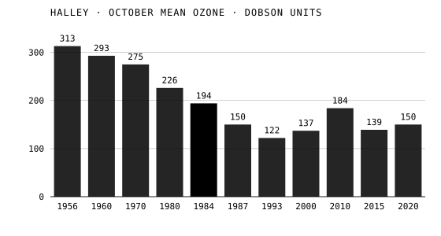
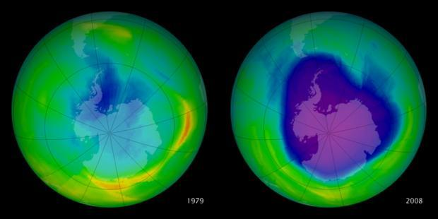

Ozone, O₃, is a poison at the ground and a shield in the stratosphere, where it absorbs 97 to 99 percent of the sun's middle ultraviolet before it reaches us. There is not much of it. The British Antarctic Survey's rule of thumb is that a column of air holds on average 300 Dobson units of ozone, which, brought down to sea-level pressure, would make a layer 3 millimeters thick. In the 1980s we found that our own chemicals were thinning it, most of all each spring over Antarctica, and that the **[ozone depletion](kloom:e/ozone-depletion)** we had caused could be stopped.

## Chapman's cycle

How the layer is made was worked out by the British mathematician **Sydney Chapman** in 1930. Hard ultraviolet splits oxygen molecules into atoms; an atom joins an O₂ to make ozone; ozone absorbs gentler ultraviolet and splits again; and now and then an oxygen atom meets an ozone molecule and both become ordinary oxygen:

| Step         | Reaction                          |
| ------------ | --------------------------------- |
| oxygen split | O₂ + ultraviolet (< 242 nm) → 2 O |
| ozone made   | O + O₂ + M → O₃ + M               |
| ozone split  | O₃ + ultraviolet → O₂ + O         |
| ozone lost   | O + O₃ → 2 O₂                     |

(M is any third molecule, which carries off the energy.) The cycle turns sunlight into heat and holds ozone steady. The last step is slow. Anything that speeds it up drains the layer.

## Midgley's gases

**[Chlorofluorocarbons](kloom:e/chlorofluorocarbon)** were made as safe refrigerants by **[Thomas Midgley Jr.](kloom:e/thomas-midgley-jr)** of General Motors, the chemist of the frame on leaded petrol; Frigidaire applied for the patent on the last day of 1928, and in 1930 Midgley showed the American Chemical Society how harmless the gas was by breathing it in and blowing out a candle. Being nearly inert, CFCs went into refrigerators, air conditioners and aerosol cans. In 1974 **[Mario Molina](kloom:e/mario-molina)**, a postdoctoral researcher, and **[F. Sherwood Rowland](kloom:e/f-sherwood-rowland)** at the University of California, Irvine, asked where they end up. Their paper in _Nature_ of 28 June 1974 found no sink in the lower air: the two main CFCs, CFCl₃ and CF₂Cl₂, would last 40 to 150 years, drift up to 20–40 kilometers and there be broken by ultraviolet, each molecule releasing a chlorine atom or more. World production in 1972 was about 0.8 million tons. The chlorine, they wrote, sets off a catalytic chain reaction.

## One atom, thousands of molecules

| Step | Reaction           |
| ---- | ------------------ |
| 1    | Cl + O₃ → ClO + O₂ |
| 2    | ClO + O → Cl + O₂  |
| net  | O₃ + O → 2 O₂      |

The net reaction is Chapman's slow last step, done fast, and chlorine comes out of step 2 as it went into step 1. It stops only when the atom is locked away, chiefly by taking a hydrogen from methane to make hydrogen chloride. Molina and Rowland give the rates: chlorine reacts with methane about a thousandth as fast as with ozone, and methane is scarcer by another factor of ten or so. By our arithmetic, then, a chlorine atom attacks ozone something like ten thousand times for each time it is caught, and hydroxyl radicals free it from hydrogen chloride to start again. Wikipedia puts the average at 100,000 ozone molecules before the chlorine leaves the cycle, and elsewhere in the same article at "tens of thousands".

The aerosol and halocarbon industries disputed it; a DuPont chairman called ozone depletion "a science fiction tale". Measurements of chlorine monoxide in the stratosphere showed the cycle at work. Molina and Rowland shared the 1995 Nobel Prize in Chemistry with **Paul Crutzen**, who had shown in 1970 that nitrogen oxides destroy ozone the same way.

## The hole at Halley

**[Joe Farman](kloom:e/joe-farman)**, Brian Gardiner and Jonathan Shanklin of the British Antarctic Survey had measured ozone with a Dobson spectrophotometer at **[Halley](kloom:e/halley-research-station)** on the Brunt Ice Shelf since 1956. In May 1985 they reported in _Nature_ large losses of ozone in the Antarctic spring. By the Survey's own October means, charted below, the 1984 figure was about a third lower than the 1960s', by our arithmetic. Susan Solomon and her colleagues showed in 1986 why the loss was polar: on the ice clouds of the winter stratosphere, chlorine is freed from the reservoirs that elsewhere hold it.

| Year | October mean at Halley (DU) |
| ---- | --------------------------: |
| 1956 |                         313 |
| 1960 |                         293 |
| 1970 |                         275 |
| 1980 |                         226 |
| 1984 |                         194 |
| 1987 |                         150 |
| 1993 |                         122 |
| 2000 |                         137 |
| 2010 |                         184 |
| 2015 |                         139 |
| 2020 |                         150 |

The story often told, and repeated in Wikipedia, is that the software of NASA's Nimbus 7 satellite threw the low values out as errors. The NASA team's own account, as the climate scientist Gavin Schmidt set it out in 2017, is that readings below 180 Dobson units were flagged, not discarded; that the team noticed the flood of flags in the October 1983 data, and by December 1984 was confident enough to submit a conference abstract; and that it had doubted the values because ground data from the South Pole showed about 300. Farman, in his own telling, said NASA was flagging some seventy percent of the October data "but no-one was looking at it".

## Montreal, and after

The **[Montreal Protocol](kloom:e/montreal-protocol)** was signed on 16 September 1987 and came into force in 1989. It became the first treaty in the United Nations' history ratified by every member. The 2022 scientific assessment, released in January 2023, expects Antarctic ozone to return to its 1980 values around 2066, the Arctic's around 2045, and the rest of the world's around 2040. The next assessment is due at the end of 2026. The hole still varies with the weather: the 2025 hole was the fifth smallest since 1992, by NOAA and NASA's count, while the Survey reported on 28 September 2026 that this year's had peaked in mid-September at about 25 million square kilometers and, at 24 million, was larger than in any of the last ten years at that time of year.

The next frame follows another gas we added to the air, and could not simply stop: carbon dioxide.
