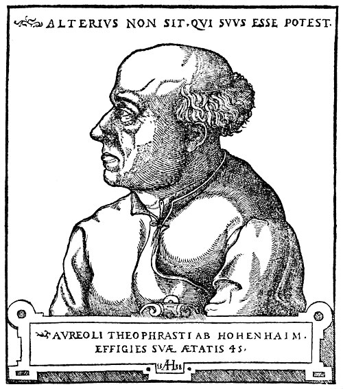

Early in 1527 **[Johann Froben](kloom:e/johann-froben)**, a printer famous across Europe, called a wandering Swiss physician to **[Basel](kloom:e/basel)** to treat his leg. The physician eased it quickly, and **[Erasmus](kloom:e/erasmus)**, who lodged in Froben's house, wrote asking him to stay. He was Theophrastus von Hohenheim, known to history as **[Paracelsus](kloom:e/paracelsus)**, and Froben's circle made him the city's physician, with the right to lecture at its university. From his second lecture he taught in German rather than Latin, so that barber-surgeons and alchemists could come, and he told the faculty that "the patients are your textbook, the sickbed is your study." He lasted about a year.

## The fire of St John

On Midsummer's Eve 1527, by the usual account, he threw Avicenna's [_Canon of Medicine_](kloom:e/the-canon-of-medicine), the textbook of every medical faculty, into the students' bonfire. His own words, as the University of Basel quotes them, name no book: "I have thrown the summa of the books into St John's fire, so that all misfortune goes up in the air with the smoke." Wikipedia and the historian Ursula Weisser, in the _Encyclopaedia Iranica_, say it was the _Canon_; the University of Basel's own history says manuscripts, "probably Galen and Avicenna", and that he is said to have done it. What is sure is the gesture's meaning, and that it was his. After Froben died that year, and a lawsuit over a fee went against him, Paracelsus left Basel in February 1528. It was, the university's history says, the only post of his life that gave him standing.

## Chemistry for the sick

He wandered for the rest of his life, and wrote as he went. In Nuremberg in 1529 and 1530 he attacked the fashionable cure for **[syphilis](kloom:e/syphilis)**, a decoction of guaiac wood from the Americas, as useless, a trade that enriched the Fugger bankers who imported it. He treated the disease with [mercury](kloom:e/mercury-element), as others did, and the Leipzig medical faculty blocked his fuller book on it. He is credited with the first use of the name "zincum" for zinc.

His theory, set out in the _Opus paramirum_ of about 1530, gave every body three principles, the _tria prima_: sulfur, the principle of burning; mercury, of fluidity; and salt, of solidity. It set chemistry a new task. In the _Paragranum_ of 1530 alchemy is "the third ground of medicine", and he is blunt about its aim: "It is not as they say, that alchemy makes gold and makes silver; here the purpose is, make arcana and turn them against the diseases." A chemical remedy was to be separated, by fire, from what was harmful in a mineral or a plant.

## The dose makes the poison

That made his medicines suspect. Physicians said his recipes were poison and corrosive, and in 1538 he answered them in his third _Defence_: "All things are poison, and nothing is without poison; the dose alone makes a thing not a poison." Every food and drink, he went on, is poison past its dose. Then he gave an example, and it can be checked. White **[arsenic](kloom:e/arsenic)**, he wrote, "is one of the highest poisons, and a drachm of it kills any horse"; fire it with saltpeter, and it is poison no longer, and ten pounds of it may be eaten without harm.

The chemistry of his recipe is an oxidation. Melted with saltpeter, potassium nitrate, arsenic in its +3 state becomes arsenic +5, a potassium arsenate, while the nitrate's nitrogen takes the electrons and leaves as brown fumes. Balanced by our arithmetic:

> As₂O₃ + 2 KNO₃ → 2 KAsO₃ + NO + NO₂

| Quantity                                        | Value     | Working                    |
| ----------------------------------------------- | --------- | -------------------------- |
| One apothecary's drachm of white arsenic, As₂O₃ | 3.89 g    | the English drachm         |
| Arsenic in it                                   | 2.95 g    | 3.89 × 149.8 ÷ 197.8       |
| Dose for a horse of 500 kg                      | 7.8 mg/kg | 3.89 g ÷ 500 kg            |
| Potassium arsenate from it                      | 6.37 g    | 3.89 × 324.0 ÷ 197.8       |
| Arsenic still in the arsenate                   | 2.95 g    | nothing is lost            |
| Ten pounds of it, in drachms                    | 960       | 10 × 12 ounces × 8 drachms |

The horse is our assumption, and the numbers are by our arithmetic. The Merck Veterinary Manual puts a single lethal dose of trivalent arsenic at 1 to 25 mg per kilogram, so his drachm would indeed kill a horse. And the firing does help: the manual reckons arsenates four to ten times less toxic than arsenites. But every atom of arsenic is still in the pot, and ten pounds is 960 drachms: even at a tenth of the toxicity, about a hundred deadly doses for a horse. His principle was right, and his example was wrong by a factor of a hundred.

The principle has outlived him. Arsenic trioxide, the same white arsenic, was approved in the United States in 2000 as a medicine, at a measured dose, for a form of leukemia.

## After Basel

Many of his books were printed only after his death in Salzburg in 1541, and a ten-volume edition, prepared in Basel in 1589–1591, carried them across Europe. His followers, the Paracelsians, flourished in the first half of the seventeenth century and brought mineral remedies into ordinary medicine. He was compared with Luther; he answered that Luther would defend what Luther said, and he what he said, and that "you wish us both in the fire."

Paracelsus learned mining in the Alps as a boy and wrote on miners' diseases. The next frame is a physician who went down the mines too, and wrote down everything he saw there.
