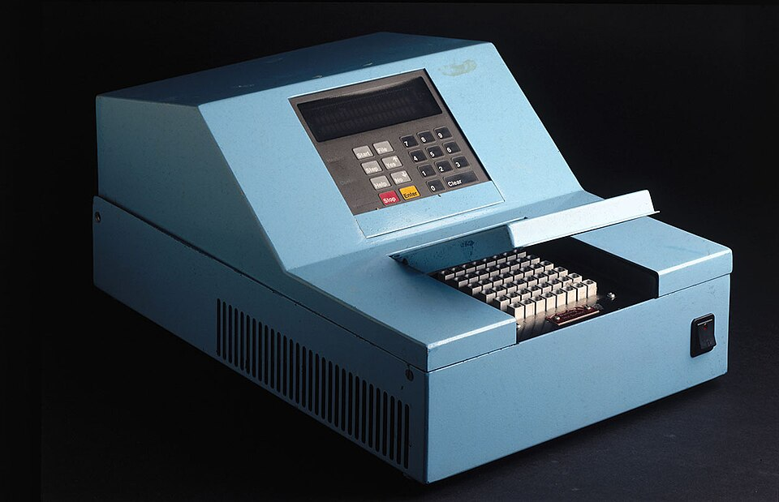

The **[polymerase chain reaction](kloom:e/polymerase-chain-reaction)** copies one chosen stretch of **[DNA](kloom:e/dna)** over and over, doubling it with every turn of a simple cycle of heating and cooling, until a trace too small to see becomes enough to weigh, sequence or test. It was thought of in 1983 at the **[Cetus Corporation](kloom:e/cetus-corporation)**, one of the first biotechnology companies, in Emeryville, California. Every step in it was already known. What was new was doing them in a loop.

## A drive to Mendocino

The story of the idea is **[Kary Mullis](kloom:e/kary-mullis)**'s own, told most fully in his Nobel lecture of 1993. Mullis was a chemist who made short pieces of DNA, _oligonucleotides_, for the rest of the company. One Friday night he was driving north to his cabin in Mendocino County, his girlfriend and fellow Cetus chemist Jennifer Barnett asleep beside him, turning over an experiment for reading a single base of a gene. He imagined adding a second short primer, to bind to the other strand facing the first, then heating the mixture to separate the copies and letting it cool so that fresh primers could bind again. Each round would double the signal. He stopped the car, in his telling at mile marker 46.7 on Highway 128, and found paper and a pen in the glove compartment, and checked that two to the tenth is about a thousand, two to the twentieth about a million, and two to the thirtieth about a billion. Wikipedia's article on the reaction puts the drive on the Pacific Coast Highway; the lecture names Highway 128, the road inland.

His colleagues, he said, were not excited. His first experiment, set up at midnight on 9 September, failed; the first that worked, on a piece of a plasmid, was on 16 December 1983. Other scientists at Cetus, among them Randall Saiki, Henry Erlich and Norman Arnheim, were set to make the method work on human genes, and their paper came out before Mullis's own description of it. How much of the invention belongs to Mullis and how much to the team is still argued, and Mullis himself resented that Cetus paid him a $10,000 bonus and sold the patents to Roche for about $300 million ($330 million in Wikipedia's article on [_Taq_ polymerase](kloom:e/taq-polymerase)).

## Doubling, and nearly doubling

The first paper, by Saiki and six colleagues including Mullis in _Science_ in December 1985, amplified a 110-base-pair piece of the β-globin gene to diagnose sickle-cell anaemia. Each of its 20 cycles took six or seven minutes by hand: boil at 95 °C, cool to 30 °C so the primers bind, and add fresh enzyme, because the heat destroyed the polymerase every time. The paper measured the yield and wrote the arithmetic out: if a fraction _X_ of the molecules is copied in each cycle, _n_ cycles multiply them by (1 + _X_)ⁿ. It found about 85 per cent a cycle, and 1.85²⁰ ≈ 220,000.

That exponent is why efficiency matters so much. By our arithmetic, for 30 cycles from one molecule:

| Efficiency per cycle | Copies after 30 cycles | Share of the perfect yield | Cycles to reach 2³⁰ |
| -------------------: | ---------------------: | -------------------------: | ------------------: |
|                 100% |          1,073,741,824 |                       100% |                  30 |
|                  95% |            502 million |                        47% |                31.1 |
|                  90% |            231 million |                        21% |                32.4 |
|                  85% |            104 million |                        10% |                33.8 |
|                  80% |             46 million |                         4% |                35.4 |

A few points of efficiency lost in each cycle cost a factor of ten by the end, but only three or four extra cycles to recover it. The patent that Mullis, Saiki and their colleagues were granted in July 1987 adds one more subtlety: in the first two cycles the copies run on past the primers, and only from the third does the product of the chosen length appear, so after _n_ cycles one duplex gives 2ⁿ − _n_ − 1 of them, 1,048,555 after 20.

## An enzyme from a hot spring

The cure for the dying enzyme came from Yellowstone. In the 1960s the microbiologist **[Thomas Brock](kloom:e/thomas-d-brock)** looked for life in its hot springs, and with the student Hudson Freeze he described in 1969 a bacterium, **[_Thermus aquaticus_](kloom:e/thermus-aquaticus)**, first isolated from Mushroom Spring in the Lower Geyser Basin which had to be grown at 70 to 75 °C. In 1976 Alice Chien, David Edgar and John Trela at the University of Cincinnati purified its DNA polymerase, which worked best at 80 °C. Cetus put **_Taq_ polymerase** into the reaction, and in January 1988 Saiki and colleagues reported that it survived the boiling, so it was added once, extension ran at a hotter and more selective temperature, and single genes were amplified more than ten million times. The machine in the photograph, "Baby Blue", a prototype of about 1986 now in London's Science Museum, did the heating and cooling.

The **[Nobel Prize in Chemistry](kloom:e/nobel-prize-in-chemistry)** for 1993 went half to Mullis "for his invention of the polymerase chain reaction (PCR) method". The reaction now types the DNA left at crime scenes, where the FBI's database has since 2017 compared profiles at 20 stretches of DNA, all typed by PCR. In January 2020, with no sample of the virus to work from, Victor Corman, Christian Drosten and their colleagues designed a test for the new coronavirus from its published sequence and sent it to the World Health Organization on 13 January; it ran 45 cycles and caught as few as four copies of the virus's RNA in a reaction.

Outside his own field Mullis was less careful: he doubted that HIV causes AIDS and played down our part in climate change. The next frame turns from copying a molecule to computing one: the shape of a protein, predicted by a machine.
