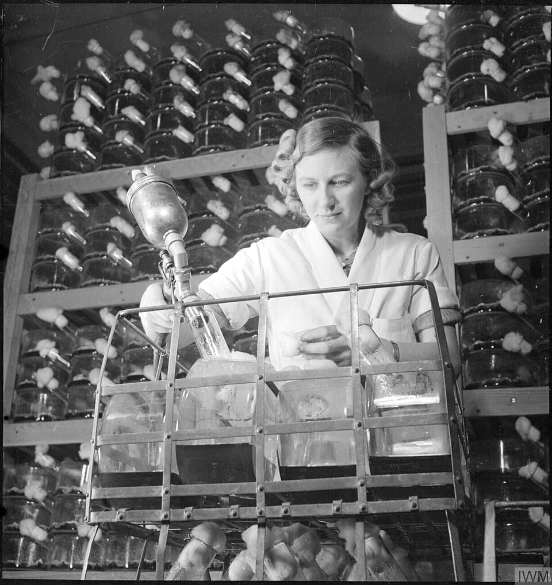

On 3 September 1928 **[Alexander Fleming](kloom:e/alexander-fleming)** came back from his summer holiday to his laboratory at St Mary's Hospital in London and sorted through the culture plates he had left on his bench. On one, a blob of mold had grown among the colonies of _Staphylococcus_, and around it the colonies had gone translucent: the bacteria were dissolving. Fleming grew the mold, a _Penicillium_, in broth, found that the broth stopped streptococci and staphylococci but not typhoid, and in March 1929 named the juice **[penicillin](kloom:e/penicillin)**. He published in June 1929. Neither he nor his assistants could purify it, and he used it mostly to sort one kind of bacterium from another on a plate.

Where the spores came from is a story. Fleming himself suggested in 1945 that they drifted in through the window over Praed Street. His co-workers said much later that the window was kept shut, and the usual account now is that the spores drifted in through the open doors from the laboratory of the mycologist C. J. La Touche, on the floor below. As Fleming said in his Nobel lecture, "penicillin started as a chance observation."

## Oxford

In 1939 **[Ernst Chain](kloom:e/ernst-chain)**, a biochemist at the Sir William Dunn School of Pathology in Oxford, found Fleming's paper, and the school's head, **[Howard Florey](kloom:e/howard-florey)**, set a team on it. The mold grew only on the surface of its broth, in bottles, bedpans and ceramic vessels made to a bedpan's pattern. **[Norman Heatley](kloom:e/norman-heatley)** worked out how to get the drug out. Penicillin is an acid: from acidified broth it passes into an organic solvent, and Heatley found that it would pass back into water made alkaline. That moved it out of the broth and into clean water.

At eleven in the morning of Saturday 25 May 1940, Florey injected eight mice with a lethal streptococcus and gave four of them penicillin. By half past three on Sunday morning the four untreated mice were dead and the treated four alive. The team's paper in _The Lancet_ of 24 August 1940, "Penicillin as a Chemotherapeutic Agent", was about mice. A woman dying of cancer took the first dose, in January 1941, to test that it was safe. The first person treated for an infection was Albert Alexander, an Oxford policeman, on 12 February 1941. The American Chemical Society's history says his infection began when he scratched his mouth pruning roses; Wikipedia's says only that it grew from a sore at the corner of his mouth. He began to recover within a day, but the penicillin ran out, even with what was saved from his urine, and he died on 15 March.

## Peoria

Britain at war could not make it in bulk. With money from the **[Rockefeller Foundation](kloom:e/rockefeller-foundation)**, Florey and Heatley flew to the United States in June 1941 and were sent to the Department of Agriculture's Northern Regional Research Laboratory in Peoria, Illinois, which knew fermentation. There Andrew Moyer swapped the sugar in the broth for lactose and then added corn steep liquor, a waste from milling maize, and the yield rose tenfold. The laboratory found strains that would grow submerged in stirred, aerated tanks, the best of them on a moldy cantaloupe from a Peoria market, and Pfizer opened the first deep-tank plant in Brooklyn on 1 March 1944.

| Year | Billions of units made in the US |
| ---- | -------------------------------: |
| 1943 |                               21 |
| 1944 |                            1,663 |
| 1945 |                  more than 6,800 |
| 1949 |                          133,229 |

## A ring that should not hold

What the molecule was took until 1945. The Oxford chemists proposed two structures, and Chain's Nobel lecture says that most workers preferred the one without a four-membered ring, because such a ring, "admittedly very unusual", had never been seen in a natural product. **[Dorothy Hodgkin](kloom:e/dorothy-hodgkin)**'s **[X-ray crystallography](kloom:e/x-ray-crystallography)** settled it for the ring, the _β-lactam_: a cyclic amide of three carbons and a nitrogen, fused to a five-membered ring holding sulfur. The crystallography frame tells how she did it.

The ring is the drug. A square's corners are 90°. A carbon with four single bonds prefers 109.5°, and the ring's carbonyl carbon and its nitrogen prefer 120°; by our arithmetic every corner is bent by 20° to 30°. In an ordinary amide the nitrogen lies flat and shares its lone pair with the C=O, which makes the bond sluggish. Bent into the ring and pushed into a pyramid, it cannot share, and the carbonyl becomes as reactive as a ketone's. In 1965 Donald Tipper and Jack Strominger proposed what it does. Penicillin mimics the end of the peptide, D-alanyl-D-alanine, that a bacterial enzyme joins into the cell wall. The enzyme's serine attacks the lactam's carbonyl, as the plate shows, and the ring springs open, leaving the drug fixed to the enzyme: Ser–OH + β-lactam → Ser–O–C(=O)–, a penicilloyl enzyme. The wall cannot be cross-linked, and a growing bacterium bursts.

Resistance followed the same chemistry. In 1940 Chain and Edward Abraham found a bacterium that made penicillinase, an enzyme that breaks the same ring. Fleming warned in 1945 that underdosing would breed resistant microbes. At Hammersmith Hospital in London, Mary Barber found that seven of eight infections she studied in 1946 yielded to penicillin, and two years later only three of eight. More than 1,800 such enzymes are now known.

Fleming, Florey and Chain shared the Nobel Prize in Physiology or Medicine in 1945. The trail ends here, with a drug grown in a mold. It began with Perkin's mauveine, a dye found by a student who set out to make a drug.
