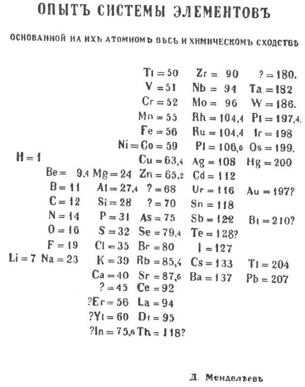
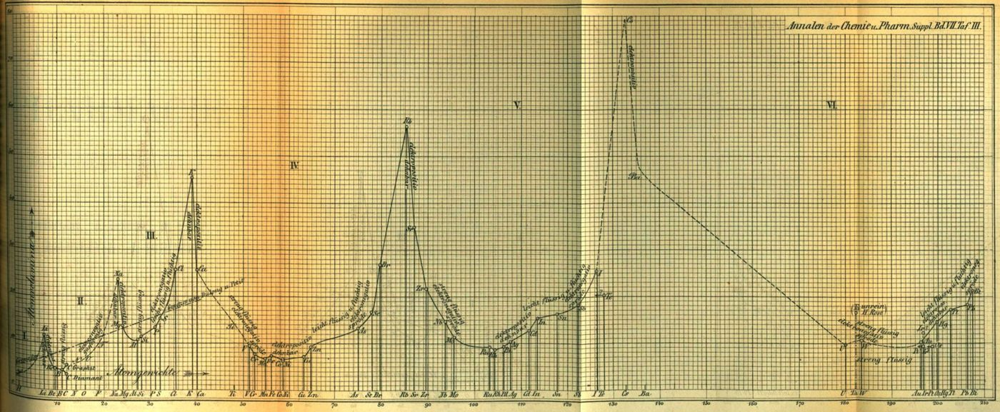

On 17 February 1869 by the Russian calendar, 1 March by ours, **[Dmitri Mendeleev](kloom:e/dmitri-mendeleev)**, professor of chemistry at St Petersburg University, sent his printer a single sheet headed "An attempt at a system of the elements, based on their atomic weight and chemical affinity". It set the 63 known elements in columns by weight, so that elements alike in their chemistry lined up across the rows. In four places there was no symbol, only a question mark and a number: ?=45, ?=68, ?=70 and ?=180. Those gaps are why the **[periodic table](kloom:e/periodic-table)** is remembered as his, though others had seen part of the pattern first. A colleague, Nikolai Menshutkin, read it to the Russian Chemical Society on 18 March; Mendeleev was ill, says the chemist Carmen Giunta, or away inspecting cheese dairies, says the Science History Institute.

## Octaves and a helix

The pattern had been waiting since the Karlsruhe congress of 1860, which Mendeleev attended, gave chemists one agreed set of atomic weights. In 1862 the French geologist Alexandre-Émile Béguyer de Chancourtois wound the elements round a cylinder, sixteen units of weight to a turn, and found like elements standing one above another; he wrote in a geologist's terms, without the diagram, and chemists ignored it. In London **[John Newlands](kloom:e/john-newlands-chemist)** laid the elements out in rows of seven, so that the eighth repeated the first, "like the eighth note of an octave in music". When he read his law of octaves to the Chemical Society on 1 March 1866, Dr Gladstone objected that it left no room for elements still to be found, and Professor G. C. Foster "humorously inquired" whether he had ever tried them in the order of their initial letters. The Society did not print the paper.

Gladstone's objection is the one Mendeleev answered. His table assumed from the start that elements were missing, and it put chemistry before weight. Tellurium, at 128, is heavier than iodine, at 127, but tellurium behaves like sulfur and selenium and iodine like bromine, so he set them in that order and declared that tellurium's weight "must lie between 123 and 126". He was wrong: the weights were right, and why the order holds anyway waited until 1913.

## Filling a gap by arithmetic

In 1871 Mendeleev described three missing elements in detail, naming each with the Sanskrit _eka_, one: eka-boron, eka-aluminum and eka-silicon. His method he called "atomic analogy": an element's properties follow from its four neighbors, the two beside it in its row and the two above and below it in its group. The plate draws it for eka-silicon, between silicon and tin, and between eka-aluminum and arsenic.

He gave eka-silicon an atomic weight of 72, and an atomic volume, the space its atomic weight in grams fills, of 13 cubic centimeters, reading along the row from zinc's 9 and arsenic's 14. Weight divided by volume is density: 72 ÷ 13 = 5.5 grams per cubic centimeter, the figure he printed. The same sum for eka-aluminum, 68 ÷ 11.5, gives 5.9. The division is ours; the numbers are his.

## Three finds

On 27 August 1875, "between three and four at night", **[Paul-Émile Lecoq de Boisbaudran](kloom:e/paul-emile-lecoq-de-boisbaudran)** saw a violet line no known element made, in the spectrum of a zinc ore from Pierrefitte in the Pyrenees. The spectroscope of Bunsen and Kirchhoff had found another element, and he named it **[gallium](kloom:e/gallium)**. His first density, 4.7, was the one property that missed; Mendeleev wrote to him that it should be near 5.9, and after purifying the metal Lecoq found 5.935. "The prevision of Mendeleev is thus exactly verified," he wrote, but added that he had not known of the prediction, and that it would not have led him to gallium. In 1879 Lars Fredrik Nilson found scandium in Scandinavian minerals, and the Swedish chemist Per Teodor Cleve saw that it was eka-boron.

The last was the cleanest test. In 1885 **[Clemens Winkler](kloom:e/clemens-winkler)**, at Freiberg in Saxony, analyzed a new silver ore and could never account for 6 to 7 per cent of it. Early in 1886 he found why: an element he named **[germanium](kloom:e/germanium)**. He took it at first for Mendeleev's eka-antimony, and learned otherwise, he wrote, "how treacherous it can be to build upon analogies". It was eka-silicon, "prognosticated fifteen years ago":

| Property                 | Eka-silicon, as Mendeleev foretold | Germanium, as Winkler measured |
| ------------------------ | ---------------------------------- | ------------------------------ |
| Atomic weight            | 72                                 | 72.32                          |
| Density of the element   | 5.5                                | 5.469                          |
| Density of the dioxide   | 4.7                                | 4.703                          |
| Density of the chloride  | 1.9                                | 1.887                          |
| Chloride's boiling point | a little under 100 °C              | about 80 °C (86.5 °C today)    |

Wikipedia's article on germanium gives the predicted weight as 72.64, which is today's value; Mendeleev's paper says 72.

## The curve and the dream

**[Lothar Meyer](kloom:e/lothar-meyer)** of the Karlsruhe Polytechnic published a table of his own in a paper dated December 1869, with a curve of each element's atomic volume against its atomic weight that rose to a sharp peak at every alkali metal. He and Mendeleev shared the Royal Society's Davy Medal in 1882; Newlands had his in 1887.

The best-known story is that the table came to Mendeleev in a dream. It rests on one memoir, by his friend the geologist Alexander Inostrantsev, written after Mendeleev's death. Mendeleev never told it himself, and spoke instead of years of work; Vladimir Shiltsev and Elizaveta Shiltseva, writing at Fermilab, count it among the myths about him. Another has him laying out the elements on cards, like patience.

The table of 1869 had no column for gases that would not react, no reason why tellurium and iodine change places, and no end. The trail _Finding the elements_ follows all three: the noble gases, Moseley's atomic numbers, the first element made by hand, the elements beyond uranium, and the seventh row, finished.
