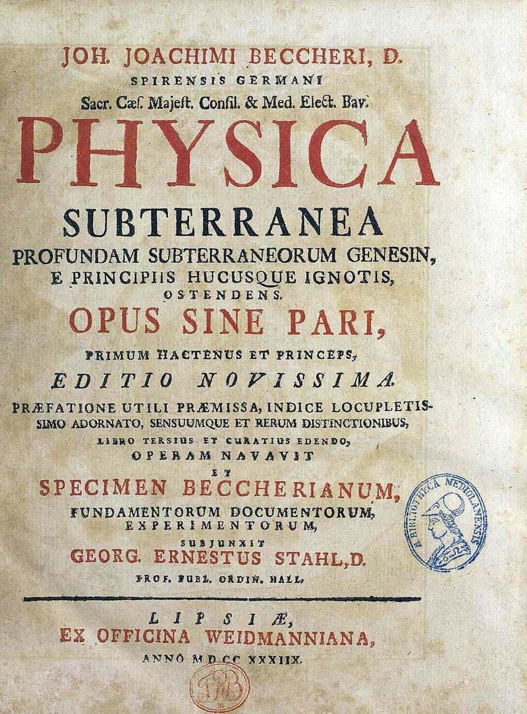

For most of the eighteenth century, chemists explained fire with a substance that does not exist, and the explanation worked remarkably well. The **[phlogiston theory](kloom:e/phlogiston-theory)** said that everything that burns holds a principle of fire, and that burning lets it go. It began with a German physician and adventurer, **[Johann Joachim Becher](kloom:e/johann-joachim-becher)**, and it was made into a system by a professor of medicine at Halle, **[Georg Ernst Stahl](kloom:e/georg-ernst-stahl)**. Most of the chemists who discovered the gases in the next few frames, Black, Cavendish, Scheele and Priestley among them, thought in its terms.

## A fatty earth

Becher's _Physica subterranea_, a book on the making of minerals underground, kept the old idea that bodies are built of a few principles, but replaced fire and air among them with three kinds of earth. One of them, the _terra pinguis_ or fatty earth, was what made a thing oily, sulphurous and combustible, and it left when the thing burned. Wikipedia's article on the theory dates the book 1667 in one paragraph and 1669 in another, and the 1911 _Encyclopaedia Britannica_ gives 1669.

Stahl republished Becher's book in 1703, with a _Specimen Becherianum_ of his own, and in his books up to the _Fundamenta chymiae_ of 1723 he called the principle _phlogiston_, an older word from the Greek for "burnt". In the Britannica's summary of the system, a combustible body is phlogiston joined to something else, and the fiercer the burning, the more phlogiston it holds. Charcoal, which burns away to almost nothing, was very nearly pure phlogiston.

## What it explained

The strength of the theory was that it made one process out of many. Burning wood, calcining a metal to a powdery _calx_ (what we call an oxide), and breathing all released phlogiston into the air. A candle went out in a closed jar because the air could hold only so much of it. And it explained, better than anything before it, what a smelter does. Heat a calx with charcoal and the metal comes back, because the charcoal gives its phlogiston to the calx. That is the chemistry of the first **[copper](kloom:e/copper)** smelters, read backwards: where we say carbon takes oxygen away from the ore, Stahl said charcoal put phlogiston in.

## The same reactions, twice

Here are two reactions written both ways. The masses are our arithmetic from modern atomic weights (Sn 118.7, Cu 63.5, C 12, O 16), which no one in Stahl's time had:

| Reaction                 | Phlogiston's account                       | Oxygen's account       | What the balance says                                                   |
| ------------------------ | ------------------------------------------ | ---------------------- | ----------------------------------------------------------------------- |
| Tin roasted in air       | tin → calx of tin + phlogiston             | Sn + O₂ → SnO₂         | 100 g of tin gives 127 g of calx                                        |
| Calx of copper, charcoal | calx + phlogiston (from charcoal) → copper | 2 CuO + C → 2 Cu + CO₂ | 100 g of calx and 7.5 g of charcoal give 80 g of copper and 28 g of gas |

Read the first line as Stahl did and the calx should weigh less than the **[tin](kloom:e/tin)**, because something has left. The balance says it weighs about a quarter more. Read the second line as Stahl did and the copper should weigh more than its calx, because something has been added. The balance says it weighs a fifth less. The oxygen column, which the frames after this one reach, has the weights come out right both times, with nothing left over.

## The trouble with weight

The gain in weight was no secret. In 1630 **[Jean Rey](kloom:e/jean-rey-physician)**, a physician at Le Bugue in Périgord, wrote a book to answer Brun, an apothecary of Bergerac, who had stirred two pounds six ounces of English tin over a fire for six hours and taken out two pounds thirteen ounces of white calx. Rey's answer was that the extra weight came "from the air", thickened by the heat and stuck to the metal. By our arithmetic Brun's tin gained 18%, about two-thirds of the 27% a complete calcination gives.

In 1673 **[Robert Boyle](kloom:e/robert-boyle)** sealed eight ounces of tin in a glass vessel, heated it, broke the seal, and found it 23 grains heavier. He concluded that particles of fire had passed through the glass and stuck to the metal. In another of these trials he noted that "the external air rushed in with a noise" as the seal was broken, and he weighed the metal only afterwards. Wikipedia's article on phlogiston counts Boyle among the theory's supporters who gave phlogiston a negative weight; Boyle died in 1691, before Stahl's system, and his own explanation was fire, not phlogiston.

Stahl did not address the gain. His followers did. Some made phlogiston a principle of _levity_, lighter than nothing, so that losing it made a thing heavier; others, as the Britannica puts it, ignored the weight as an accident, since what mattered to them was the change in a substance's qualities. The balance would have the last word. The next frame is Joseph Black, weighing a white powder and the air that came out of it.
