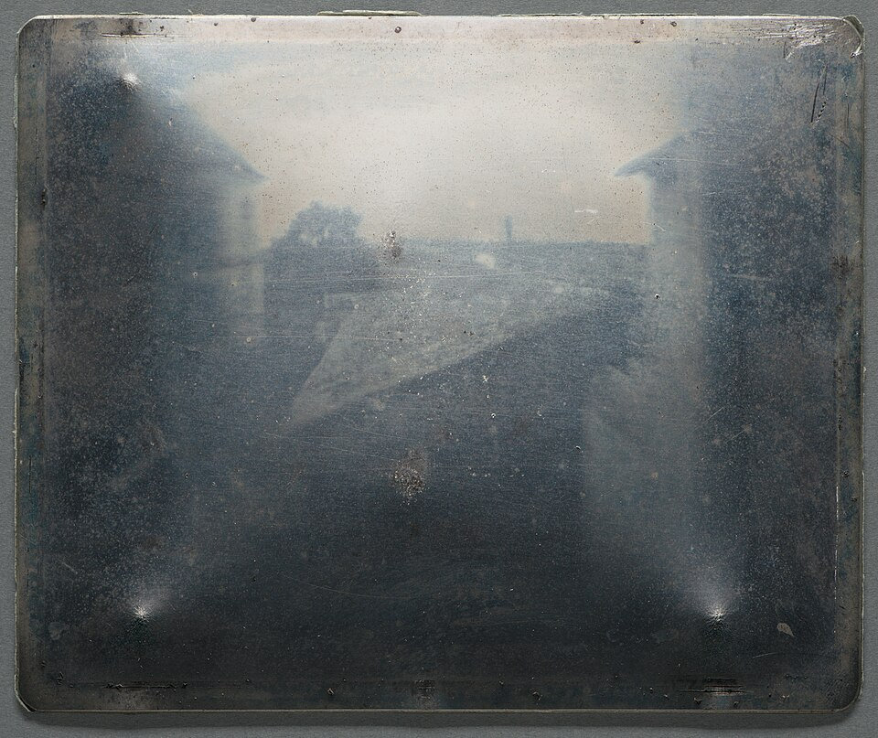
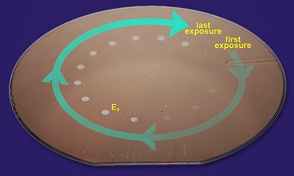

Every chip is a photograph. A film that light changes is spread on a wafer, a pattern is shone onto it, and a solvent washes away the lit parts or the dark ones, leaving a stencil for the etching that follows. That film is a **[photoresist](kloom:e/photoresist)**, and its chemistry, more than its optics, has set how small a circuit can be printed.

## Tar on pewter

The first photoresist was a tar. **[Nicéphore Niépce](kloom:e/nicephore-niepce)**, working at his estate at Saint-Loup-de-Varennes in Burgundy, dissolved _bitumen of Judea_, a natural asphalt, in oil of lavender, spread it thin on a pewter plate and set the plate in a camera obscura at an upstairs window. Light hardened the bitumen where it fell; a wash of lavender oil and white petroleum then carried off the soft, unlit parts. The result, made in 1827, is the oldest surviving photograph from a camera. How long it took is disputed: the traditional estimate, from the sun lighting buildings on both sides, is about eight hours, while the Harry Ransom Center, which owns the plate, says several days.

Bitumen was a _negative_ resist: light made it insoluble, so the image kept the lit parts. Its synthetic successor came from **[Eastman Kodak](kloom:e/kodak)**. In March 1950 Louis Minsk and his colleagues there applied for a patent on _polyvinyl cinnamate_ with a nitro-compound sensitizer, a plastic that light renders insoluble in organic solvents; the patent was granted in September 1952, and Kodak sold the material as KPR, Kodak Photo Resist.

## A microscope turned round

At the US Army's Diamond Ordnance Fuze Laboratories in Maryland, **[Jay Lathrop](kloom:e/jay-w-lathrop)** and James Nall needed transistors small enough for a mortar shell's proximity fuze. Mesas of germanium were then shaped under drops of wax, which spread. Nall had heard that printed-circuit makers etched through photoresist; the historian Chris Miller writes that the resist they bought was Kodak's. They coated germanium with it and, having no fine photographic negatives, shone light backwards through a metallurgical microscope, so that its lens shrank a pattern onto each die. Lathrop and Nall chose the name **[photolithography](kloom:e/photolithography)**, though, as Lathrop admitted, the process is etching and not lithography at all. They presented it on 1 November 1957 and had filed their patent the day before.

The dates are told differently. Lathrop, in a 1996 interview, put the work in 1955 and granted that William Shockley had tried resist at Bell Labs in 1954; the Computer History Museum credits Jules Andrus and Walter Bond at Bell Labs with adapting photoengraving to silicon in 1955. Nall went on to Fairchild and Lathrop to Texas Instruments, the two companies that made the first integrated circuits; computing's frames on Fairchild's planar process and on the integrated circuit tell how they used it.

## Positive resists

For chips the industry settled on a _positive_ resist, where light makes the film soluble: a phenol–formaldehyde resin, _novolac_, mixed with a _diazonaphthoquinone_ (DNQ). The DNQ keeps the resin from dissolving in a watery base. Light drives nitrogen gas out of its diazo group, the rest rearranges and picks up water, and it becomes a carboxylic acid that the base dissolves readily. A photon can change no more than the one molecule that absorbs it.

## One photon, many reactions

That was the problem in 1979, when **[IBM](kloom:e/ibm)** wanted to print with deep ultraviolet light of 248 nm from its mercury lamps, which gave only a thirtieth as much light at that wavelength. At IBM San Jose, **[C. Grant Willson](kloom:e/c-grant-willson)** and Jean Fréchet, on sabbatical from Ottawa, wanted a resist thirty times more sensitive, and imagined one in which a single photon started a chain of reactions. Hiroshi Ito, who joined in 1980, made it work with a _photoacid generator_, an onium salt that releases a strong acid when lit, mixed into a polystyrene whose phenol groups were capped with _t_-butoxycarbonyl (t-BOC) groups.

| Step           | Reaction                                                |
| -------------- | ------------------------------------------------------- |
| exposure       | onium salt + light → H⁺                                 |
| bake, repeated | Ar–O–CO–O–C(CH₃)₃ + H⁺ → Ar–OH + CO₂ + CH₂=C(CH₃)₂ + H⁺ |
| development    | the phenol, Ar–OH, dissolves in aqueous base            |

The acid comes out of each reaction as it went in, so one proton frees many phenols. By our arithmetic from the atomic weights, each repeat unit, C₁₃H₁₆O₃ (220), falls to C₈H₈O (120): the exposed film sheds 45 percent of its mass as carbon dioxide and isobutene. The team measured it at 100 to 200 times more sensitive. IBM was making its 1-megabit memory chips with it at Burlington, Vermont, by 1986, once it had learned to keep the coated wafers in filtered air, since something in the factory's air spoiled the surface.

## Shorter light

The finest line a lens can print is about _k_₁λ/NA: the wavelength over the numerical aperture, times a factor, _k_₁, for everything else, which optics puts at 0.61 for two points and clever processing pushes down. Wikipedia gives ASML's machines these resolutions; the _k_₁ each implies is our arithmetic:

| Light         | λ       | NA   | Resolution | _k_₁ = resolution × NA / λ |
| ------------- | ------- | ---- | ---------- | -------------------------- |
| ArF, in water | 193 nm  | 1.35 | 38 nm      | 0.27                       |
| EUV           | 13.5 nm | 0.33 | 13 nm      | 0.32                       |
| EUV, high NA  | 13.5 nm | 0.55 | 8 nm       | 0.33                       |

**[Extreme-ultraviolet lithography](kloom:e/euv-lithography)** gains the wavelength, and pays in chemistry. A photon of 13.5 nm carries about 92 electronvolts against 6.4 at 193 nm, far more than the 3.6 needed to break a carbon–carbon bond, so a given dose arrives as about fourteen times fewer photons, and chance decides where each lands. Amplified resists still carry it, and the acid's wandering both multiplies each photon and blurs the edge.

The same decades that shrank the circuit asked for something to run it on, away from the wall: the lithium-ion battery.
