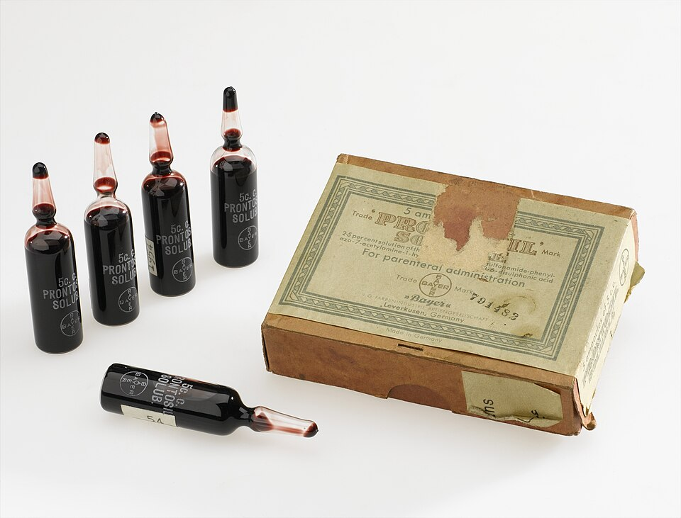
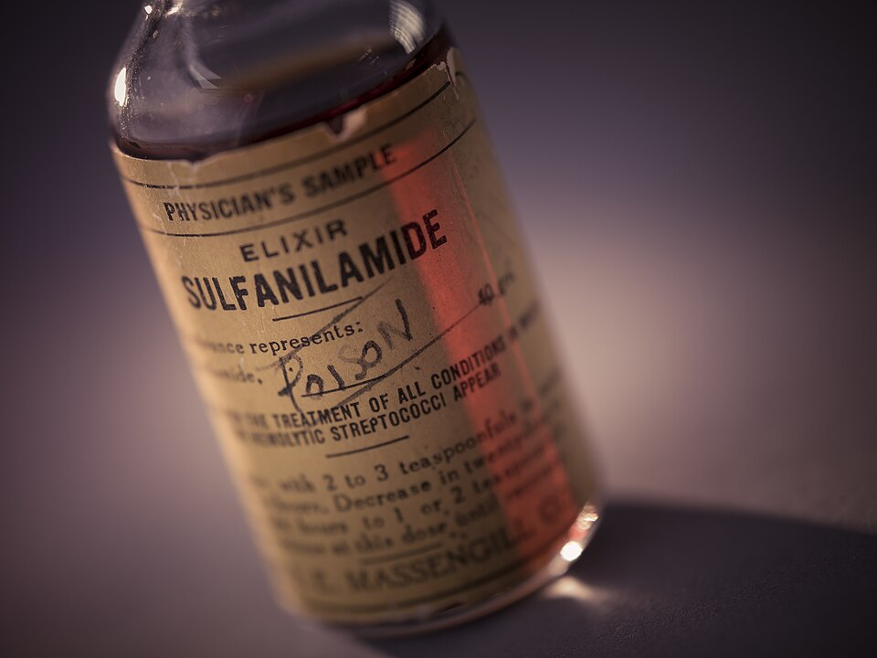

Just before Christmas 1932, in the laboratories of the dye trust **[IG Farben](kloom:e/ig-farben)** at Elberfeld, in the Rhineland, a pathologist named **[Gerhard Domagk](kloom:e/gerhard-domagk)** infected a batch of mice with ten times the lethal dose of a streptococcus taken from a patient with blood poisoning. About half of them were given a red dye an hour and a half later. The experiment began on 20 December; on the 24th every untreated mouse was dead and every treated one was alive and well. The dye, made by the chemists Josef Klarer and Fritz Mietzsch and numbered KL 730, went on sale as **[Prontosil](kloom:e/prontosil)**: the first drug that could cure a range of bacterial infections from inside the body.

The dates are the Nobel committee's, from its account of 1939. Wikipedia's articles on Domagk and on Prontosil put the first successful test in 1931, and give twelve treated mice and fourteen controls; the committee said only "approximately half". We follow the committee.

## A dye that did nothing in glass

Bayer's chemists had been screening dyes for years, on an idea [Paul Ehrlich](kloom:e/paul-ehrlich) had pursued before Salvarsan: a dye that clings to microbes more than to us might be made to attack them. Prontosil, an azo dye with a sulfonamide group added, did nothing to bacteria in a dish. Domagk, who believed a drug worked with the body's defences, tested in living animals, and that is why he saw it work. IG Farben filed for a German patent on Christmas Day 1932, but Domagk's paper did not appear until 15 February 1935, in the _Deutsche Medizinische Wochenschrift_.

The family story comes from Domagk himself. His daughter Hildegard, six years old, stabbed her hand with a needle, and a streptococcal infection spread up her arm; after many incisions her surgeon talked of amputating. Domagk, having cultured the streptococci, asked leave to give her Prontosil, and she recovered, her skin stained reddish for good. The sources disagree on when: Wikipedia dates the needle to 4 December 1935, after the paper, while the Nobel Foundation's biography says he left his daughter's cure out of his report and waited for the clinicians' results.

## The cut the body makes

Late in 1935, in Ernest Fourneau's laboratory at the **Pasteur Institute** in Paris, Jacques and Thérèse Tréfouël, Federico Nitti and Daniel Bovet showed that the dye was not the drug. The body splits Prontosil at its azo bond, the N=N that joins its two rings and gives it its colour, and one half, colourless **[sulfanilamide](kloom:e/sulfanilamide)**, does the work. Adding hydrogen across the bond cuts the molecule in two. By our arithmetic, from the atomic weights:

| Before                         | After                                 |
| ------------------------------ | ------------------------------------- |
| Prontosil, C₁₂H₁₃N₅O₂S, 291.33 | sulfanilamide, C₆H₈N₂O₂S, 172.20      |
| hydrogen, 4 H, 4.03            | 1,2,4-triaminobenzene, C₆H₉N₃, 123.16 |
| **295.36**                     | **295.36**                            |

So 59% of every dose of Prontosil is the drug inside it. Sulfanilamide was no secret: the chemist Paul Gelmo had made it in Vienna in 1908, and its patent, as a dye intermediate, had long run out. Anyone could make it, and hundreds of firms soon did.

Did IG Farben know? It has been argued that it found sulfanilamide's power in 1932 and spent three years on the patentable dye instead. Bovet wrote in 1988 that Domagk's logbook records sulfanilamide's formula only in January 1936, after the French paper. Domagk, in his Nobel lecture of 1947, said his own unpublished experiments had already been looking for colourless sulfonamides.

The clue to how it works came in 1940, when Donald Woods, at the Middlesex Hospital in London, found that para-aminobenzoic acid, PABA, undoes sulfanilamide's effect, and proposed that the drug competes with a nutrient of like shape. We now know the rest. Bacteria build the vitamin folate from PABA with an enzyme, dihydropteroate synthase, and the plate shows why the drug fools it: both molecules are a benzene ring with an amine at one end and an acidic group at the other, the same length. The enzyme takes the drug in PABA's place and makes a dead end. We take our folate from food and have no such enzyme, so the drug spares us. It stops bacteria multiplying rather than killing them, and it did nothing against tuberculosis.

## A poison, a law and a prize

The sulfa craze had a cost. In 1937 the S. E. Massengill Company of Bristol, Tennessee, dissolved sulfanilamide in diethylene glycol, flavoured it with raspberry, checked its "flavor, appearance, and fragrance", and shipped **[Elixir Sulfanilamide](kloom:e/elixir-sulfanilamide)** in September. The solvent destroys the kidneys. More than a hundred people died in fifteen states, many of them children with sore throats; of 240 gallons made, inspectors got back all but about six. The only charge the law allowed was misbranding, because an "elixir" should contain alcohol. The **[Federal Food, Drug, and Cosmetic Act](kloom:e/federal-food-drug-and-cosmetic-act)**, signed on 25 June 1938, made firms show a new drug was safe before selling it.

In October 1939 Domagk was awarded the Nobel Prize in Physiology or Medicine. **[Hitler](kloom:e/adolf-hitler)** had forbidden Germans to accept one after the 1935 Peace Prize went to the imprisoned pacifist Carl von Ossietzky, and the Gestapo held Domagk for a week; he declined. He received the diploma and medal in 1947, but not the money.

The sulfa drugs were made in a flask. The next frame's drug was grown: penicillin, out of a mould.
