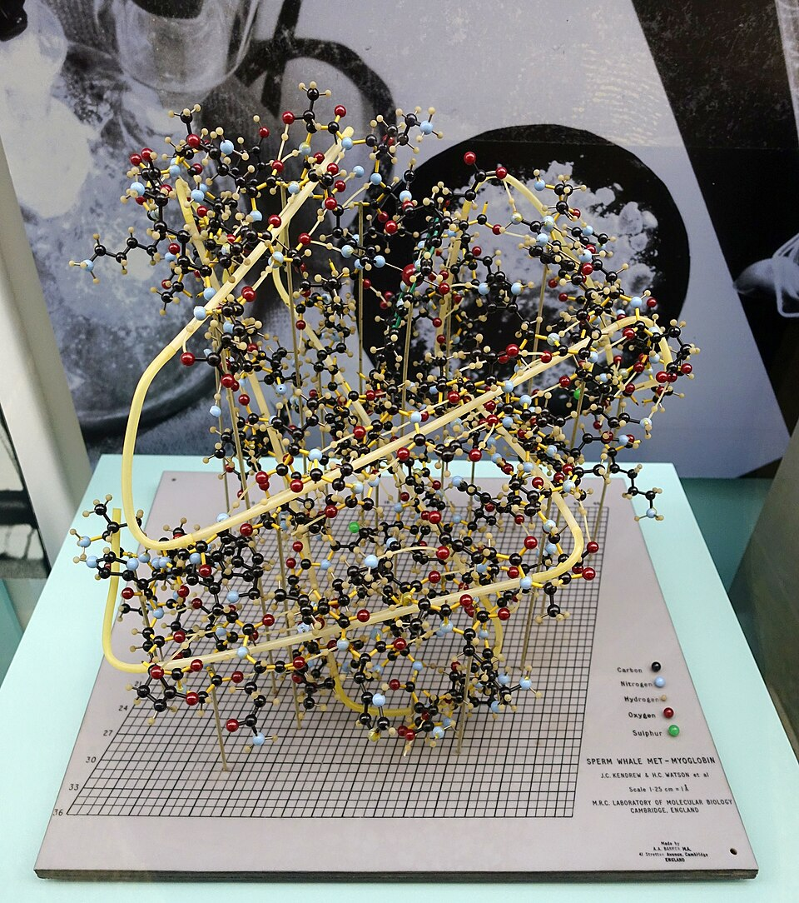

In the spring of 1948 **[Linus Pauling](kloom:e/linus-pauling)**, visiting professor at Oxford, caught a cold and spent several days in bed. Bored with detective novels, he said, he drew a chain of amino acids on a sheet of paper, with the bond lengths and angles he had measured in small molecules at Caltech, and folded it until each turn could hydrogen-bond to the next. A few hours of that, in his telling, recalled forty years later, gave him the answer. The paper model is his story; the geometry is in print.

## Folding by the rules

Proteins are chains of amino acids joined by peptide bonds, and by 1948 X-rays showed that wool and hair held some regular coil. Pauling had two rules the physicists lacked. His theory of resonance said the peptide group is flat: the C–N bond is about half double, 1.32 Å long, and will not twist. And he saw no reason why a turn of the chain should hold a whole number of residues. He waited three years, because keratin's strongest X-ray reflection sat at 5.1 Å, not the 5.4 Å his helix gave. Then Lawrence Bragg and two younger colleagues at Cambridge published a survey of possible helices in 1950 that missed his, and Pauling, by his later account, decided to publish before they found it.

The paper went to the _Proceedings of the National Academy of Sciences_ on his fiftieth birthday, 28 February 1951, with Robert Corey, his crystallographer, and Herman Branson, a Black physicist on leave from Howard University, whom Pauling had set to find every helix the rules allowed. They found two. One, the "5.1-residue helix", has hardly ever been seen. The other is the **[α-helix](kloom:e/alpha-helix)**, drawn in the plate:

| The α-helix                            | Pauling, Corey and Branson, 1951 |           Today |
| -------------------------------------- | -------------------------------: | --------------: |
| Residues in one turn                   |                             3.69 |             3.6 |
| Rise along the axis, per residue       |                           1.47 Å |           1.5 Å |
| One turn (pitch)                       |                           5.44 Å |           5.4 Å |
| Each C=O hydrogen-bonded to the N–H of |     the third amide group beyond | residue _i_ + 4 |

The numbers check each other. A residue turns the chain through 360° ÷ 3.6 = 100°, and a turn is 3.6 residues of 1.5 Å, 5.4 Å; Pauling's own 3.69 × 1.47 Å gives 5.42 Å, by our arithmetic. Residue _i_ + 4 lies 400° round and 6 Å up from residue _i_, just past one full turn, so the carbonyl oxygen of residue _i_, pointing along the axis, meets the N–H of residue _i_ + 4. Every backbone group is bonded, which is why the helix is stable. A companion paper gave the **β-sheet**, chains lying side by side and bonded to each other, rising 3.3 Å a residue instead of 1.5.

**[Max Perutz](kloom:e/max-perutz)**, one of Bragg's two, read the paper on a Saturday morning in spring 1951, as he told it, and saw that a stack of 1.5 Å steps should give an X-ray reflection at 1.5 Å that nobody had looked for. He tilted a horse hair in the beam and found it within hours, then found it in hemoglobin. Two faults were found later: the paper's drawing is a left-handed helix of the wrong-handed amino acids, the mirror image of nature's, and its sheets are flat where real ones twist.

## A definite sequence

**[Frederick Sanger](kloom:e/frederick-sanger)** at Cambridge asked a different question: in what order are the amino acids? Nobody knew, and some doubted that a protein had one order at all. He took **[insulin](kloom:e/insulin)**, which was pure and could be bought, labeled the free end of each chain with fluorodinitrobenzene, which makes a yellow tag, broke the chains into fragments and fitted the overlapping pieces together. The chain of 30 residues was solved by 1951, the chain of 21 soon after, and the three sulfur bridges that hold them together by 1955: 51 amino acids in a fixed order. Insulins from cattle, pigs and sheep, he found, differ only in three of them, inside one sulfur ring of the shorter chain. He won the Nobel Prize in Chemistry in 1958.

## The first shapes

Seeing a whole protein took the heavy-atom method, which Perutz showed in 1953: bind a heavy atom such as mercury into the protein crystal, and the change in the X-ray pattern gives each reflection its phase. **[John Kendrew](kloom:e/john-kendrew)** chose **[myoglobin](kloom:e/myoglobin)** from the sperm whale. His first map, in 1957, had 6 Å resolution; the second, in 1959, reached 2 Å, from nearly 10,000 reflections, and from the first stage the sums ran on Cambridge's computer, **[EDSAC](kloom:e/edsac)**. Of its 151 residues, as then counted, 118 lay in eight right-handed α-helices whose coordinates matched Pauling and Corey's within error. Perutz, who had begun on hemoglobin in 1937, reached 5.5 Å in 1959: four chains, each folded like myoglobin. The two shared the Nobel Prize in Chemistry in 1962. Pauling had had his, for the chemical bond, in 1954.

Pauling's rules did not always hold for him. His own structure for DNA, early in 1953, was a triple helix with neutral phosphates, in a molecule that is an acid; Watson and Crick, building models in his manner, found the double helix within months. The crystallography of other molecules, and the prediction of protein shapes by machine, are later frames' to tell. The next frame asks where the first amino acids came from.
