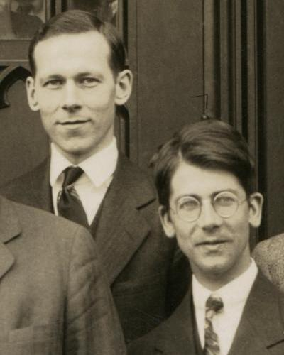

Lewis's shared pair said what a bond is made of, not why it holds. In the summer of 1927, a year after Schrödinger published his wave equation, two young German physicists in Zurich used it on the simplest molecule there is, two hydrogen atoms, and found the bond coming out of the mathematics. **[Quantum chemistry](kloom:e/quantum-chemistry)** began there, and within ten years it had split into two ways of thinking about molecules that chemists argued over for a generation.

## Two atoms in Zurich

**[Walter Heitler](kloom:e/walter-heitler)** and **[Fritz London](kloom:e/fritz-london)** sent their paper to the _Zeitschrift für Physik_ on 30 June 1927, from the physics institute of the University of Zurich, and thanked **[Erwin Schrödinger](kloom:e/erwin-schrodinger)** there for his interest in it. They wrote the wave function of the two electrons as a combination of each atom's own: electron 1 on atom _a_ and electron 2 on _b_, plus the same with the electrons exchanged. Added one way, the combination gave an energy that fell as the atoms approached and then rose again, a well: a molecule. Added the other way, it gave repulsion at every distance. The attraction, they wrote, is a characteristically quantum-mechanical effect, owed to the exchange of two identical electrons, with no counterpart in classical physics. And the Pauli principle picked out which curve two atoms follow: the bonding one needs the electrons' spins opposed, which is Lewis's pair.

They did not claim a good number. One integral they could not evaluate, and with only an upper bound for it their curve bottoms out near 1.5 Bohr radii, about 0.8 Å. It was not their aim, they wrote, to calculate the values as exactly as possible, but to understand the bond. The Japanese physicist Yoshikatsu Sugiura evaluated the missing integral later that year.

## Checking the answer

The measure of a theory of the bond is whether it gets the bond's energy and length. Pauling and Wilson's textbook of 1935 gathered the results so far, and they show a calculation closing on a measurement:

| Treatment of H₂                           | Well depth, eV | Bond length, Å |
| ----------------------------------------- | -------------: | -------------: |
| Heitler–London, with Sugiura's integral   |           3.14 |           0.80 |
| Simple molecular orbitals                 |           3.47 |           0.73 |
| Wang, 1928, a shrunken atomic orbital     |           3.76 |           0.76 |
| Rosen, 1931, with polarization            |           4.02 |           0.77 |
| Weinbaum, 1933, ionic terms, polarization |           4.10 |                |
| James and Coolidge, 1933                  |          4.722 |           0.74 |
| Measured                                  |           4.72 |         0.7395 |

The first calculation found two-thirds of the bond: 3.14 of 4.72 is 67 per cent, by our arithmetic. Hubert James and Albert Coolidge used a wave function of up to thirteen terms, whose gain came mainly from one term in the distance between the two electrons, and matched the measurement within their own estimate of error, 0.013 eV. The plate draws the first and last curves, each rebuilt by our arithmetic as a Morse curve from its depth, its length and its vibration in Pauling and Wilson's table.

A molecule never lies still at the bottom of its well. In 2018 a team in Amsterdam, Zurich and Hefei measured the energy needed to split hydrogen from its lowest vibrating state to about one part in a billion: 36,118.07 cm⁻¹ for the para form, by our arithmetic from their figures, which is 4.478 eV, about a quarter of a volt less than the well is deep. Theory and experiment still check each other on this one molecule.

## Pauling and Mulliken

**[Linus Pauling](kloom:e/linus-pauling)**, who on a Guggenheim Fellowship had visited Heitler and London in Zurich, turned Heitler and London's idea into a chemistry. From 1931 he mixed an atom's orbitals into _hybrids_, four for carbon pointing to the corners of a tetrahedron, set out a scale of _electronegativity_, how hard an atom pulls on a shared pair, and described molecules like benzene as a _resonance_ among several Lewis structures. His book _The Nature of the Chemical Bond_ (1939) is dedicated to Gilbert Newton Lewis, and says that the foundation of the modern theory of valence was laid in Lewis's paper of 1916. Pauling won the Nobel Prize in Chemistry in 1954.

**[Robert S. Mulliken](kloom:e/robert-s-mulliken)** at Chicago and **[Friedrich Hund](kloom:e/friedrich-hund)** in Germany built the other picture from molecular spectra: electrons fed into _molecular orbitals_ that belong to the whole molecule, not to its atoms. The word _orbital_ itself dates, Mulliken said, from 1932. Chemists at first preferred Pauling's atoms and pairs, Mulliken said in his Nobel lecture of 1966, because they fitted customary ways of thinking; the molecular orbital, he argued, suited calculation and spectra better. Pauling and Wilson had already noted in 1935 that each method, pushed far enough, becomes the other. In the Soviet Union, in 1951, resonance was denounced as contrary to dialectical materialism.

One more result from these years made the quantum molecule easy to think about: once the electrons' cloud is known, the force on each nucleus is plain electrostatics. This is the **[Hellmann–Feynman theorem](kloom:e/hellmann-feynman-theorem)**: Hans Hellmann put it in his textbook of quantum chemistry in 1937, and a student at MIT, Richard Feynman, proved it again in 1939.

Mulliken ended his lecture by announcing an "era of computing chemists". Computational chemistry is its own frame; the next frame first follows another way of looking inside molecules, by the spins of their nuclei.
