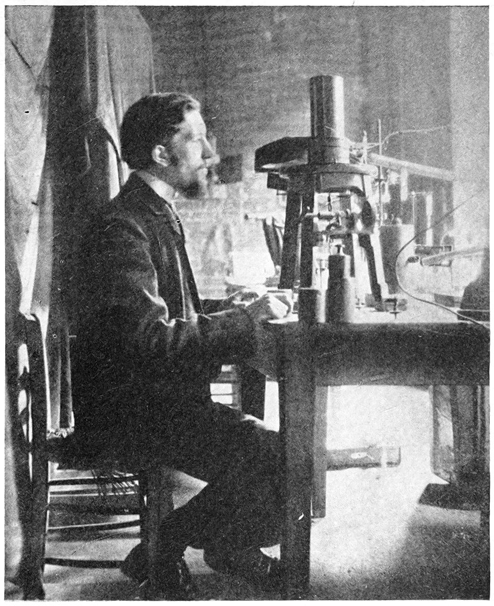
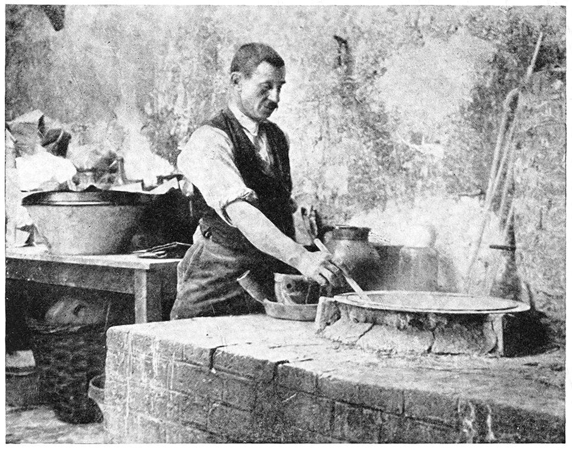

Two elements were found in 1898 by a property nobody had used to find anything before. **[Marie Curie](kloom:e/marie-curie)**, a Polish physicist working towards a doctorate in Paris, had taken up the uranium rays that Henri Becquerel found in 1896 (the physics subject tells that story), and turned them into a number. With her husband **[Pierre Curie](kloom:e/pierre-curie)**, she then followed that number through the chemistry of an ore until it led to two metals no one had seen. It was the first time an element was hunted by its radiation, and it made **[radioactivity](kloom:e/radioactive-decay)**, her word, a tool of chemical analysis.

## A number for the rays

Her instrument was the one the plate draws. The powdered sample lay on the lower of two metal plates, charged by a battery. The rays made the air between the plates conduct, and a small current leaked across to the upper plate, which was joined to an electrometer. Rather than read the electrometer's swing, she canceled it: a sheet of quartz, stretched by weights in a pan, gives off a known charge, and the weight needed to hold the needle still measured the current. Radioactivity became a figure in amperes, "a phenomenon capable of being measured with a certain accuracy", she wrote in her thesis. The quartz balance and electrometer were Pierre's and his brother's, devised some fifteen years before.

The figures held a surprise. Uranium metal gave 2.3 × 10⁻¹¹ amperes, but **[pitchblende](kloom:e/uraninite)** from **[Joachimsthal](kloom:e/jachymov)** gave 7.0, and some ores were four times as active as uranium itself. Something in them was more active than uranium.

## Polonium and radium

So the Curies used the electrometer as a chemist uses a test: dissolve the ore, split it by the ordinary reactions, and measure every fraction. On 18 July 1898 they told the Academy of Sciences that the activity followed bismuth, and that they had concentrated it to 400 times uranium's. "If the existence of this new metal is confirmed, we propose to call it **[polonium](kloom:e/polonium)**", after her country, then partitioned among three empires. Their spectroscopist, **[Eugène Demarçay](kloom:e/eugene-anatole-demarcay)**, could find no new line in it, and they said so. (Wikipedia's article on polonium dates the discovery 18 August; the paper was read on 18 July.)

On 26 December, with the chemist Gustave Bémont, they reported a second active substance that behaved like barium, concentrated 900 times. This time Demarçay found a line at 381.47 nanometers that belonged to no known element, and it strengthened as the activity rose. They named it **[radium](kloom:e/radium)**.

## Tonnes for a tenth of a gram

To prove an element, chemists wanted it pure and weighed. The Curies' paper of December thanked the Austrian government for 100 kilograms of residue from the uranium works at Joachimsthal, now Jáchymov in the Czech Republic, sent free. Later accounts differ: her thesis says the government gave a ton and allowed several more, and her life of Pierre, written in 1923, says they bought several tons "at an advantageous price". Either way, it was worked in a leaking wooden shed across the courtyard from the electrometer. "I had to work with as much as twenty kilogrammes of material at a time," she remembered, stirring the boiling mass for hours with an iron bar.

The thesis gives the yield. A ton of residue gave 10 to 20 kilograms of crude sulfates, and those about 8 kilograms of mixed barium and radium chlorides. Radium chloride is a little less soluble than barium's, so she crystallized the mixture again and again, each crystallization leaving the crystals about five times as active as the liquid. In March 1902 she had 0.12 grams of radium chloride. Wikipedia's article on her says a tenth of a gram came from one tonne of ore; its article on radium, that a ton of pitchblende holds about a seventh of a gram of radium. By our arithmetic that is one part in seven million.

## Weighing radium through silver

Then she weighed it, as chemists had weighed barium for decades. Dissolve a weighed amount of the dry chloride, add silver nitrate, and every chlorine comes down as silver chloride, which can be weighed:

RaCl₂ + 2 AgNO₃ → 2 AgCl + Ra(NO₃)₂

Her first measurement on the purest chloride, with her values for silver (107.8) and chlorine (35.4), goes like this by our arithmetic:

| Step                              | Number                      |
| --------------------------------- | --------------------------- |
| Radium chloride weighed           | 0.09192 g                   |
| Silver chloride formed            | 0.08890 g                   |
| Moles of AgCl, at 143.2 g a mole  | 0.000621                    |
| Moles of RaCl₂, half as many      | 0.0003104                   |
| Weight of a mole of RaCl₂         | 0.09192 ÷ 0.0003104 = 296.1 |
| Radium, less two chlorines (70.8) | **225.3**                   |

Three such measurements gave her 225. The number had crept up as her samples grew purer, from barium's 137 through 140 and 174, and she took the climb itself as evidence. Radium's accepted weight is 226, the mass of radium-226, which makes almost all natural radium. She was about half a per cent low, with a tenth of a gram.

| Sample                            | Atomic weight found |
| --------------------------------- | ------------------: |
| Pure barium chloride (control)    |          137 to 138 |
| 3,500 times as active as uranium  |                 140 |
| 7,500 times                       |               145.8 |
| About a million times             |               173.8 |
| Nearly pure radium chloride, 1902 |                 225 |
| Radium today                      |                 226 |

The Curies shared the 1903 Nobel Prize in Physics with Becquerel. In 1910 Marie Curie and André Debierne made the metal itself, by electrolyzing radium chloride onto mercury, and in 1911 she received the Nobel Prize in Chemistry, alone, for the two elements. Polonium she never isolated: its common isotope halves in 138 days. The rays had given chemistry a way to find what its reagents could not see, and the next frame turns from the atom to the factory.
