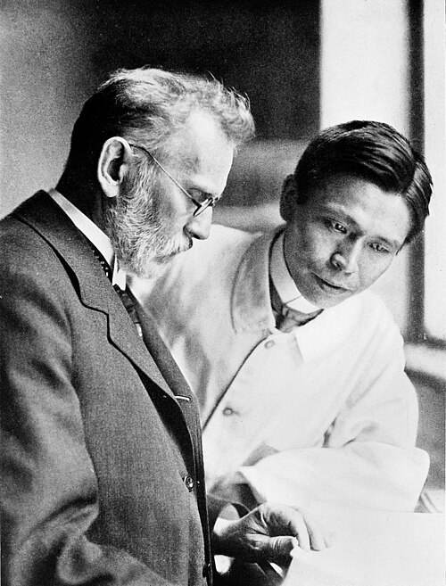

On 31 August 1909, in Frankfurt, the Japanese bacteriologist **[Sahachiro Hata](kloom:e/sahachiro-hata)** injected a yellow [arsenic](kloom:e/arsenic) compound into the vein of a rabbit weighing 2,150 grams, 0.04 grams for every kilogram of rabbit. The rabbit had a syphilitic sore on its scrotum, teeming with the corkscrew bacteria that cause the disease. The next day he could find none, and in under three weeks the sore had healed to a scar. The compound was number 606 in the series made in **[Paul Ehrlich](kloom:e/paul-ehrlich)**'s institute, and as **[Salvarsan](kloom:e/arsphenamine)** it became, in 1910, what is often called the first modern antimicrobial drug.

## Dyes that choose

Ehrlich began with dyes. As a young doctor he stained tissues with the new aniline colours and noticed that each dye took to some cells and not others: **[methylene blue](kloom:e/methylene-blue)**, injected into a living animal, picked out its nerves. If a dye could choose, he reasoned, a poison might choose too, and kill a microbe while sparing the patient. In 1891 he treated two malaria patients with methylene blue, with some success, though not more than quinine gave. His rule was _corpora non agunt nisi fixata_, "drugs will not act unless they are bound", and in his side-chain theory of 1897 cells carried side-chains, receptors, that a toxin fitted like a key. The drug he wanted he called a _Zauberkugel_, a **[magic bullet](kloom:e/magic-bullet-medicine)**, after the bullets that never miss in Weber's opera _Der Freischütz_. He shared the Nobel Prize in Physiology or Medicine in 1908 for his work on immunity.

## Six hundred and six

From 1906 his chemists at the Georg-Speyer-Haus, led by Alfred Bertheim, took apart and rebuilt atoxyl, an arsenic compound shown in 1905 to act on the trypanosomes of sleeping sickness. They made hundreds of variants, and each was numbered and tried on infected animals: an early systematic drug screen, and the model for later ones. Compound 606 was made in 1907, tried by two assistants, and put aside as useless. When Hata came from Tokyo in 1909, Ehrlich asked him to test the arsenicals again, on rabbits infected with **[syphilis](kloom:e/syphilis)**, whose cause had been identified only in 1905. Hata's own account, published with Ehrlich in 1910, gives the numbers: 592 was the free base, a pale yellow powder kept in sealed tubes because air spoiled it, and 606 its hydrochloride. Wikipedia says that 606 was the sixth compound of the sixth series; the historian Keith Williams, that it was simply the 606th preparation tested.

Hata's rabbits also gave the drug its margin. A single dose of 0.015 grams per kilogram cleared the bacteria by the next day, and a rabbit could stand 0.1 grams per kilogram, so the curing dose was about a seventh of the tolerated one. After trials in patients, Ehrlich and Hata announced the results at Wiesbaden in April 1910. By the end of the year the institute had given out some 65,000 doses, and **[Hoechst](kloom:e/hoechst-ag)** was selling the drug as Salvarsan, "the arsenic that saves". It had to be dissolved and injected with care, and it could harm; a more soluble successor, Neosalvarsan, followed in 1912 or 1913, as sources differ.

## Weighing the rings

Ehrlich drew 606 as two identical halves joined by a double bond between arsenic atoms, As=As, like the N=N of the azo dyes. Textbooks printed it that way for nearly a century. In 2005 Nicholas Lloyd and his colleagues at the University of Waikato in New Zealand made Salvarsan by an improved version of the old method and weighed its molecules whole by electrospray mass spectrometry. They found no sign of Ehrlich's As=As, a bond now known only in crowded molecules. Salvarsan is a mixture of rings of arsenic atoms, each arsenic carrying one 3-amino-4-hydroxyphenyl group: rings of three and of five above all. The plate draws the two.

Why did the error last so long? Every candidate structure is a whole number of the same unit, RAs, which is C₆H₆AsNO. By our arithmetic, from the atomic weights (C 12.011, H 1.008, As 74.922, N 14.007, O 15.999):

| Structure            | Formula     | Mass of the molecule | Arsenic |
| -------------------- | ----------- | -------------------: | ------: |
| one unit, RAs        | C₆H₆AsNO    |                183.0 |   40.9% |
| Ehrlich's, R–As=As–R | (C₆H₆AsNO)₂ |                366.1 |   40.9% |
| ring of three        | (C₆H₆AsNO)₃ |                549.1 |   40.9% |
| ring of five         | (C₆H₆AsNO)₅ |                915.2 |   40.9% |

An elemental analysis, which burns a sample and weighs its parts, gives the same percentages for all of them; Lloyd's own sample, as the hydrochloride with a molecule of water, analysed exactly as Ehrlich's had. Only a method that weighs whole molecules can tell a ring of three from a ring of five, and the spectrum shows each ring, plus one proton, at 550 and 916.

| Arsenic atoms in the ring |  m/z | Peak height |
| ------------------------: | ---: | ----------: |
|                         3 |  550 |         100 |
|                         4 |  733 |          43 |
|                         5 |  916 |          90 |
|                         6 | 1099 |          18 |
|                         7 | 1282 |           4 |
|                         8 | 1465 |           2 |

The authors warn that the heights are a qualitative guide to the amounts. They also watched the rings break down in air to RAs(OH)₂, which they think is what kills the bacteria: Salvarsan as a slow-release source of the real drug.

Salvarsan and its successors treated syphilis until penicillin replaced them in the 1940s. Ehrlich's method, making compounds by the hundred and testing each on infected animals, outlived his drug; the next frame is Prontosil.
