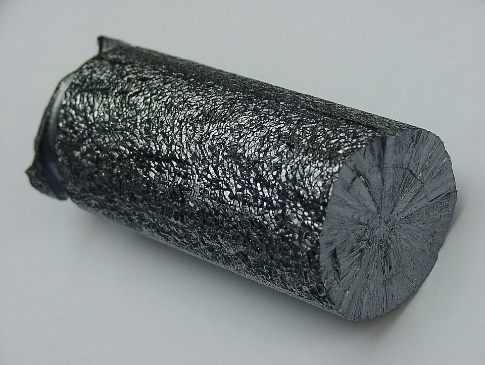

**[Silicon](kloom:e/silicon)** is almost never found alone. More than nine-tenths of the Earth's crust is silicate minerals, silicon bound to oxygen, and quartz and sand are its oxide. Taking the oxygen off is ordinary industrial chemistry. Taking everything else off is not. Silicon for chips is among the purest materials made in bulk: the industry's grade is "nine nines", 99.9999999 per cent, one stray atom in a billion. This frame does the chemistry that gets it there, and counts what a billionth means.

## From sand to chunks

The first step is smelting, as for iron. Quartz and coke are heated in an electric arc furnace, and the carbon takes the oxygen away as carbon monoxide. The product is metallurgical silicon, 96 to 99 per cent pure, most of it made for steelmakers and aluminum foundries; Wikipedia's article estimates that about 15 per cent of it goes on to be refined for semiconductors. That refining is done by turning the silicon into a liquid that can be distilled, as a chemist purifies any liquid, and then back into silicon. The German firm Siemens developed the method in 1954, and it still makes most of the world's pure silicon. By our arithmetic, from the atomic weights (silicon 28.09, oxygen 16.00, carbon 12.01, chlorine 35.45):

| Step       | Reaction                    | Conditions                         | For each kilogram of silicon     |
| ---------- | --------------------------- | ---------------------------------- | -------------------------------- |
| Smelting   | SiO₂ + 2 C → Si + 2 CO      | arc furnace                        | 2.14 kg of quartz, 0.86 kg of C  |
| Chlorinate | Si + 3 HCl → SiHCl₃ + H₂    | 300 °C                             | 4.8 kg of trichlorosilane        |
| Distill    | SiHCl₃ separated by boiling | boils at 31.8 °C                   | impurities left behind           |
| Deposit    | SiHCl₃ + H₂ → Si + 3 HCl    | on silicon rods heated to 1,150 °C | the hydrogen chloride goes round |

Trichlorosilane is a volatile liquid, and distilling it leaves the metals and the doping elements behind in the by-products. In the Siemens reactor the pure vapor meets rods of silicon heated by an electric current, and silicon grows on them for about two days, until each is 12 centimeters thick.

## Pulling a crystal

Chunks of pure silicon are not yet a crystal, and a transistor needs one crystal, with no grain boundaries. In 1916 the Polish chemist Jan Czochralski, working at AEG in Berlin, found that a metal could be pulled from its melt as a single crystal; a story told of him has him dipping his pen into molten tin instead of his inkwell. He published in 1918, and the Computer History Museum dates the work to 1917. The **[Czochralski method](kloom:e/czochralski-method)** was a way to measure how fast metals crystallize until **[Gordon Teal](kloom:e/gordon-kidd-teal)**, a chemist at **[Bell Labs](kloom:e/bell-labs)**, built a puller with John Little to grow single crystals of **[germanium](kloom:e/germanium)** for transistors, by early 1950. The plate draws one: a seed crystal is dipped into the melt and drawn slowly up, turning, and the crystal grows on it atom by atom in the seed's own order.

The melt must be pure first. In 1952 **[William Pfann](kloom:e/william-gardner-pfann)**, also at Bell Labs, published **[zone melting](kloom:e/zone-melting)**: a narrow molten band is passed slowly along a bar, and because most impurities would rather stay in the liquid than freeze, the band sweeps them to one end. Its first commercial use refined germanium to one impurity atom in ten billion. (Wikipedia's article credits the first idea to the crystallographer J. D. Bernal, and Pfann with making it work.) Silicon was harder, because molten silicon attacks every crucible but one of its own oxide. It was refined floating, the molten zone held in a vertical bar and touching nothing; a Czochralski crucible of quartz leaves oxygen in the crystal, about 10¹⁸ atoms in a cubic centimeter.

## Why silicon won

Germanium came first because, the Computer History Museum says, it was much easier to work with. But germanium transistors leaked when they should have been off, and silicon's did not. Silicon also grows a skin of its own oxide, glassy silicon dioxide, which is insoluble in water and makes a mask and a seal for the chip beneath; germanium's oxide is unstable. By the end of the 1950s, the museum's history says, silicon was the industry's material.

## One in a billion

What does nine nines mean? By our arithmetic, a gram of silicon holds 6.022 × 10²³ ÷ 28.09, or 2.1 × 10²² atoms. One in a billion of them is 2.1 × 10¹³: twenty-one trillion stray atoms in every gram. Then a crystal is _doped_ on purpose. In the example worked in the physics subject's frame on band theory, one phosphorus atom in five million cuts silicon's resistivity half a million times, and that dose is two hundred times the impurity nine nines allows. The purification exists so that the doping, not dirt, decides how the silicon conducts.

| Silicon                     | Stray atoms per billion | In one gram |
| --------------------------- | ----------------------: | ----------- |
| Metallurgical, 98% pure     |              20,000,000 | 4 × 10²⁰    |
| Nine nines                  |                       1 | 2 × 10¹³    |
| The sphere AVO28-S5: carbon |                 about 9 | 2 × 10¹⁴    |
| The sphere AVO28-S5: boron  |                    0.28 | 6 × 10¹²    |

The last rows show what counting finds even in silicon made for metrology. For the redefinition of the kilogram, an international team counted the atoms in two one-kilogram spheres of silicon enriched in the isotope silicon-28, cut from a crystal grown in Berlin in 2007 by the floating-zone method, to fix the **[Avogadro constant](kloom:e/avogadro-constant)**. Their paper of 2011 lists the stray carbon, oxygen and boron in each sphere, and even the empty sites in the lattice, and weighs them out of the count.

Silicon's crystals are sliced into wafers, and the next frame draws circuits on them with light.
