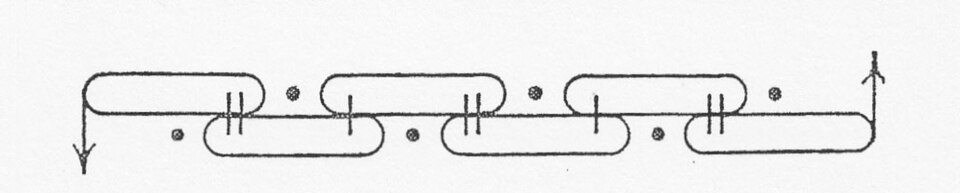

By the 1850s chemists could say what a compound was made of, and not how it was put together. Two substances could share a formula and behave nothing alike. In May 1858 **[August Kekulé](kloom:e/august-kekule)**, a young lecturer at Heidelberg, published the idea that made the difference: every atom has a fixed number of bonds it can make, and carbon has four, and carbon atoms can use some of them to join one another into chains. A molecule stopped being a heap of atoms and became a drawing, which a chemist could read and then build.

## Two authors, one idea

Kekulé was not alone. **[Archibald Scott Couper](kloom:e/archibald-scott-couper)**, a Scot working in Charles Adolphe Wurtz's laboratory in Paris, reached the same idea on his own. Through what Wikipedia calls a misunderstanding with Wurtz, Kekulé's paper came out first, and Couper's appeared in condensed form only on 14 June 1858. When Couper confronted Wurtz he was thrown out of the laboratory. He had a breakdown the next year and did no serious work for the rest of his life.

Couper's paper was the more modern of the two. He drew his molecules with the symbols of the atoms joined by dotted lines for the bonds, very like the formulas of today, while Kekulé's own drawings laid atoms side by side as sausage-shaped blobs, as in the drawing of his ring below. The idea both of them had is now called **[valence](kloom:e/valence-chemistry)**: the combining power of an atom, one for hydrogen, two for oxygen, four for carbon.

## The ring

Chains explained a great deal, but not **[benzene](kloom:e/benzene)**, C₆H₆, which had only one hydrogen for each carbon and was the parent of the aromatic compounds that chemists were drawing out of coal tar. In January 1865, teaching at Ghent, Kekulé proposed that its six carbons close into a ring, joined by single and double bonds in turn. The evidence was counting: every benzene with one hydrogen replaced came in one form only, so all six places were alike, and every benzene with two replaced came in exactly three forms, the substituents one, two or three places apart around the ring. No chain could do that.

He had been anticipated in part. In 1861 the Austrian **[Johann Josef Loschmidt](kloom:e/johann-josef-loschmidt)** printed a booklet of more than 300 molecules drawn as touching circles, including rings. For benzene he drew one large circle, which he said stood for a structure not yet known; some have read it as a ring four years before Kekulé, and others, reading his own caveat, as a confession that he did not know.

In 1890 the German Chemical Society celebrated the benzene ring's twenty-fifth birthday, and Kekulé told how it came to him: in a reverie he had seen a snake seize its own tail. It is the most famous daydream in science, and it is his telling, a quarter of a century later, at his own celebration. A parody journal of 1886 had already drawn benzene as six monkeys holding each other in a ring. Some historians think the joke lampooned a snake story that was already going round by word of mouth; others that Kekulé's story answered the joke, and was invented. Nobody can check.

## Counting with trees

A formula with bonds is a set of points joined by lines, and that made it mathematics. In 1874 the English mathematician **[Arthur Cayley](kloom:e/arthur-cayley)** saw that the saturated hydrocarbons, CₙH₂ₙ₊₂, are exactly the "trees" he had studied in 1857: joined points with no loops, each carbon with at most four branches. The number of hydrocarbons with a given formula is the number of such trees, and he counted them.

Take five carbons, C₅H₁₂. Draw every tree of five points with no point carrying more than four branches, as the plate does. There are exactly three: a chain of five; a chain of four with one carbon on the second; a chain of three with two carbons on the middle. Every other drawing is one of these turned over. The hydrogens follow by our arithmetic: five carbons offer 20 bonds, the four carbon–carbon bonds of any tree use 8 of them, and the other 12 take hydrogens, so every tree gives C₅H₁₂.

| Carbons | Formula | Trees, and so compounds |
| ------: | ------: | ----------------------: |
|       4 |   C₄H₁₀ |                       2 |
|       5 |   C₅H₁₂ |                       3 |
|       6 |   C₆H₁₄ |                       5 |
|       7 |   C₇H₁₆ |                       9 |
|      10 |  C₁₀H₂₂ |                      75 |

Cayley's count ran ahead of the laboratory. For the alcohols with five carbons his trees gave eight, and chemists in 1874 knew two. He wrote that the missing ones might simply be unknown, and they were: all eight amyl alcohols are known today.

In 1878 **[James Joseph Sylvester](kloom:e/james-joseph-sylvester)**, Cayley's friend, wrote in _Nature_ that the invariants of algebra could each be drawn as "a graph precisely identical with a Kekuléan diagram or chemicograph". It is the first use of the word _graph_ in that sense. **[Graph theory](kloom:e/graph-theory)**, the mathematics of points and lines whose historians begin it with Euler's bridges of Königsberg, took its name from chemistry's drawings of bonds.

Kekulé's diagrams were flat. The next frame is a meeting he called to settle what the atoms in them weighed.
