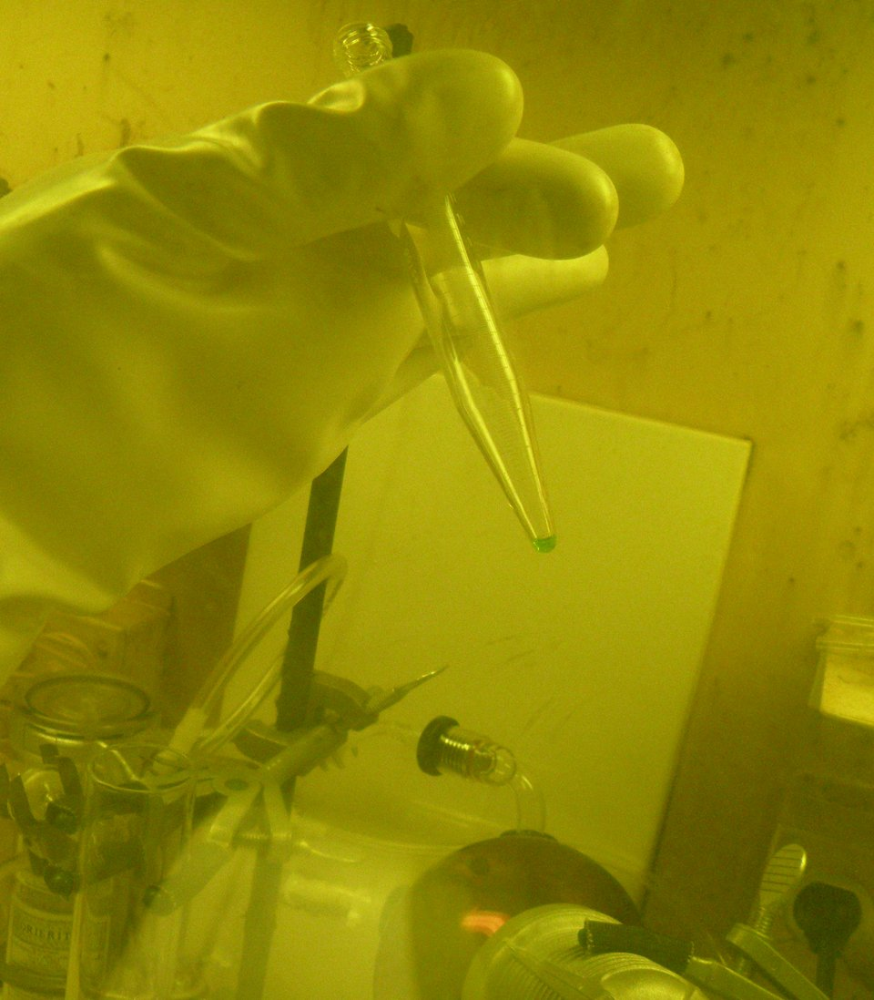

On 28 November 2016 the International Union of Pure and Applied Chemistry gave names to elements 113, 115, 117 and 118: nihonium, moscovium, tennessine and **[oganesson](kloom:e/oganesson)**. With them the seventh row of the periodic table was full, for the first time, from francium to the noble gas at its end. Nobody has ever seen a visible amount of any of them. Each of these **[superheavy elements](kloom:e/superheavy-element)** is known from a handful of atoms, made one at a time and recognized by the way they fall apart, most within seconds.

## Hot fusion

Seaborg's elements were made by adding neutrons, or small nuclei, to targets that could be weighed. The heavier the nucleus made, the likelier it is to split before it cools, and the rarer each success. Germany's GSI laboratory made elements 107 to 112 between 1981 and 1996 by "cold" fusion, firing medium-weight nuclei into lead and bismuth. At **[RIKEN](kloom:e/riken)**, near Tokyo, Kōsuke Morita's team ran zinc into bismuth from 2003 to 2012, nearly 600 days of beam, and saw three atoms of element 113.

The heavier elements came from Dubna, north of Moscow, where **[Yuri Oganessian](kloom:e/yuri-oganessian)**'s group at the **[Joint Institute for Nuclear Research](kloom:e/joint-institute-for-nuclear-research)** fired a beam of calcium-48 into targets of the heaviest elements that reactors can make: plutonium, americium, curium, berkelium and californium, supplied from Oak Ridge and from Dimitrovgrad in Russia. Calcium-48 has 20 protons and 28 neutrons, both "magic" numbers that make a nucleus unusually stable, and it brings many neutrons with it. It is 0.2% of natural calcium and must be enriched. Element 117 needed 22 milligrams of berkelium-249, whose half-life is 327 days.

## One atom a week

Oganesson was made in 2002 and 2005 by a team from Dubna and Lawrence Livermore, reported in 2006, and named in 2016 after Oganessian, the second person, after Glenn Seaborg, to have an element named for him in his lifetime. The reaction:

²⁴⁹Cf + ⁴⁸Ca → ²⁹⁴Og + 3n

The charges add, 98 + 20 = 118, and the masses, 249 + 48 = 294 + 3. Why so few atoms? The paper gives everything needed to work it out. In 2005 the target held 0.34 milligrams of californium-249 on each square centimeter, and 1.6 × 10¹⁹ calcium ions went through it in 1,080 hours. The chance that one ion makes oganesson is set by the reaction's cross-section, measured at 0.5 picobarn: 5 × 10⁻³⁷ square centimeters. By our arithmetic:

| Step                                  | Number                                       |
| ------------------------------------- | -------------------------------------------- |
| californium atoms per cm² of target   | 0.34 × 10⁻³ ÷ 249 × 6.02 × 10²³ = 8.2 × 10¹⁷ |
| atoms made = ions × atoms per cm² × σ | 1.6 × 10¹⁹ × 8.2 × 10¹⁷ × 5 × 10⁻³⁷ = 6.6    |
| reaching the detector, at 35%         | about 2.3                                    |
| seen                                  | 2                                            |
| made per week, at that rate           | about 1                                      |

That is about one atom a week, and each lasts about a thousandth of a second. Everything made in those 45 days weighed, by the same arithmetic, about 3 × 10⁻²¹ grams. The Dubna paper reports three atoms in all; a 2020 paper counts five.

## Chemistry of one atom

A few seconds of life is enough to ask one question of an atom: does it stick? Atoms are blown by a stream of gas along a channel lined with detectors coated with gold or quartz, and where they stop says how strongly they bind. **[Flerovium](kloom:e/flerovium)**, element 114, sits under lead, but relativistic effects, strong in so heavy an atom, give it an almost closed outer shell. A GSI team reported in 2022 that it is very volatile and the least reactive of its group, sticking to gold less than mercury does but more than the noble gas radon: a metal, just. In 2024 nihonium and moscovium proved more reactive than their neighbors copernicium and flerovium. Oganesson lives too briefly to test. Calculations say it is no noble gas: a solid melting at about 52 °C, "neither noble nor a gas", in the title of their paper.

## The island, and what is next

Theory has long promised an **[island of stability](kloom:e/island-of-stability)** near 184 neutrons and somewhere between 114 and 126 protons, where nuclei might last far longer than their neighbors. The plate draws it. Oganesson-294 has 176 neutrons; the most yet seen in a nucleus, as of 2015, was 177. Half-lives climb as the shore is approached, and some models put them at a million years on the island itself.

Element 119 or 120 would begin an eighth row. By 30 September 2026 neither had been announced. RIKEN has been firing vanadium into curium since 2018. At Berkeley, a titanium-50 beam made two atoms of livermorium, element 116, in 22 days in 2024, the test for making 120 from californium, a search Berkeley had planned for late 2025 and which Wikipedia reports under way by September of that year. Dubna began firing titanium-50 into berkelium in May 2026, aiming at 119. In June its team reported a sensitivity of 480 femtobarns, where 180 to 200 are needed to expect one atom; first results were expected in September or October.

The trail ends where it began, at **Mendeleev**'s table of 1869, which now has no gaps left to fill.
