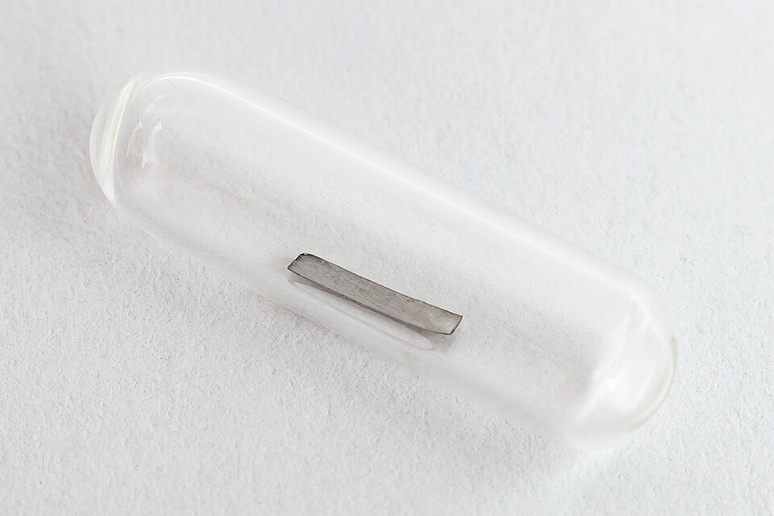

When **[Dmitri Mendeleev](kloom:e/dmitri-mendeleev)** laid out his table, one square under manganese stood empty, between molybdenum, element 42, and ruthenium, 44. He called the missing element _eka-manganese_ and predicted that it would behave like manganese. No one found it. Henry Moseley's X-ray measurements of 1913 and 1914, the frame before this one, fixed each element's number and showed 43 still missing, and by 1925 hafnium and rhenium had filled two of the other gaps. Element 43 was the first element to be made before it was found. It is **[technetium](kloom:e/technetium)**, and the reason no one could find it is that the Earth had lost it: every one of its isotopes is radioactive, and the longest-lived have half-lives of about four million years, a thousandth of the Earth's age.

## Masurium

In 1925 three German chemists, Walter Noddack, **[Ida Tacke](kloom:e/ida-noddack)** and Otto Berg, announced both missing elements at once. Rhenium was real, and they are credited with it. For element 43 they reported faint X-ray lines in concentrates of uranium-bearing minerals, and named it _masurium_, after Masuria in East Prussia, the region Walter Noddack's family came from. The name offended many, who heard in it the German victories there in the First World War. No one could repeat the measurement, and the claim was dismissed as an error.

It has been reopened. Uranium splits on its own, very rarely, and some of the fragments are technetium, so a uranium ore does hold a trace of it. In 1988 the Belgian physicist Pieter Van Assche argued that the 1925 spectrum was real, and in 2008 he and John Armstrong of the US National Institute of Standards and Technology simulated the spectrum that the Noddacks' residues should have given and found it close to the published one. Wikipedia's article, following Paul Kuroda's study of 1989, answers that the ores could have held at most about 3 × 10⁻¹¹ micrograms of technetium in a kilogram, far below anything their instruments could see.

## A foil in the post

In the summer of 1936 the Italian physicist **[Emilio Segrè](kloom:e/emilio-segre)**, newly made a professor at Palermo, visited **[Ernest Lawrence](kloom:e/ernest-lawrence)**'s Radiation Laboratory at Berkeley and talked him into sending home some discarded parts that had grown radioactive in the **[cyclotron](kloom:e/cyclotron)**, the machine that whirls charged particles in a spiral between two D-shaped electrodes. In February 1937 a strip of molybdenum arrived by mail. It had been part of the deflector, the plate at the rim that steers the beam out, and it had been struck by deuterons, the nuclei of heavy hydrogen. The plate draws the machine in plan.

The question was chemical, so he turned to the Palermo mineralogist **[Carlo Perrier](kloom:e/carlo-perrier)**. They dissolved the foil and followed its radioactivity through chemical separations. Part of it left the molybdenum behind and behaved like manganese, and still more like rhenium, the elements above and below the gap. They found three half-lives, of about 90, 80 and 50 days, far too little of anything to weigh, recognised only by its radiation and its chemistry. A deuteron carries one proton and one neutron into the nucleus, and in one of the reactions it leaves the neutron behind:

⁹⁶Mo + ²H → ⁹⁷Tc + n

The charges balance, 42 + 1 = 43, and so do the masses, 96 + 2 = 97 + 1. The three half-lives turned out to belong to two isotopes, technetium-95 and technetium-97. The university wanted the element named _panormium_, after Palermo's Latin name. In 1947 Perrier and Segrè chose _technetium_, from the Greek _technetos_, "artificial". The earliest element found only by making it later turned out not to be wholly artificial after all: in 1952 the astronomer Paul Merrill found its lines in the spectra of red giant stars, which must have been making it, and in 1962 a trace of it was isolated from pitchblende.

## Six hours

In 1938 Segrè went back to Berkeley to study the element's short-lived isotopes, which did not survive the mail, and Italy's new racial laws, passed while he travelled, kept him there. With **Glenn Seaborg** he found an isotope that decays mostly by giving off a gamma ray, with a half-life they measured at 6.6 hours and is now put at 6.0: **[technetium-99m](kloom:e/technetium-99m)**. It became medicine's workhorse. It is made where it is used, from its parent, molybdenum-99, in a shielded column of alumina. The molybdate clings to the alumina; the pertechnetate ion, TcO₄⁻, that it decays into clings less, and is washed out with salt water. Brookhaven's historians date the first such generator to 1957; Wikipedia gives 1958.

The six hours are the point. They are long enough to make a dose and image it, and short enough that little is left to irradiate the patient. By our arithmetic, with the half-life of 6.0066 hours:

| Hours after the dose |             Fraction left |
| -------------------: | ------------------------: |
|                    0 |                         1 |
|                    6 |                         ½ |
|                   12 |                         ¼ |
|                   18 |                         ⅛ |
|                   24 | (½)^(24 ÷ 6.0066) = 0.063 |

A day later about one-sixteenth is left, 6%. The parent, with a half-life of 66 hours, keeps about 17% of itself after a week, by the same arithmetic, which is why a hospital replaces its generator every week.

How many scans that makes depends on whom you ask. The International Atomic Energy Agency estimated about 25 million a year in 2009; Brookhaven said more than 40 million in 2011; and the Nuclear Energy Agency's report of 2025 gives more than 30 million, 80 to 85% of all nuclear medicine.

Seaborg's next elements were ones that nature had never made at all: the next frame goes past uranium.
