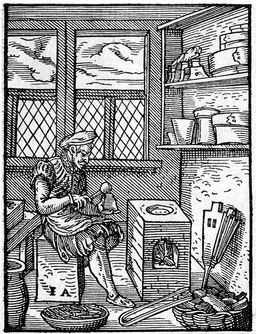

A printed page is made of thousands of small metal bars, each with a letter on its end, and each must stand to the same height, within about a tenth of a millimeter, or the page prints unevenly. The press that inked them is western civilization's story. This frame is about the metal. **[Gutenberg](kloom:e/johannes-gutenberg)**'s workshop in **[Mainz](kloom:e/mainz)**, by about 1450, needed a metal that melted in a small furnace, ran into the finest strokes of a letter, came out sharp, and was hard enough to be pressed into paper thousands of times. Lead alone melts easily but is soft, and it shrinks as it freezes. The answer was **[type metal](kloom:e/type-metal)**: lead hardened with **[antimony](kloom:e/antimony)** and tin, the alloy of printing type for five hundred years.

## What Gutenberg's metal was

Almost nothing is known of it. No type from Gutenberg's shop survives, and the archaeometallurgist Daniel Berger, reviewing every analyzed find in 2017, wrote plainly that "the composition of Gutenberg's first type is not known." The oldest pieces found, published in 1954, are from Lyon, at the end of the fifteenth century.

The written recipes come later, and they disagree. The first, in the _Pirotechnia_ (1540) of the Sienese metallurgist **[Vannoccio Biringuccio](kloom:e/vannoccio-biringuccio)**, makes type from "three parts of fine tin, an eighth part of black lead, and another eighth part of fused marcasite of antimony": by our arithmetic, about 92% tin. Under Jost Amman's woodcut of a typefounder, printed in Frankfurt in 1568, the poet **[Hans Sachs](kloom:e/hans-sachs)** has the founder say his type is made of bismuth, tin and lead, with no antimony at all. The 42-line Bible's tens of thousands of pieces of type were cast from a metal that nobody wrote down.

What the ground gives back is lead. Berger drilled into type thrown into a latrine in Mainz in the early seventeenth century and into type found under the plaster of a church at Oberursel, cast in the early 1600s, and analyzed the turnings by X-ray fluorescence:

| Source                         | Date      | Tin       | Antimony | Lead |
| ------------------------------ | --------- | --------- | -------- | ---- |
| Biringuccio's recipe           | 1540      | about 92% | about 4% | 4%   |
| Hans Sachs's verse             | 1568      | some      | none     | some |
| Type from Mainz, 20 pieces     | 1600–1630 | 5.6%      | 11.0%    | 83%  |
| Type from Oberursel, 20 pieces | 1600–1623 | 3.7%      | 12.5%    | 83%  |
| Type for hand-setting          | 1956      | 5–6%      | 28–29%   | 66%  |

Type from [Wittenberg](kloom:e/wittenberg), a generation or two older, held the same metals with up to 2% bismuth. Berger suspects that tin, far dearer than lead, gave way to lead quickly, and that the tin-rich recipes may describe only the earliest type. Nobody can yet say which Gutenberg used.

## Why the mixture melts low

Lead melts at 327 °C and antimony at 631 °C, yet lead with about an eighth of its weight in antimony melts lower than either: at 247 °C by a 1936 National Bureau of Standards survey (13% antimony), at 252 °C by Wikipedia's account (12%). Such a mixture is a **[eutectic](kloom:e/eutectic-system)**, from the Greek for "melting well", and it freezes all at once at one temperature, as a pure metal does, rather than turning to mush over a range.

| Metal or mixture            | Melts at | Source                |
| --------------------------- | -------: | --------------------- |
| Antimony                    |   631 °C | Wikipedia             |
| Lead                        |   327 °C | Wikipedia             |
| Lead, 13% antimony          |   247 °C | Hidnert, 1936         |
| Lead, 8.8% antimony (ideal) |   245 °C | by our arithmetic     |
| Lead, 12% antimony, 4% tin  |   239 °C | Berger, after Osamura |

It can be predicted from almost nothing. A liquid holding two kinds of atom is more disordered than a pure one, so it survives to a lower temperature before it freezes. Treat the melt as an ideal solution, and each metal's freezing point falls with the amount of the other: ln _x_ = −(Δ*H*/_R_)(1/_T_ − 1/*T*ₘ), where _x_ is the fraction of the atoms that are that metal, Δ*H* its heat of melting and *T*ₘ its melting point. With lead's 4.77 kJ per mole at 600.6 K and antimony's 19.79 kJ per mole at 903.8 K, and nothing else, the two falling curves cross at 14 atoms of antimony in a hundred, or 8.8% by weight, and 245 °C, by our arithmetic. The plate draws both curves. The measured eutectic lies within a few degrees of that guess. Add a little tin and the eutectic falls further, to 239 °C, at 12% antimony and 4% tin.

The seventeenth-century type sits on that point. Berger plotted every piece and found them clustered close to the three-metal eutectic, with hard crystals of an antimony–tin compound in a softer lead matrix: "certainly not chosen by chance," he concluded. It is often added that type metal expands as it freezes, filling the mold; Wikipedia's article says only that antimony lessens lead's shrinkage, and none of the sources read for this frame gives a measurement.

## The hand mold

The metal went into a **hand mold**: two halves, cased in wood against the heat, that slid to fit the width of each letter and closed around a matrix of copper or brass, into which a punch had struck the letter's shape. Opened, it gave up one piece of type; closed again, it cast the next to the same height. Its earliest written record is from 1477, in a lawsuit at Perugia and a printing shop's accounts in Florence. In 2001 Paul Needham and Blaise Agüera y Arcas, comparing letters in a Mainz print of about 1456, found so many variants of one letter that they suggested each piece was cast alone, perhaps in a throwaway sand mold. The book historian Christoph Reske compared the same prints under a microscope and found few enough variants to fit a punch, a matrix and a mold, "probably invented by Johannes Gutenberg after all."

The alloy was found by trial long before anyone could explain it. The next frame belongs to a physician who wanted chemistry to make medicines, and defended his poisons by their dose.
